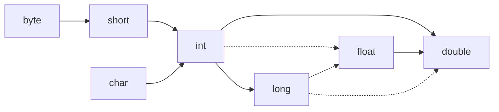
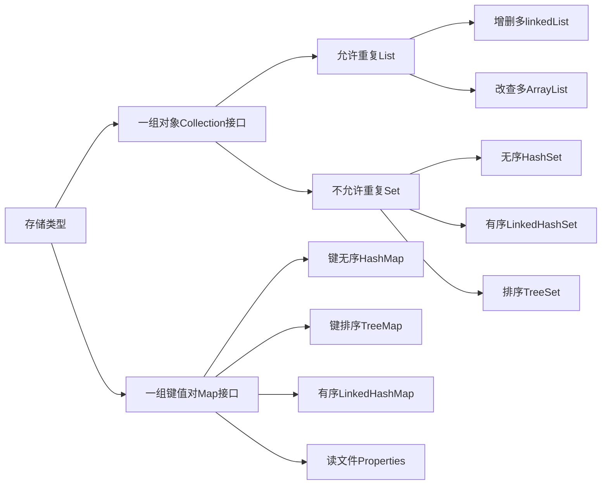

# 转义字符

1. `\t`一个制表位
2. `\n`换行符
3. `\\`一个\
4. `\"`一个"  在字符串中输出双引号，需要用转义字符
5. 单引号同上
6. `\r`表示回车

# 注释（comment）

- idea注释快捷键 
  1. 单行注释（ctrl+/ ）
  2.  多行注释（ctrl+shift+/）
  3. 方法或者类说明注释，自动带参数和返回值 ：/**
- 文档注释 javadoc  类和方法都要用文档注释

# 代码规范

- 类和方法的注释都要以javadoc的方式来写
- 运算符和=两边习惯各加一个空格
- 源文件使用utf-8编码
- 行宽度不超过80字符
- 代码编写此行风格和行尾风格。推荐使用行尾风格。

# 数据类型

## 整形

类型 | 存储需求 | 取值范围
:-: | :-: |  :-:
int | 4字节 | -2147483648～2147483647 
short | 2字节 | -32768～32767 
long | 8字节 |
byte | 1字节 | -128～127 

- int最常用，但如果要表示地球居住的人口，就需要用long类型了。

- Java没有任何无符号（unsigned）的形式的int、long、short或byte类型。
## 浮点型

类型 | 存储需求 | 取值范围
:-: | :-: | :-:
float | 4字节 | 有效位数为6～7位 
double | 8字节 | 有效位数为15位 

- double表示的精度是float类型的两倍（被称为双精度）

- float类型的数值有一个后缀F或者f（例如，3.14F）。没有后缀F的浮点数值（如3.14）总是默认为double类型。

- double类型也可以在后面添加后缀D或者d（例如，3.14D）

  

- ## 常量

- 常量使用关键字final指示。

- 习惯上，常量名使用全大写

- 经常希望某一个常量可以在一个类的多个方法中使用，通常将这些常量称为类常量。使用关键字static final设置一个类常量。

- 需要注意，类常量的定义位于main方法的外部。因此，在同一个类的其他方法中也可以使用这个常量。而且, 如果一个常量被声明为public，那么其他类的方法也可以使用这个常量，如下面例子中的CM_PER_INCH。

```java
  public class Constants2 {
      public static final double CM_PER_INCH = 2.54;
      
      public static void main(String[] args) {
          double paperWidth = 8.5;
      }
  }
```

# 数据类型转换

 



1. 6个实线箭头表示无信息丢失的转换；另外三个虚线箭头表示可能有精度损失的转换
2. 当使用二元运算符连接两个值时，先要将两个操作数==转换成同一种类型==，然后再进行计算
   - 如果操作数中有一个是double类型，另一个操作数就会转换成double类型
   - 否则，其中一个操作数是float类型，另一个操作数就会转换成float
   - 否则，其中一个操作数为long类型，另一个操作数就会转换为long类型
   - 否则，两个数中都会被转换成int类型

*long类型占8个字节，而float类型占四个字节，但float类型不是用二进制直接表示数值大小，而是通过公式表示，在此基础上，float类型的数值范围大于long类型的数值表示范围，因此不需要强制转换，但转换有精度的丢失。*

# 强制类型转换

- 强制类型转换，例如double类型转换为int类型，当然这会丢失一些精度。
- 强制类型转换的语法格式是在圆括号中给出想要转换的目标类型，后面紧跟带转换的变量名
- 强制类型转换通过==截断小数部分==来将浮点数值转换为整型。

```java
public class demo {
    public static void main(String[] args) {
        double x = 1.9;
        int xn = (int)x;
        System.out.println(xn);
    }
}

out：1
```

# i++运算符

- `i++`：先用本来的值参与运算，然后再将`i-1`的值赋值给`i`。
- `++i`：先运算`i+1`赋值给`i`，然后再用i的新值参与运算。

# 位运算

```java
public class BitOperations {
    public static void main(String[] args) {
        int a = 3;
        int b = 5;
        System.out.println(a&b);//与
        System.out.println(a^b);//异或
        System.out.println(a|b);//或
        System.out.println(~b);//取反

        System.out.println(5<<3); //左移3位相当于5*2^3
        System.out.println(64>>4);//右移4位相当于64/2^4
        System.out.println(-64>>>4);

        //判断奇数偶数
        int js = 7;
        int os = 8;
        System.out.println(js & 1);//奇数与1做与位运算结果为1
        System.out.println(os & 1); //偶数与1做与位运算结果为0

        //交换变量
        int n = 11;
        int m = 99;
        m = n ^ m;
        n = m ^ n;
        m = m ^ n;
        System.out.println(n); //99
        System.out.println(m); //00
    }
}
```

#Char

- Java的char类型占两个字节，支持unicode字符集中的BMP字符。

```java
int a = 1;
char b = '1';
int c = (int)(b);
int d = (int)('0');
System.out.println(1+'0');
System.out.println(b);
System.out.println(c);
System.out.println(d);

49
1
49
48
```

# 字符串String

- Java字符串就是Unicode字符序列。

- Java没有内置的字符串类型，而是在标准Java类库中提供了一个预定义类，叫做String。

- 每个用双引号括起来的字符串都是String类的一个实例。

## 字符串运算

```java
public class StringDemo {
    public static void main(String[] args) {
        int x = 15;
        int y = 10;
        System.out.println(x + y + "" + (x + y)+y);
    }
}
```

- 先算括号里面的，再从左到右依次相加。

## 子串

```java
public class StringTest {
    public static void main(String[] args) {
        String greeting = "Hello";
        String s = greeting.substring(0,3);//substring方法可以从一个较大的字符串中提取出一个子串
        System.out.println(greeting);
        System.out.println(s); //Hel

        //Java语言允许使用+号连接字符串
        String expletive = "Expletive";
        String PG13 = "deleted";
        String message = expletive + PG13;
        System.out.println(message); //Expletivedeleted

        //字符串与非字符串拼接
        int a = 11;
        String ss = expletive + a;
        System.out.println(ss); //Expletive11
        
        //字符串与布尔类型相加
        String name = "zyf";
        boolean a = false;
        String b = name + a;
        System.out.println(b); //zyffalse

        //静态的join方法
        String all = String.join(",","A","B","C");
        System.out.println(all); //A,B,C

        //repeated方法
        String rep ="JAVA".repeat(4);
        System.out.println(rep);

        //检测字符串是否相等
        boolean q = all.equals(rep);
        System.out.println(q);
    }
}
```

**split方法**

```java
String a = "a,b,c,";
String[] split = a.split(",");
for (int i = 0; i < split.length; i++) {
    System.out.println(split[i]);
}

a
b
c
```

**charAt方法**

```java
String s = "abc";
System.out.println(s.charAt(0));
System.out.println(s.length()); //字符串使用.length()方法可以返回字符串的长度

a,3
```


## 构建字符串（StringBuilder）

如果需要很多小段字符串构建一个字符串，可以按以下步骤进行：

```java
public class demo {
    public static void main(String[] args) {
        StringBuilder builder = new StringBuilder();
        String ch = "ch";
        String str = "str";
        builder.append(ch);
        builder.append(str);
        String completedString = builder.toString();
        System.out.println(completedString);
    }
}
```

返回构建器中的代码单元数量

```java
public class demo {
    public static void main(String[] args) {
        StringBuilder builder = new StringBuilder();
        String ch = "ch";
        String str = "str";
        builder.append(ch);
        builder.append(str);
        int num = builder.length();
        System.out.println(num);
    }
}
out：5
```

# 读取输入（Scanner）

- 想要通过控制台进行输入，首先要构造一个与“标准输入流”System.in关联的Scanner对象。

```java
Scanner in = new Scanner(System.in);
String name = in.nextLine(); //接收回车字符
String name = in.next(); //读取单词
int age = in.nextInt();//读取一个整数
```

# 格式化输出

- 可以使用语句`System.out.printf(x)`进行格式化输出。
- 每个以%字符开始的格式说明符都用相应的参数替换。
- 格式说明符尾部的转换符指示要格式化的数值类型，数值类型和转换符见下表

转换符 | 类型 | 示例
:-: | :-: | :-:
d | 十进制数 | 159 
f | 定点浮点数 | 15.9 
e | 指数浮点数 | 1.59e+01 
s | 字符串 | Hello 
c | 字符 | H 
b | 布尔 | true 

```java
public class demo {
    public static void main(String[] args) {
        System.out.printf("%.2f",1000.0/3.0);
        System.out.printf("%s","ss");
    }
}
```

```java
public class FormattedOutput {
    public static void main(String[] args) {
        // %d表示整形 %f浮点型  %s字符串  %t日期时间
        int a = 1121;
        System.out.printf("%s\n",a);//1121
        System.out.printf("%8.2f\n",10000.0/3.0);// 3333.33
        System.out.printf("%.3f\n",10000.0/3.0); //3333.333
        System.out.printf("%,.3f\n",10000.0/3.0); //3,333.333
        System.out.printf("%,(.3f\n",-10000.0/3.0);//使用分组分隔符并将负数括在括号内 (3,333.333)

        System.out.printf("%1$s = %3$s %2$s\n","Name","zhou","shen");//Name = shen zhou

        System.out.printf("%tc\n",new Date());//周一 3月 14 15:53:49 CST 2022

        System.out.printf("%1$s %2$tB %2$te,%2$tY","Due date:",new Date());// Due date: 三月 14,2022
    }
}
```
#  数组

## 数组声明

- 数组声明：`int[] a = new int[3]`
- 数组声明的简写形式：`int[] b = {1,2,3}`
- 当创建一个数字数组后，所有元素都初始化为0；boolean数组的元素初始化为false；对象数组的元素则初始化为一个特殊值null，表示这些元素还存放任何对象。
- `String[] names = new String[100]` 会创建一个包含十个字符串的数组，所有字符串都为null。
- 想要获取数组中元素的个数，可以使用`array.length`

## for each循环

- 是一种很强的循环结构，可以依次来处理数组中的每个元素（或者其他元素集合），而不必考虑指定下标值

- 语句格式为 `for （variable：collection）statement`
```java
  public class demo {
      public static void main(String[] args) {
          int[] a = new int[10];
          for (int i = 0; i < a.length; i++)
          {
              a[i] = i;
          }
          for (int i:a)
          {
              System.out.print(i);
          }
      }
  }
  
  out：0123456789
```

## 数组拷贝

- 将一个数组的所有值拷贝到一个新的数组中去，要使用Array类的copyOf方法
 ```java
  public class demo {
      public static void main(String[] args) {
          int[] a = new int[3];
          for (int i = 0; i < a.length; i++)
          {
              a[i] = i;
          }
          int[] b = Arrays.copyOf(a, a.length);
          for(int i : b)
          {
              System.out.print(i);
          }
      }
  }
  out：012
 ```

```java
public class demo {
    public static void main(String[] args) {
        int[] a = new int[3];
        for (int i = 0; i < a.length; i++)
        {
            a[i] = i;
        }
        int[] b = Arrays.copyOf(a, a.length*2);
        for(int i : b)
        {
            System.out.print(i);
        }
    }
}
out：012000
```

- copyOf方法的第二个参数是新数组的长度，这个方法通常用来增加数组的长度
- 如果数组元素是数值型，那么额外的元素将会被赋值为0；如果数组元素为布尔型，则将赋值为false。
- 如果长度小于原始数组的长度，则只拷贝前面的值。

## 多维数组

- 二维数组的声明：`double[][] balance`

- 如果知道数组的元素，则不需要调用new，可以这样进行初始化

  ```java
  int[][] magicSquare = {
          {16, 3, 2, 13},
          {5, 10, 11, 8},
          {9, 6, 7, 12}
  };
  ```

- for each循环不能自动处理二维数组的每一个元素，可以尝试两个循环的嵌套

  ```java
  public class demo {
      public static void main(String[] args) {
          double[] interestRate = {0.10, 0.11, 0.12, 0.13, 0.14, 0.15};
          final int NRATES = 6;
          final int NYEARS = 10;
          double[][] balances = new double[NYEARS][NRATES];
          for(int i = 0; i < NRATES; i++)
          {
              balances[0][i] = 10000.00;
          }
          for(int i = 1; i < NYEARS; i++)
          {
              for(int j = 0; j < NRATES; j++)
              {
                  balances[i][j] = balances[i-1][j] + balances[i-1][j]*interestRate[j];
              }
          }
          for(int i = 0; i < interestRate.length; i++)
          {
              System.out.printf("%9.0f%%",100*interestRate[i]);
          }
          System.out.println();
          for(double[] a : balances)
          {
              for (double b : a)
              {
                  System.out.printf("%10.2f",b);
              }
              System.out.println();
          }
      }
  }
  out：
        10%       11%       12%       13%       14%       15%
    10000.00  10000.00  10000.00  10000.00  10000.00  10000.00
    11000.00  11100.00  11200.00  11300.00  11400.00  11500.00
    12100.00  12321.00  12544.00  12769.00  12996.00  13225.00
    13310.00  13676.31  14049.28  14428.97  14815.44  15208.75
    14641.00  15180.70  15735.19  16304.74  16889.60  17490.06
    16105.10  16850.58  17623.42  18424.35  19254.15  20113.57
    17715.61  18704.15  19738.23  20819.52  21949.73  23130.61
    19487.17  20761.60  22106.81  23526.05  25022.69  26600.20
    21435.89  23045.38  24759.63  26584.44  28525.86  30590.23
    23579.48  25580.37  27730.79  30040.42  32519.49  35178.76
  
  ```

 # java命名规范

- 只能由字母、数字、下划线和美元符号组成。
- 不能以数字开头。
- 区分同一个字母的大小写。
- 包名：全小写。
- 类名：首字母大写，如果以多个字母组成，要求每个单词的首字母都要大写，如HelloWorldApp。
- 接口名：命名规则与类相同。
- 方法名：往往由多个单词组成，第一个为动词，因此动词全要小写，后面单词首字母大写，如balanceAccount、isButtonPressed。
- 变量名：一般为名词，全小写。
- 常量名：全大写。

# IDEA使用方法

- java源码放在src文件夹中。
- 使用utf-8编码。
- src文件夹中存放的是源码文件，out文件夹中存放的是编译后的`.class`文件。

## 快捷键

- 删除当前行 ctrl + 向上箭头
- 复制当前行 ctrl + 向下箭头
- 补全代码alt+/
- 添加注释 取消注释 ctrl+/
- 自动导入类 alt+enter
- 快速格式化代码 ctrl+alt+L
- 快速运行程序 alt+R
- 生成构造器 ctrl+insert
- 查看一个类的层级关系 ctrl+H
- 将光标放在一个方法上，输入ctrl+B，可以定位到方法
- 自动分配变量名 通过在后面添加.var
- 将光标移动至本行的最后 end
- 将光标移动至行头 home
- 补全分号 ctrl+shift+enter

## idea模板（提高开发效率）

- fori for循环
- sout 输出等

## 断点调试

- F8逐行执行代码
- 数组越界的异常
- F7快捷键追源码。（将光标放在某个变量上，可以看到最新的数据）shift+F8跳出方法。
- F9快捷键直接执行到下一个断点，动态下断点。
- [【IDEA】IDEA调试debug时，stepinto进不去方法和数据显示不完整的解决方法debug进不去方法](https://blog.csdn.net/qq_40839718/article/details/123464047)

# Java的值传递

**在 Java 中，参数传递总是按值传递。这意味着当我们将变量作为参数传递给方法时，实际上传递的是变量的值的副本。然而，Java 中的值传递在基本数据类型和引用数据类型之间有所不同。**

## 基本数据类型

Java 有 8 种基本数据类型：byte、short、int、long、float、double、char 和 boolean。当我们将基本数据类型作为参数传递给方法时，传递的是变量的值的副本。因此，在方法内部对参数进行的任何更改都不会影响原始变量。

```java
public void modify(int num) {
    num = 90;
}

public static void main(String[] args) {
    int a = 0;
    modify(a);
    System.out.println(a); // 输出 0，因为 a 的值没有被修改
}
```

## 引用数据类型

引用数据类型包括类、接口和数组。当我们将引用数据类型作为参数传递给方法时，传递的是对象引用的副本。这意味着在方法内部，**我们可以通过这个引用副本访问和修改原始对象的状态，但不能更改原始引用变量指向的对象。**

可以通过引用的副本改变原始对象的状态：

```java
public void modify(ArrayList<Integer> list) {
    list.add(90);
}

public static void main(String[] args) {
    ArrayList<Integer> a = new ArrayList<>();
    new CD().modify(a);
    System.out.println(a); // 输出 [90]，因为 a 的值已被修改
}
```

使用引用的副本无法更改原始引用变量的指向：

```java
public void modify(ArrayList<Integer> list) {
    ArrayList<Integer> newList = new ArrayList<>();
    newList.add(900);
    list = newList;
}

public static void main(String[] args) {
    ArrayList<Integer> a = new ArrayList<>();
    new CD().modify(a);
    System.out.println(a); // 输出 []，引用的副本无法改变原始引用的指向
}
```

尽管我们不能更改 `a` 引用本身指向的对象（即不能将 `a` 指向一个新的 `ArrayList` 对象），但我们可以通过传递给 `modify` 方法的引用副本来修改 `a` 指向的对象的状态。

总之，Java 中的参数传递总是按值传递。对于基本数据类型，传递的是变量的值的副本，而对于引用数据类型，传递的是对象引用的副本。这意味着我们可以通过引用副本修改引用数据类型对象的状态，但不能更改原始引用变量指向的对象。

# 对象与类

- 类（class）是构造对象的模板或蓝图。
- 由类**构造**（construct）的对象称为创建类的实例（instance）。
- 在Java中，所有类都源自一个“神通广大的超类”，它就是Object。
- 通过扩展一个类的过程称为**继承**（inheritance）。
- ==自定义的类==是一种自定义的数据类型。

## 对象

### 对象的三个特征：

- 对象的行为：可以对对象完成哪些操作
- 对象的状态：当调用那些方法时，对象会如何响应
- 对象的标识：如何区分具有相同行为与状态的不同对象

JVM的内存中，对象的存在形式：


- 基本数据类型存放在堆中，引用数据类型还要放在常量池中

###  用户自定义类

- 当Employee a 时声明了一个空的a，其中存放的数据为空。
- 当new 了一个Employee后，在内存中开辟了一块空间存放Employee，这块空间的地址赋给a

```java
class ClassName
{
field1;//实例字段1    属性  成员变量
field2;//实例字段2    实例字段可以是基本类型也可以是引用类型
.....
constructor1//构造器1
constructor2//构造器2
....
method1//方法
method2//方法
....
}
```

```java
public class demo2 {   //public修饰的类为公共类，一个源文件中只能有一个公共类
    public static void main(String[] args) {
        Employee[] staff = new Employee[3];
        staff[0] = new Employee("zhou",75000, 1987, 2, 17);  //先声明在创建
        staff[1] = new Employee("yang",50000, 2000, 5, 17);
        staff[2] = new Employee("fan",40000, 2003, 9, 17);

        for(Employee e : staff)
        {
            System.out.println("name="+e.getName()+",salary="
                               +e.getSalary()+",hireday="+ e.getHireday());
        }
    }

}

class Employee{
    private String name;
    private double salary;
    private LocalDate hireday;

    public Employee(String n, double s, int year, int month, int day)
    {
        name = n;
        salary = s;
        hireday = LocalDate.of(year, month, day);
    }

    public String getName()
    {
        return name;
    }
    public double getSalary()
    {
        return salary;
    }
    public LocalDate getHireday()
    {
        return hireday;
    }

    public void raiseSalary(double byPercent)
    {
        double raise = salary * byPercent/100;
        salary += raise;
    }
}
```

- 在该程序中包含了两个类，Employee类和带有public访问修饰符的demo2类，demo2类中包含了main方法。

- 源文件名为demo2，这是因为文件名必须与public类的名字相匹配。

- 在一个源文件中只能有一个公共类，但可以有任意数目的非公共类。

- 在编译时，编译器将在目录下创建两个类文件，demo2.class和Employee.class。

- 将程序中包含main方法的类名提供给字节码解释器，以启动这个程序：java demo2。

- 字节码解释器开始运行demo2类main方法中的代码，在这段代码中先后构造了3个Employee对象，并显示他们的状态。

- 有两个实例字段本身就是对象，name字段是String类型对象，hireDay字段是LocalDate类对象。这种情况十分常见：类

  包含的实例字段通常属于某个类类型。

  

### 构造器

  - 构造器与类同名。
  - 每个类可以有一个以上的构造器。
  - 构造器可以有0个、1个或多个参数。
  - 构造器没有返回值。
  - 构造器总是伴随着**new操作符**一起调用，不能对**已经存在的对象**调用构造器来达到重新设置实例字段的目的。

### this关键字

```java
public Employee(String n, double s, int year, int month, int day)
{
    name = n;
    salary = s;
    hireday = LocalDate.of(year, month, day);
}
//构造器中若形参使用与属性相同的名称，那么无法有效给对象赋值，这是变量的作用域决定的，引出this
```


- 虚拟机会给每个对象分配this，代表当前对象。

- 可以理解为：this中存储了对象的索引，指向自己
- 哪个对象调用（方法），this就代表哪个对象

```java
package com.zhouyangfan.this_;

public class Person {

    String name;

    public Person(String sName){
        this.name = sName;
        System.out.println("this的hashCode为 "+this.hashCode());
    }

    public void m1(){
        System.out.println("this的hashcode为 "+ this.hashCode());
    }
}

package com.zhouyangfan.this_;

public class TestThis {
    public static void main(String[] args) {
        Person person1 = new Person("zhou");
        System.out.println("zhou的hashcode为 "+person1.hashCode());
        person1.m1();
        Person person2 = new Person("yang");
        System.out.println("yang的hashcode为 "+ person2.hashCode());
        person2.m1();

    }
}
this的hashCode为 1324119927
zhou的hashcode为 1324119927
this的hashcode为 1324119927
this的hashCode为 81628611
yang的hashcode为 81628611
this的hashcode为 81628611
```

#### this的使用细节

- this关键字可以用来访问本类的属性、方法、构造器。
- this用于区分当前类属性和局部变量。
- 访问成员方法的语句。
- 访问构造器的语法（只能在构造器中访问另外一个构造器）。
- this不能在类定义外部使用，只能在类定义的方法中使用。
- 在方法中，若不加this。此属性与局部变量同名，此属性将被局部变量赋值。

------

### 方法中的显示参数与隐式参数

- 隐式参数，是出现在方法名前的Employee类型的对象（方法调用目标的==接收者==）。
- 显式参数，是位于方法后面括号中的数值。
- 显式参数显式地列在==方法声明==中，隐式参数没有出现在方法声明中。

```java
public void raiseSalary(double byPercent)  //byPercent为显式参数
    {
        double raise = salary * byPercent/100;
        salary += raise;
    }
```

- ​    在每一个方法中，关键字this指示隐式参数，可以如下改写raiseSalary方法：

```java
public void raiseSalary(double byPercent)  //byPercent为显式参数
    {
        double raise = this.salary * byPercent/100;
        salary += raise;
    }
```

------

### 封装

- demo2中，name字段一旦在构造器中设置，就无法对他进行修改

- salary不是只读字段，但只能用raiseSalary方法，一旦这个值出现了错误，只需要调试这个方法就可以了，如果salary字段是公共的，破坏这个字段的捣乱者有可能出现在任何地方

- 想要获取或设置实例字段的值，需要提供下面三项内容：

  1. 一个私有的数据字段

  2. 一个公共的字段访问器方法

  3. 一个公共字段更改器方法

------

### final关键字

final可以修饰类、属性、方法和局部变量

- 当实例字段定义为final，这样的字段必须在构造对象时初始化，并且以后不能再修改这个字段。

```java
  class Emplotee
  {
      private final String name;
      ...
  }
```

- final修饰符对于类型为基本类型或者不可变类型的字段尤其有用。（类中所有方法都不会改变其对象）
- 当不希望类被继承时，可以用final修饰。
- 当不希望父类的某个方法被子类覆盖、重写。
- 当不希望类的某个属性值被修改，可以用final修饰，又称为常量，必须要赋值。
  - 在定义时赋值
  - ==在构造器中赋值（若为静态，则不能在构造器中赋值）==
  - 在代码块中赋值（若为静态，则要在静态代码块中赋值）
- 当不希望某个局部变量被修改，可以使用final。
- final类不能被继承，在可以被实例化。
- 如果不是final类，但含有final方法，则该方法不能被==重写==，但是可以被==继承==。
- final类的方法没有必要用final修饰
- final不能修饰构造器
- ==final和static往往搭配使用，效率更高，不会导致类的加载，底层编译器做了优化处理。==
- 包装类（Integer、Double。。。）String类时final类，不能被继承。

------

### 静态字段

- 静态字段被称为类字段，它属于类，而不属于任何单个的变量，通常用static定义。
- 静态变量被所有对象共享。
- 静态变量是在类加载的时候生成的，即使没有创建对象实例也可以生成。
- 类变量的访问必须遵守相关的访问权限。
- 尽量使用类名.变量名来访问。
- 静态变量生命周期是随着类加载的开始，随着类消亡而销毁。

```java
class
{
	private static int nextID = 1;
	private int id;
}
```

### 静态常量

- 静态常量很常用，使用static final来定义

```java
//在Math中定义一个静态常量
//在程序中可以用Math.PI来访问这个常量
public class Math
{
	...
    public static final double PI = 3.1415926535
    ...
}
```

- 如果省略关键字static，PI就变成了Math的一个实例字段。也就是说需要通过一个类的对象来访问PI。

### 静态方法

- 静态方法不是在对象上执行的方法。例如Math类的pow方法就是一个静态方法。表达式Math.pow()
- 可以认为静态方法是没有==this参数==的方法（在非静态方法中，this参数指示这个方法的隐式参数）
- Employee类的静态方法==不能访问id实例字段==，因为它不能在对象上执行操作。==但是静态方法可以访问静态字段。==
- 当静态方法不涉及到任何和对象相关的成员，则可以将方法设计成静态方法，提高开发效率。
- 静态方法不能使用this和super等关键字。
- 普通方法既可以访问非静态成员，也可以访问静态成员。

```java
public static int getNextID()
{
	return nextID;
}
//可以提供这个类型来调用这个方法
int n = Employee.getNextID();
```

- 通过对象来调用静态方法是合法的，但静态方法的调用与实例对象没有任何关系，因此建议用==类名==而不是对象来调用静态方法。
- 静态方法不能访问实例字段，只能访问静态字段，但非静态方法可以访问静态字段和实例字段。
- main方法必须是静态方法，因为main方法执行前没有任何对象，只能通过类名访问。
- 在以下两种情况下可以使用静态方法：
  1. 方法不需要访问对象状态，因为它需要的所有参数都是通过显式参数提供。
  2. 当只需要访问类的静态字段而不是实例字段时，使用静态字段。

### main方法

- main方式是由java虚拟机调用的。
- main方法也是一个静态方法，调用main方法不需要任何对象。
- main方法接收String类型的数组参数，该数组中保存执行java命令时传递给所运行的类的参数。
- 在main方法中，我们可以直接调用main方法所在的类的静态方法或静态属性。但是，不能直接访问该类中的非静态成员，必须创建该类的一个实例对象后，才能通过这个对象去访问类中的非静态成员。
- 每个类都可以有一个main方法，这通常是对类进行单元测试的一个技巧。

------

### 方法参数

- java程序设计语言总是采用按值调用（==值传递==）
- 有两种类型的方法参数
  1. 基本数据类型。（值传递）
  2. 对象引用。（引用类型的值传递）
- 基本数据类型进行数据传递，是将数据拷贝一份再传入方法中。
- 引用类型的值传递是拷贝指针，再传入方法中。（引用传递不拷贝任何的内存）

```java
public class demo4 {
    public static void main(String[] args) {
        double number = 10;
        System.out.println("增加三倍前，number的数值为"+number);
        tripleValue(number);
        System.out.println("增加三倍后，number的数值为"+number);

        Animal dog = new Animal("Bob", 10, "beef", '1');
        System.out.println("增加年龄前," + dog.getName() + "的年龄为" + dog.getAge());
        raiseAge1(dog);
        System.out.println("增加年龄后," + dog.getName() + "的年龄为" + dog.getAge());

        Animal cat = new Animal("Ali", 11, "beef", '2');
        Animal mouse = new Animal("Jerry", 4, "beef", '3');
        System.out.println("名字交换前a1的名字为" + cat.getName());
        System.out.println("名字交换前a2的名字为" + mouse.getName());
        swap(cat, mouse);
        System.out.println("名字交换后a1的名字为" + cat.getName());
        System.out.println("名字交换后a2的名字为" + mouse.getName());
    }

    public static void tripleValue(double x)
    {
        x = x * 3;
        System.out.println("方法计算后x为" + x);
    }

    public static void raiseAge1(Animal x)
    {
        x.raiseAge(2);
        System.out.println("方法结束后"+x.getName()+"的年龄为"+ x.getAge());
    }

    public static void swap(Animal a1, Animal a2)
    {
        Animal temp = a1;
        a1 = a2;
        a2 = temp;
        System.out.println("交换方法结束，a1的名字为"+a1.getName());
        System.out.println("交换方法结束，a2的名字为"+a2.getName());
    }
}

class Animal{
    private String name;
    private int age;
    private String food;
    private int id;

    public Animal(String n, int a, String f, int i)
    {
        this.age = a;
        this.food = f;
        this.name = n;
        this.id = i;
    }

    public String getName()
    {
        return name;
    }
    public String food()
    {
        return food;
    }
    public int getAge()
    {
        return age;
    }

    public int getId()
    {
        return id;
    }

    public void raiseAge(int increasedNumber)
    {
        this.age = this.age + increasedNumber;
    }

}
```

------

### 对象构造 

#### 重载

- 有多个方法有相同的名字、不同的参数，便出现了重载。比如`StringBuilder`方法。
- java允许重载任何方法，而不只是构造器方法。因此，要完整地描述一个方法，需要指定方法名以及参数类型。这叫作方法的签名。

#### 默认字段初始化

- 如果在构造器中没有显式地为字段设置初始值，那么就会被自动地赋为默认值：数值为0、布尔值为false，对象引用为null。
- 方法中的局部变量必须明确地初始化。

#### 无参数构造器

- 很多类包含一个无参数构造器，由无参数构造器创建对象时，对象状态会设置为适当的默认值。
- 如果写一个类时没有编写构造器，就会为你提供一个无参数构造器。这个构造器将所有的实例字段设置为默认值。
- 如果类中提供了至少一个构造器，但是没有提供无参数构造器，那么构造对象时如果不提供参数就是不合法的。

#### 显式字段初始化

- 利用方法调用初始化一个字段。

```java
public class demo5 {
    public static void main(String[] args) {
    Abc[] a = new Abc[3];
    a[0] = new Abc();
    a[1] = new Abc();
    a[2] = new Abc();
    for(Abc e : a)
    {
        System.out.println(e.getId());
    }
    }
}

class Abc{
    private static int nextId = 1;
    private int id = assignId();

    private static int assignId()
    {
        int r = nextId;
        nextId++;
        return r;
    }

    public int getId()
    {
        return id;
    }
}
```

#### 构造器的参数名

- 构造器的参数前面加上一个前缀“a”。
- 与实例字段同名，实例字段使用this指示。

### 代码块

- 块是一种初始化字段的方式，在一个类的声明中，可以包含任意多个代码块。只要构造这个类的对象，这些块就会被执行。
- 如果**静态字段**需要很复杂的初始化代码，那么可以使用**静态的初始化块**（static代码块）。静态代码块作用是对类进行初始化，而且它随着类的加载而执行，并且只会执行一次，如果是普通代码块，每创建一个对象，就执行。
- ==类什么时候会加载==：
  1. 创建对象的实例时（new）。
  2. 创建子类对象实例。
     - 创建子类对象，==父类的static代码块先被加载，子类后被加载==。
  3. 使用类的静态成员时（静态属性，静态方法）

- 普通代码块，在创建对象时，会被隐式调用，被创建一次，就会调用一次；静态代码块，在创建对象时，无论创建几个对象，都只会被调用一次。

- 如果只是使用类的静态成员时，普通代码块不会执行。

```java
public class StaticBlock {
    public static void main(String[] args) {
        AA aa = new AA();
        System.out.println(AA.aa);
        AA aa1 = new AA();
        System.out.println(AA.aa);
    }
}

class AA {
    public static int aa;

    static {
        aa = 100;
        System.out.println("调用了静态代码块");
    }
}

调用了静态代码块
100
100
```

- ==创建一个对象时，在一个类调用的顺序是：==
  1. 调用静态代码块和静态属性初始化，这两个优先级一样。（执行顺序按照代码定义的顺序）
  2. 调用普通代码块和普通属性初始化，这两个优先级一样。（执行顺序按照代码定义的顺序）
  3. 调用构造器。

- 构造器的最前面其实隐含了super()和调用普通代码快，静态相关的代码块，属性初始化块，在类加载时，就执行完毕，因此是优先于构造器和普通代码块执行的。

```java
package com.zhouyangfan.block;

public class Test {
    public static void main(String[] args) {
        BBB bbb = new BBB();
    }
}

public class AAA {
    {
        System.out.println("AAA的普通代码块");
    }

    public AAA() {
        System.out.println("AAA的构造器");
    }
}

class BBB extends AAA{

    static {
        System.out.println("调用了BBB的静态代码块");
    }
    private static int a = getnumber();
    public static int getnumber(){
        System.out.println("调用了BBB的静态方法");
        return 2;
    }


    {
        System.out.println("BBB的普通代码快");
    }

    public BBB() {
        //隐藏了super()
        //隐藏了普通的代码块
        System.out.println("BBB的构造器");
    }
}

调用了BBB的静态代码块
调用了BBB的静态方法
AAA的普通代码块
AAA的构造器
BBB的普通代码快
BBB的构造器
```

- 案例学习

```java
public class Test {
    static Sample sam = new Sample("静态成员sam初始化"); //定义静态属性

    static {
        System.out.println("static块执行");
    }

    Test(){
        System.out.println("Test默认构造器调用");
    }

    Sample sam1 = new Sample("sam1成员初始化");

    public static void main(String[] args) {
        Test test = new Test();
    }
}

class Sample {
    Sample(String s) {
        System.out.println(s);
    }

    Sample() {
        System.out.println("Sample默认构造器被调用");
    }
}

静态成员sam初始化
static块执行
sam1成员初始化
Test默认构造器调用
```

------

```java
package com.zhouyangfan.excrise;

/**
 * @author： 周杨凡
 * @date: 2022.09.19 16:07
 */
public class AA {
    public static void main(String[] args) {
        BB bb = new BB();
        BB bb1 = new BB("小军"); 
        System.out.println(bb.getName()+" "+bb.getAge());
        System.out.println(bb1.getName()+" "+bb1.getAge());
    }
}

class BB {
    private String name = "小红";
    static int age = 23;  //静态属性只在类加载

    public BB(){
        this.name = "小明";
        this.age = 17;
    }

    public BB(String name){
        this.name = name;
    }

    public String getName() {
        return name;
    }

    public static int getAge() {
        return age;
    }
}
```

- 当类加载的时候内存中开辟了一个空间存放静态属性age，之后创建对象时，就不会再加载类，当bb对象创建对象时，静态属性age被修改，bb1对象创建时，普通属性初始化会被调用，因此bb1对象的name属性为小红，后面执行构造器，又被赋值为小军。

```

```

```java
public class demo001 {
    public static void main(String[] args) {
        Dog dog = new Dog();
        System.out.println(Dog.age);
    }
}


class Cat{
    static int age;
    static {
        age = 10;
        System.out.println("父类静态代码块被执行");
    }
}
class Dog extends Cat{
    static int age; //默认初始化为0
    static {
        System.out.println("子类静态代码块被执行");
    }
}
```

子类对象的初始化，先加载父类的静态代码块，再加载子类的静态代码块。静态字段可以不进行初始化，默认为0；但final static修饰的静态常态必须进行初始化

### 包

#### 包的命名

- 只能包含数字，字母、下划线、小圆点，不能用数字开头，不能是关键字和保留字。
- 一般是小写字母+小圆点。
- com.公司名.项目名.业务模块名。
- 包的声明放在最上面，一个类最多只有一个package。

#### 包的导入

- java允许用包将类组织在一个集合中。

- 包可以防止命名冲突。

- 一个类可以使用包中的所有类，以及其他包中的公共类。

- 可以采用两种方式访问另一个包中的公共类

  1. 使用完全限定名；包名后面跟着类名

     ```
     java.time.LocalDate today = java.time.LocalDate.now();
     ```

  2. 使用import语句，在使用类时，就不必写出类的全名了。

     1. import语句应该位于源文件的顶部（但位于package语句的后面）。
     2. 如`import java.time.*;`可以导入java.time中的所有类。
     3. ==建议需要使用到哪个类就导入哪个类。==
     4. import指令，位置放在package的下面，在类定义的前面，可以有多句且没有顺序要求

#### 常用的包

1. java.lang.* 是基本包，默认引入，不需要再引入
2. java.util.*  系统提供的工具包，工具类
3. java.net.* 网络包，网络开发
4. java.awt.*  java界面开发，GUI

------


## 对象分配机制

```java
Person p1 = new Person();
p1.age = 10;
p1.name = xiaoming;
Person p2 = p1;
```


## 对象创建过程

- 栈：一般存放基本数据类型

- 堆：存放对象（Employee，数组等）

- 方法区：常量池（常量，字符串），类加载信息

  ```
  Person p1 = new Person();
  p1.age = 10;
  p1.name = xiaoming;
  ```

1. 先加载Person类信息（只会加载一次）
2. 在堆中分配空间，进行默认初始化
3. 把地址赋给p，p就指向对象
4. 进行指定初始化

## 方法调用机制


# 封装（encapsulation）

**封装就是你抽象的==数据属性==和==对数据的操作方法==封装在一起，数据被保护在内部，程序的其他部分只有通过被授权的操作==方法==，才能对数据进行操作。**

封装带来的好处

- 隐藏现实细节，方法。
- 可以对数据进行验证，保证安全合理。

## 封装实现的步骤

1. 将属性进行私有化，让外部不能直接修改属性。
2. 提供一个公共的set方法，用于对属性判断并赋值。
3. 提供一个公共的get方法，用于获取属性的值。

```java
package com.zhouyangfan.encapsulation;

public class encapsulation1 {
    public static void main(String[] args) {
        Person person1 = new Person();
        person1.setAge(122);
        person1.setName("zhoynfhdsoi");
        person1.m1();
    }
}

class Person {
    public String name;
    private double salary;
    private int age;

    public String getName() {
        return name;
    }

    public void setName(String name) {
        if (name.length() > 2 && name.length() < 6) {
            this.name = name;
        } else {
            System.out.println("名字的长度必须在2-6个字符之间，设为默认名字");
            this.name = "无名人";
        }
    }

    public double getSalary() {
        return salary;
    }

    public void setSalary(double salary) {
        this.salary = salary;
    }

    public int getAge() {
        return age;
    }

    public void setAge(int age) {
        if(age>0 && age<120){
            this.age = age;
        }else {
            System.out.println("年龄必须在0-120之间，设为默认年龄");
            this.age = 18;
        }
    }

    public void m1(){
        System.out.println("姓名为"+name+" 年龄为"+age+" 薪水为"+salary);
    }
}
```


# 继承（inheritance）

## 类、超类和子类、

### 子类

- 定义子类，使用extends关键字

```java
public class methods extends Employee
{
 	add methods and fields
}
```

- 关键字extends表明正在构造的新类派生于一个已经存在的类。这个已经存在的类成为==超类==、基类或父类；新类称为==子类==、派生类或孩子类。
- 子类比超类拥有更多的功能

### 覆盖方法

- 超类中的有些方法对子类并不一定适用，需要提供一个新的方法覆盖超类中的这个方法。

```
  public double getSalary()
  {
  	return salary + bonus;
  }
```

- Manager类中的getSalary方法要返回薪水与奖金的总和，以上代码的做法是不行的，只有Employee方法能直接访问Employee类的私有字段，这意味着，Manger类的getSalary方法不能直接访问salary字段，因此就要像其他方法一样使用公共接口，在这里就要使用Employee类中的公共方法getSalary。现在，调用getSalary方法，而不是直接访问salary字段。

- 私有属性和方法不能在子类中直接访问，要通过超类提供的公共方法去访问。 

  

```java
public double getSalary()
{
    double baseSalary = getSalary();
    return baseSalary + bonus;
}
//这段代码仍有问题，它只是在调用自身，这会导致无限地调用自己
```

- 当我们希望调用超类的getSalary方法，而不是当前自身的方法，要用super关键字解决这个问题。

```java
public double getSalary()
{
    double baseSalary = super.getSalary;
    return baseSalary + bonus;
}
```

-   在子类中可以==增加字段、增加方法或覆盖超类的方法==，不过继承绝不会删除任何字段、方法。
-   方法重写（方法覆盖）需要满足下面的条件：
    1. 子类的方法参数，方法名称，要和父类的方法参数，方法名称完全一样
    2. 子类方法的返回类型和父类方法的返回类型一样，==或者是父类返回类型的子类==。
    3. 子类方法不能缩小父类方法的访问权限


### 子类构造器

- 子类必须调用父类的构造器，完成父类的初始化，就算不写super()，编译器在编译时也会自动加上。当创建子类对象时，不管使用子类的哪个构造器，默认情况下总会去调用父类的无参构造器，如果父类没有提供无参数构造器，则必须在子类的构造器中用super去指定使用父类的哪个构造器完成对父类的初始化工作，否则，编译不会通过。（超类重写构造器后，默认构造器将被覆盖）

- 由于Manger类的构造器不能访问Employee类的私有字段，所以必须通过一个构造器来初始化这些私有字段。
- 要使用super关键字来调用父类构造器。
- super语句必须是子类构造器的第一条语句。（this语句也只能放在构造器的第一行），在一个构造器中super和this只能有一个。
- 如果子类构造器没有显式地调用超类的构造器，将自动调用超类的==无参数构造器==，如果超类没有无参数构造器，并且没有在子类中显式地调用超类地其他构造器，java编译器就会报错。
- 子类不可以继承父类的构造方法，只可以调用父类的构造方法。子类可以继承父类的全部字段和方法，但不能继承父类的构造器。

```java
public class MangerTest {
    public static void main(String[] args) {
        var boss = new Manager("zyf",8000,1989,12,15);
        boss.setBonus(5000);

        var staff = new Employee[3]; //staff为Employee类型的变量，也可以理解为指针 ，staff也被称为对象名或者对象的引用

        staff[0] = boss; //Employee类型变量指向了Manager类型
        staff[1] = new Employee("Tom",5600,1993,12,15);
        staff[2] = new Employee("tommy",4600,1996,12,15);

        for(Employee e:staff)
        {
            System.out.println("name"+e.getName()+",salary="+e.getSalary()+" "+e.getHireDay());
        }
    }
}

public class Employee {
    private String name;
    private double salary;
    private LocalDate hireDay;

    public Employee(String pName, double pSalary, int year, int month, int day)
    {
        this.name = pName;
        this.salary = pSalary;
        this.hireDay = LocalDate.of(year, month, day);
    }

    public String getName()
    {
        return name;
    }

    public double getSalary()
    {
        return salary;
    }

    public LocalDate getHireDay()
    {
        return hireDay;
    }

    public void raiseSalary(double byPercent)
    {
        double raise = this.salary*byPercent/100;
        this.salary += raise;
    }
}

public class Manager extends Employee
{
    private double bonus;

    public Manager(String pName, double pSalary, int year, int month, int day)
    {
        super(pName, pSalary, year, month, day);
        this.bonus = 0;
    }


    public double getSalary()
    {
        double baseSalary = super.getSalary();
        return baseSalary + bonus;
    }
    public void setBonus(double b)
    {
        bonus = b;
    }
}
```

- 尽管将e声明为Employee类型，但实际上e既可以引用Employee类型对象，也可以引用Manger对象。
- 当e引用Employee对象时，e.getSalary()调用的是Employee类中的方法，当e引用Manager对象时，e.getSalary()调用的是Manager类中的方法。虚拟机知道e实际引用的对象类型，因此能正确地调用相应地方法。
- 一个变量（如e）可以指示多种实际类型地现象称为==多态==（polymorphism）。在运行时能够自动选择适当地方法，称为==动态绑定==。

### ==动态绑定机制==

- 当调用对象的方法的时候，该方法会和该对象的内存地址/运行类型绑定。
- 当调用对象属性时，没有动态绑定机制，哪里声明，哪里调用。

```java
public class DynamicBind {
    public static void main(String[] args) {
        A n1 = new B();
        System.out.println(n1.sum()); //30
    }
}
class A {
    int a = 10;
    public int getA() {
        return a;
    }
    public int sum() {
        return getA() + 10;
    }
}
class B extends A {
    int a = 20;
    public int getA() {
        return a;
    }
}
```

```java
public class DynamicBind {
    public static void main(String[] args) {
        A n1 = new B();
        System.out.println(n1.getA());
    }
}
class A {
    int a = 10; //属性在哪里声明，哪里调用
    public int getA() {
        return a;
    }
}
class B extends A {
    int a = 20;
    public int getB() {
        return a;
    }
}
```

### super关键字

- 使用super关键字可以访问父类的属性，但不能访问父类的私有属性
- 可以访问父类方法，但不能访问父类的私有方法
- 访问父类构造器

##### super关键字给程序带来的便利

- 调用父类的构造器（分工明确，父类属性由父类初始化，子类的属性由子类初始化）

- 当子类中有和父类中的成员（属性和方法）重名时，为了访问父类的成员，必须通过super。如果没有重名，使用super、this、直接访问是一样的效果。当子类调用父类的方法时，先找本类中有没有此方法，有则调用本类中的方法，如果没有，则找父类，如果有，并且可以调用，则调用；如果父类没有，则继续找父类的父类，直到Object类。如果在查找的过程中找到了，但不能访问，则报错。如果整个过程没找，则报错

  

  - 当使用super关键字调用父类方法，是直接查找父类，其他步骤和上面一样
  - 如果多个上级类都有同名的成员，使用super访问遵循就近原则

  

### 多态

- java设计语言中，对象变量是多态的，一个Employee类型的变量既可以引用一个Employee类型的对象，也可以引用Employee类的任何一个子类的对象，如（Manager）。***可以理解为Employee类型的指针既可以指向Employee类型的对象，也可以指向Manager对象。***
- 在上面的例子中，变量staff [0]与boss引用同一个对象。但编译器只将staff[0]看成是一个Employee对象。这意味着staff[0].setBonus(5000)是不能正确调用的。这是因为staff[0]声明的类型是Employee，而setBoonus不是Employee类的方法。
- 不能将超类的引用赋给子类变量 如Manger m = staff[i] 是错误的。

#### 对象的多态

- 一个对象的编译类型和运行类型可以不一致
- 编译类型在定义对象时，就确定了，不能改变
- 运行类型是可以改变的
- 编译类型看定义时=号的左边，运行类型看=号的右边
- 具体对象看运行类型

#### 向上转型

- 父类的引用指向了子类的对象
- 语法：父类类型引用名 = new 子类类型（）
- ==向上转型调用方法发规则如下：==可以调用父类中所有的成员（需要遵守访问权限），但是不能调用子类的特有成员。因为在编译阶段，能调用哪些成员，是由编译类型来决定的。最终的运行效果还是要看子类的具体实现，即调用方法时，按照从子类开始查找方法，然后调用，规则与前面的方法调用规则一致。

#### 向下转型

- 语法：子类类型 引用名 = (子类类型) 父类引用
- 只能强转父类的引用，不能强转父类的对象
- 要求父类的引用必须指向的是当前目标类型的对象
- 可以调用子类类型中所有的成员

#### 其他注意点

- 属性没有重写，直接看编译类型
- instanceOf比较操作符，用于判断对象的类型（==运行类型==）是否为XX类型或者XX类型的子类型。

#### 多态参数

- 方法定义的形参类型为父类类型，实参类型允许为子类类型。（主人喂动物）

### 理解方法调用

1. 首先编译器查看对象声明类型和方法名。
2. 然后编译器确定方法调用中提供的参数类型，进行重载解析。
3. 如果是private方法、static方法、final方法或者构造器，那么编译器将准确地知道应该调用哪个方法。这称为“静态绑定”。
4. 程序运行并采用动态绑定调用方法时，虚拟机必须调用对象的运行类型对应的那个方法。假设x的==运行类型==是D，它是C类的子类。如果D类定义了方法f(string)，就会调用这个方法。否则，将在D类的超类中寻找f(String)，依次类推。虚拟机为每个类计算了一个方法表，其中列出了所有方法的签名和要调用的实际方法。这样，在真正调用方法的时候，虚拟机查找这个表就行了。如果调用的是super.f(param)，那么编译器将对隐式参数超类的方法表进行搜索。

### 强制类型转换

- 一个类型强制转换成另一个类型的过程称为强制类型转换。
- 进行强制类型转换的唯一原因是：要==暂时==忽视对象的实际类型后使用对象的全部功能。在mangerTest类中，由于某些元素是普通员工，所以staff数组必须是Employee对象数组。我们需要将数组中引用经理的元素复原成Manager对象，以便能够访问新增加的所有变量。（在第一节中，为了避免强制类型转换，我们做了一些特别的处理。将boss变量存入数组之前，将它初始化为一个Manager对象，为了设置一些奖金，必须使用正确的类型。）
- 当存入一个变量时，编译器将检查你是否承诺过多。如果将一个子类的引用赋给一个超类变量，编译器是允许的。但将一个超类的引用赋给一个子类变量时，就承诺过多了。必须进行强制类型转换，这样才能通过运行时的检查。

- 超类对象无法转换为子对象。子类对象具有超类对象没有的属性、初始化所需的参数和内存空间。因此超类对象不能转换为子对象。
- java将超类强制转化为子类的原理：子类实例的引用赋给超类变量。

```java
public class MangerTest {
    public static void main(String[] args) {
    
        staff[1] = new Employee("Tom",5600,1993,12,15);
        staff[2] = new Employee("tommy",4600,1996,12,15);
        staff[0] = new Manager("zyf",8000,1989,12,15); //超类变量引用了子类实例
        // Manager boss = staff[0]; 这会报错，因为此时staff[0]为超类的变量，无法直接转换为子类变量
        Manager boss = (Manager) staff[0]; 
        boss.setBonus(5000);


        for(Employee e:staff)
        {
            System.out.println("name"+e.getName()+",salary="+e.getSalary()+" "+e.getHireDay());
        }
    }
}
```

### 抽象类

- 父类的方法不确定性问题，引出了抽象类，==抽象类价值在于设计模式==。
- 一般来说抽象类会被继承。

- 包含一个或多个抽象方法的类本身必须被声明为抽象的，需要使用abstract关键字，不能有==方法体==。

- 除了抽象方法外，抽象类还可以包含字段和具体方法。

- 抽象方法充当着占位方法的角色，他们在子类中具体实现。

- ==即使不包含抽象方法，也可以声明为抽象类。==一个类包含了抽象方法，那么这个类必须声明为抽象类。

- ==抽象类不能实例化==。

- 可以定义一个抽象类的对象变量，但是这样一个变量只能引用非抽象子类的对象。

- abstract只能修饰类和方法。

- 抽象类的本质还是类，拥有类的所有成员。

- 一个类继承了抽象类，则它必须实现抽象类所有方法（就是有方法体），除非它自己也声明为abstract类。
- 抽象方法不能使用private、final、static来修饰，这都是与重写相违背的。

### 受保护访问

- 最好将类中的字段标记为private，而方法标记为public。即子类也不能访问超类的私有字段。

- 限制超类的某个方法只允许子类访问，或者允许子类的方法访问超类的某个字段，需要将这类方法或者字段声明为受保护的（protected）。

- 保护字段只能同一个包内的类进行访问

  

  - 使用修饰符可以用来修饰类中的属性，成员方法和类。
  - ==只有默认的和public才能修饰类==，并且遵循上述访问权限的特点。
  - 成员方法的访问规则和属性完全一样。

- ==实现了接口的方法，只能是public修饰，因为接口中的方法一定是用public修饰的，而实现类的接口方法不能分配一个弱的访问权限==

- ==若父类的方法为public的，子类重写此方法不能使用弱的访问权限修饰，必须也要用public修饰。==

protected访问权限的测试：首先创建了两个包，zyf01包中AA为BB的父类，CC类没有继承AA。zyf02包中，BB类继承了zyf01包中的AA类，CC没有继承AA类。


```java
package com.zyf01;
public class AA {
      protected int a = 1;
}

public class BB extends AA {
    @Test
    public void m1(){
        System.out.println(new AA().a);
    }

    @Test
    public void m2(){
        System.out.println(new BB().a);
    }
}

public class CC {
    @Test
    public void m1(){
        System.out.println(new AA().a);
    }
}
```

**事实证明，在同一个包下，protected修饰的属性，其他类都能访问。**

接下来看zyf02中的例子。

```java
package com.zyf02;

import com.zyf01.AA;
import org.testng.annotations.Test;

public class BB extends AA{
    @Test
    public void m1(){
        System.out.println(new AA().a);  //编译错误
    }

    @Test
    public void m2(){
        System.out.println(new BB().a); //成功访问
    }
}

public class CC {
    @Test
    public void m1(){
        System.out.println(new AA().a); //编译错误
    }
}
```

**可以看到，在不同包中，子类可以使用继承的方式访问父类protected修饰的成员，而直接new的父类对象，无法直接访问。**

**默认修饰符修饰的成员，只能是同一个包下的类访问，与protected修饰符的唯一区别是，不同包下的子类也无法访问默认修饰符修饰的成员。**

### 继承本质

1. 当创建Son对象，首先在方法区中依次加载Object、GrandPa、Father和Son类。
2. 依次加载GrandPa、Father和Son类的属性。
3. 通过子类调用属性，从下到上依次检查调用。


------

## Object:所有类的超类

java中每个类都扩展了Object，如果没有明确指出超类，Object就被认为是这个类的超类。

### Object类型变量

- 可以使用Object类型的变量引用任何类型的对象
- ==Object类型的变量只能用于作为各种值得的一个泛型容器。想要对其中的内容进行具体操作。还需要清楚对象的原始类型，并进行相应的强制类型转换。==
- 除了数值、字符和布尔类型的值都不是对象，所有的数组类型，不管是对象数组还是基本数组都扩展了Object类。             
- 父类的构造器的调用不限于直接父类，将一直追溯到Object类。             

### equals方法  相等测试与继承

#### `==`运算符

- 即可以判断基本类型，又可以判断引用类型

- 如果判断基本类型，判断的是==值==是否相等

- 如果判断引用类型，判断是地址是否相等，即判断是不是一个对象。

- 编写一个完美equals方法的建议：

  1. 显式参数命名为otherObject，稍后需要将它强制转换成另一个名为other的变量

  2. 检测this与otherObject是否相等：`if (this == otherObject) return true;`这条语句只是一个优化。实际上，这是一种经常采用的形式。因为检查身份要比逐个比较字段开销小。

  3. 检测otherObject是否为null，如果为null，返回false。这项检测是很必要的。                                            `if (otherObject == null) return false;`

  4. 比较this与otherObject的类。如果equals的语义可以在子类中改变，就使用getClass检测。                      `if (getClass() != otherObject.getClass()) return false;`；如果所有子类都有相同的相等性语义，可以使用instanceof检测：`if (!(otherObject instanceof ClassName)) return false;`

  5. 将otherObject强制转换为相应类类型的变量：`ClassName other = (ClassName) otherObject`

  6. 根据相等性概念的要求来比较字段。使用`==`来比较基本类型字段，使用`Objects.equals`比较对象字段。如果所有字段都匹配，就返回true，否则返回false。

     ```java
     return field1 == other.field1 && Object.equals(fields, other.field2)
     							  && ...
     ```

### hashCode方法

- 提高哈希结构的容器的效率。

- 两个引用，如果指向同一个对象，则哈希值肯定是一样的。

- 两个引用，如果指向的是不同对象，则哈希值是不一样的。

- 哈希值主要是根据地址号来的（不重写hashCode方法），不能将哈希值等价于地址。若重写hashcode方法，哈希值和对象属性的有关。

  ```java
  //Arrays.hashCode(values)方法
  public static int hashCode(Object a[]) {
      if (a == null)
          return 0;
  
      int result = 1;
  
      for (Object element : a)
          result = 31 * result + (element == null ? 0 : element.hashCode());
  
      return result;
  }
  ```

- 后面在集合中，`hashCode`如果需要重写的话，也会重写。

- `equals`与`hashCode`的定义必须相同，如果`x.equals(y)`返回true，那么`x.hashCode()`就必须与`y.hashCode()`必须返回相同的值。

  选择的属性相同时，equals返回真


选择的属性相同时，hashCode方法返回相同的hashcode


### `toString`方法

- toString方法是Object中重要的方法。它会返回表示对象值的一个字符串。

- 在标准类库中，许多类都定义了toString方法，以便用户能获取一些关于对象状态的有用的信息。

- 遵循的格式：类的名字（`getClass().getName()`），随后是一对方括号括起来的字段值。

- ```java
  //Object中toStrig方法源码
  public String toString() {
      //getClass().getName()返回类的全类名（包名+类名）
          return getClass().getName() + "@" + Integer.toHexString(hashCode()); //将hashCode转为16进制
      }
  ```

  ```java
  //重写toString 输出对象的属性
  public String toString()
  {
          return getClass().getName()+
          "[name="+this.name 
          + ",salary=" 
          + this.salary
          + ",hireDay=" + hireDay+"]";
  }
  ```

- toString方法也能被子类调用，使用`super.toString()`。

- 可以直接使用变量名来调用toString方法（当直接输出一个对象时，toString方法会被默认地调用）。

### finalize方法

- 当对象被回收时，系统自动调用该对象的finalize方法。子类可以重写该方法，做一些释放资源的操作。
- 什么时候被回收：当某个对象没有任何引用时，则JVM就认为这个对象是一个垃圾对象，就会使用垃圾回收机制来销毁该对象，在销毁该对象前，会先调用finalize方法，程序员就可以在finalize中，写自己的业务逻辑代码（比如释放资源：数据库连接，或者打开文件）。如果程序员不重写finalize，那么就会调用Object类的finalize，即默认处理。如果程序员重写了finalize，就可以实现自己的逻辑
- 垃圾回收机制的调试，是由系统来决定的，也可以通过`System.gc()`主动触发垃圾回收机制。

## 对象包装器与自动装箱

- 所有的基本类型都有一个与之对应的类。例如：Integer类对应的基本类型int。通常这些类被称为包装器。

- 包装器：`Integer`、`Long`、`Float`、`Double`、`Short`、`Byte`、`Charater`和`Boolean`。前六个类派生于公共的超类Number。

- 包装器是不可变的，即一旦构造了包装器，就不允许更改包装在其中的值。

- 包装器还是==final类==，因此不能派生它们的子类。

- 要定一个整形数组列表，尖括号中的参数类型不允许为基本类型，这里就用到Integer包装器。

  ```java
  //声明一个Integer对象的数组列表
  var list = new ArrayList<Integer>()
  ```

- 自动装箱：可以很容易地向ArrayList中添加int类型的元素。list.add(3)将自动变成`list.add(Integer.valueOf(3))`.

- 自动拆箱：将一个int对象赋给一个int值时，将会自动拆箱。编译器会将 `int n = list.get(i)`；自动转换成`int n = list.get(i).intValue()`;

- 自动装箱和自动拆箱也适用于算术表达式

  ```java
  Integer n = 3;
  n++
  //编译器自动地插入一条对象拆箱的指令，然后进行自增运算，最后再进行装箱
  ```

- 比较两个包装器对象时最好调用equals方法。

- 包装器类引用可以为null，所以自动装箱，可能会抛出一个`NullPointException`异常：

  ```java
  Integer n = null;
  System.out.println(2*n); //抛出NullPointException异常
  ```

- 在一个表达式中混合使用Integer和Double类型，Integer就会拆箱，升级为double，再装箱为Double。

  ```java
  Integer n = 1;
  Double x = 2.0;
  System.out.println(true ? n : x)
  ```

- 装箱和拆箱是编译器要做的工作，不是虚拟机，编译器在生成字节码的时候会插入必要的方法调用，虚拟机只是去执行这些字节码。

## 参数数量可变的方法

- 可以提供参数数量可变的方法，有时候这些方法称为变参（varargs）方法。
- printf方法是一个变参方法，它接收两个参数，一个是格式字符串，另一个是Object[ ]数组，其中保存着其他所有参数（如果调用者提供的是整数或者是其他基本类型的值，它会自动装箱为对象。）

```java
public class demo10 {
    public static void main(String[] args) {
        double a = max(1.1,4.5,78.9);
        System.out.println(a);
    }
    
    public static double max(double...values)
    {
        double largest = 11.0;
        for(double v : values)
        {
            if (v > largest)
            {
                largest = v;
            }
        }

        return largest;
    }
}
```

## 继承的细节

- 子类继承了所有的属性和方法，但私有属性不能直接在子类中==直接访问==，要通过公共方法区访问。
- 子类必须调用父类的构造器，super（）被隐藏。
- 当创建子类对象时，不管使用子类哪个构造器，默认情况下总会去调用父类的无参构造器，如果父类没有提供无参数构造器，则必须在子类的构造器中用super去指定用父类的哪个构造器完成对父类的初始化工作，否则，编译不会通过。
- 如果希望指定调用父类的构造器，使用super关键字指定，调用无参数构造器，super（）可以省略。
- super必须放在构造器的第一行。
- super和this不能共存在一个构造器。
- java所有类是Object类的子类。
- 父类构造器的调用不限于直接父类，将一直追溯知道Object类。
- 子类最多只能继承一个父类（指直接继承）。

# 接口（interface）

引出接口

```java
package com.zhouyangfan.interface_;
public interface Usb { //定义了一个接口
    public void start();
    public void stop();
}

public class Phone implements Usb{

    public void start(){
        System.out.println("手机开始工作");
    }

    public void stop(){
        System.out.println("手机结束工作");
    }
}

public class Camera implements Usb {

    public void start(){
        System.out.println("相机开始工作");
    }

    public void stop(){
        System.out.println("相机结束工作");
    }

}

public class Computer {
    //形参是接口类型Usb
    //接收实现了Usb接口的类的对象实例
    public void work(Usb usb){
        usb.start();
        usb.stop();
    }
}

public class InterfaceTest {
    public static void main(String[] args) {
        Computer computer = new Computer();
        Camera camera = new Camera();
        Phone phone = new Phone();
        computer.work(camera);
        computer.work(phone);
    }
}

相机开始工作
相机结束工作
手机开始工作
手机结束工作
```

- 接口不能被实例化。

- ==接口中所有方法都是public方法，接口中的抽象方法，可以不用abstract修饰==。

- 一个普通类实现接口，就必须将该接口的所有方法都实现。alt+enter快捷键。

- 抽象类实现接口，可以不用实现接口方法。

- 一个类同时可以实现多个接口。

- ==接口中的属性只能是final的，而且是public static final的。（可以通过接口的名字直接访问属性，不能再次被赋值）。==

  - 为什么接口中的属性要用static修饰：接口是一种高度抽象的模板，而接口属性也即是模板的成员，就应当是所有实现模板的类的共有特性，所以他是类属性，加入不是static的话，一个类继承多个接口，出现重名的变量，无法区分。

  - 为什么接口中的属性要用final修饰：接口比抽象类更抽象，可以理解为一种协议，也就是说协议的内容是不允许被更改的。因为static修饰了该属性，那么不使用final修饰，一旦属性被修改，那么实现该接口的类中该属性的值都将被修改。

- 接口不能继承其他类，但是可以继承别的多个接口。
- 接口的修饰符只能是public和默认的，和类一样。

```java
package com.zhouyangfan.interface_.excrise1;

public interface A {
    int a = 23;
}

class B implements A{ }

class Test{
    public static void main(String[] args) {
        B b = new B();
        System.out.println(b.a); 
        System.out.println(B.a); //B实现了接口，拥有接口A的属性，且属性a是静态的
        System.out.println(A.a); // a是public的
    }
}

23
23
23
```

## 接口vs类

- 接口和继承解决的问题不同
  - 继承的价值在于：解决代码的复用性和可维护性
  - 接口的价值：设计，设计好各种规范，让其他类去实现
- 接口比继承更加灵活
  - 继承是满足is-a的关系，而接口只需要满足like-a的关系
- ==接口在一定程度上实现代码的解耦。（即：接口规范+动态绑定）==

### 接口与抽象类的区别

1. 抽象类只能单继承，接口可以多实现
1. 抽象类是一个类，属性和方法可以被任意权限修饰符修饰，可以声明为静态或非静态，final或非final属性，可以有抽象方法和非抽象方法。接口中的属性只能被public static final修饰，只能有静态方法（即便没有显式地声明），而且是不可以修改的。
1. 抽象类是对象的抽象，接口是对行为的抽象；抽象类是对整个类的抽象，包括属性、行为等，接口是对类行为（局部）的抽象。
1. 核心：调用者使用的动机不同，实现接口是为了使用他规范的某一个行为；继承抽象类是为了使用这个类属性和行为。
1. 抽象类是从子类中发现公共部分，然后泛化成抽象类，子类继承该父类即可，抽象类和子类满足的是is-a的关系；实现接口的子类和接口可以不存在这种关系。

## 接口多态特性

1. 多态参数（接口类型可以接收多个对象）

2. 向下转型案例

   ```java
   package com.zhouyangfan.interface_.excrise3;
   
   public class Test {
       public static void main(String[] args) {
           //多态数组 -> 接口类型数组
           Usb[] usbs = new Usb[2];
   
           usbs[0] = new Camera();
           usbs[1] = new Phone();
   
           for (Usb u:
                usbs) {
               u.work(); //动态绑定
               //Phone调用call方法，需要向下转型
               if(u instanceof Phone){ //判断运行类型是 Phone
                   ((Phone) u).call();
               }
           }
       }
   }
   
   public interface Usb {
       void work();
   }
   
   class Phone implements Usb{
   
       @Override
       public void work() {
           System.out.println("手机在工作");
       }
   
       public void call(){
           System.out.println("手机正在打电话");
       }
   }
   class Camera implements Usb{
   
       @Override
       public void work() {
           System.out.println("相机正在工作");
       }
   }
   
   相机正在工作
   手机在工作
   手机正在打电话
   ```

- 接口的多态传递现象：

```java
package com.zhouyangfan.interface_.InterfacePass;

public class InterfacePass_ {
    public static void main(String[] args) {
        IG ig = new Teacher();
        //如果ig继承了IH接口，而Teacher类实现了 IG 这个接口，
        // 那么就实际上Teacher类也实现了 IH 接口
        //这就是多态传递现象
        IH ih = new Teacher();
    }

}

interface IH{
    void work();
}

interface IG extends IH{} //接口可以继承接口

class Teacher implements IG{

    @Override
    public void work() {
        System.out.println(" ");
    }
}
```

# 内部类

**一个类的内部又完整的嵌套了另一个类结构，嵌套的类被称为内部类（inner class），嵌套其他类的类称为外部类。** *内部类的最大特点是可以直接访问私有属性，并且可以体现出类与类之间的包含关系。*（==难点和重点==）

- 内部类的分类

  - 定义在外部类局部位置上（比如方法内）：
    1. 局部内部类（有类名）
    2. 匿名内部类（==没有类名，重点！！！！==）

  - 定义在外部类的成员位置上：
    1. 成员内部类（没用static修饰）
    2. 静态内部类（使用static修饰）

------

##局部内部类

- 局部内部类是定义在外部类的局部位置，==通常在方法==。
- 可以直接访问外部类的所有成员，包含==私有==的。
- 不能添加访问修饰符（因为局部内部类是==局部变量==），但是可以使用final修饰。
- ==作用域==：仅仅在定义它的方法体或代码块中。
- 局部内部类可以直接访问外部类的成员。
- 外部类只能在方法中创建内部类的对象。
- 如果外部类和局部内部类的成员==重名==时，默认遵循就近原则，如果想访问外部类成员，则可以使用`外部类名.this.成员`。`外部类名.this`是外部类的一个对象，即哪个对象调用了方法，这个外部类名.this就指向了这个对象。

```java
package com.zhouyangfan.innerclass;

public class Outer {
    private int n = 100;
    private void m2(){
        System.out.println("Outer : m2");
    }

    public Outer(){}

    public void method(){
        class inner { //局部变量
            public void f1() {
                System.out.println(n); //可以访问外部类的私有属性。
                m2(); //可以调用外部类的私有方法。
            }
        }

        inner inner = new inner(); //在方法中创建内部类的对象，以调用内部类的方法。
        inner.f1();
    }
    public static void main(String[] args) {
        Outer outer = new Outer();
        outer.m2();
        outer.method();
    }

}
```

```java
public class Outer {
    private int n = 100;
    private void m2(){
        System.out.println("Outer : m2 "+ n);
    }

    public Outer(){}

    public void method(){
        class inner {
            private int n = 200;
            public void f1() {
                System.out.println(n); //当内部类属性与外部类相同时，就近原则。
                System.out.println(Outer.this.n);//使用外部类.this.属性 可以访问外部类的属性
                m2(); //可以调用外部类的私有方法。
            }
        }

        inner inner = new inner(); //在方法中创建内部类的对象，以调用内部类的方法。
        inner.f1();
    }

    public static void main(String[] args) {
        Outer outer = new Outer();
        outer.m2();
        outer.method();
    }
}

Outer : m2 100
200
100
Outer : m2 100
```

## ==匿名内部类==

- 本质是类，但该类没有==显式的名字==。
- 虽然匿名，但还是一个对象。
- 可以访问外部类的所有成员，包括私有的。
- 如果外部类和局部内部类的成员重名时，默认遵循就近原则，如果想访问外部类成员，则可以使用`外部类名.this.成员`。`外部类名.this`是外部类的一个对象，即哪个对象了方法，这个`外部类名.this`就指向了这个对象。

  - 基于接口的匿名内部类
    1. 传统方式是写一个类，实现该接口，并创建对象。但要类只是使用一次，后面不再使用，可以使用匿名内部类来简化开发。此内部类的编译类型为接口类型，运行类型为匿名内部类。匿名内部类的类名为`外部类+$1`（jdk底层在创建匿名内部类）。
    2. 编译类型为接口`Usb`。
    3. 运行类型为`Outer1$1。`
    4. 匿名内部类只能使用一次，就不能再使用。

  - 基于类的匿名内部类
    1. 对象father的编译类型为：`Father`。
    2. 对象father运行类型为：`Outer1$2`。

```java
package com.zhouyangfan.innerclass;

public class AnonymousInnerClass {
    public static void main(String[] args) {
        Outer1 outer1 = new Outer1();
        outer1.method1();
        outer1.method2();
    }
}

class Outer1 {
    public void method1() {
        Usb phone = new Usb() { //编译类型为接口类型 运行类型为匿名内部类
            public void work() {
                System.out.println("手机在工作");
            }
        };
        phone.work();
        System.out.println("基于接口的匿名内部类"+phone.getClass());
    }

    public void method2(){
        //参数列表会传递给构造器
        Father father = new Father("jack"){ //直接返回了 匿名内部类Outer1$2对象。
          public void test(){
              System.out.println("我是类的匿名内部类");
          }
        };
        father.test();
        System.out.println("基于类的匿名内部类"+father.getClass());
    }
}

interface Usb {
    void work();
}
class Father{ //若为抽象方法，那么匿名内部类必须要要重写抽象方法
    private String name;

    public Father(String name){
        this.name = name;
    }

    public void test(){};
}

手机在工作
基于接口的匿名内部类class com.zhouyangfan.innerclass.Outer1$1
我是类的匿名内部类
基于类的匿名内部类class com.zhouyangfan.innerclass.Outer1$2
```

- 基于类的匿名内部类的两种写法

```java
package com.zhouyangfan.innerclass;

public class AnonymousInnerDetails {
    public static void main(String[] args) {
        A a = new A();
        a.method();
    }
}

class A{
    public void method(){
        B b = new B(){
            public void hi(String s){
                System.out.println(s);
            }
        };

        b.hi("hallo");

        new B(){
            public void hi(double s){
                System.out.println(s);
            }
        }.hi(100.0);

        new B(){

            @Override
            public void ok(String o) {
                super.ok(o); //与继承多态机制一致
            }
        }.ok("你好");
    }
}

class B{
    public void hi(String s){
        System.out.println(s);
    }

    public void ok(String o){
        System.out.println("打招呼"+o);
    }
}
```

- 匿名内部类的最佳实践：==当作实参直接传递，简洁高效==

```java
package com.zhouyangfan.innerclass;

public class InnerClassExercise01 {

    public static void test(Usb1 usb){
        usb.method();
    }

    public static void main(String[] args) {
        test(new Phone1()); //更加具体
        test(new Usb1() { //更加简洁
            @Override
            public void method() {
                System.out.println("手机在工作，匿名内部类");
            }
        });
    }
}

interface Usb1{
    void method();
}

class Phone1 implements Usb1{

    @Override
    public void method() {
        System.out.println("手机在工作");
    }
}
```

```java
package com.zhouyangfan.excrise;

/**
 * @author： 周杨凡
 * @date: 2022.09.19 17:04
 * 计算器接口具有work方法，功能是运算，有一个手机类Cellphone，
 * 定义方法testWork测试计算功能，调用计算接口work方法，
 * 要求调用Cellphone对象的testWork方法，使用上匿名内部类
 */
class AA{
    public static void main(String[] args) {
        Phone phone = new Phone();
        phone.work(new Calculator() { //匿名内部类可以作为参数直接传递进去
            @Override  //编译类型 接口类型   运行类型：匿名内部类
            public double calculate(double a, double b) {
                return a+b;
            }
        },5,10);
    }
}

public interface Calculator {
    public double calculate(double a, double b);
}


class Phone{
    public double work(Calculator c, double a, double b){
        double result = c.calculate(a,b);
        System.out.println("计算的结果为"+result);
        return result;
    }
}
```

## 成员内部类

成员内部类是定义在外部类的成员位置，并且没有static修饰。

- 可以直接访问外部类的所有成员，包括私有的
- ==可以添加任意的访问修饰符==（public、protect、默认的、private），因为它的地位就是一个成员。

```java
package com.zhouyangfan.innerclass;

public class MemberInnerClass {
    public static void main(String[] args) {
        CC cc = new CC();
        cc.test();
        
        CC.CCC inner = cc.new CCC(); //用外部类的对象new一个内部类
    }
}

class CC{
    private String name = "zhou";
    private int age = 16;

    class CCC{
        public void ptintInfo(){
            System.out.println("name="+name+" age="+16);
        }
    }

    public void test(){
        //创建成员内部类，并调用其中的方法
        //内部类私有的属性也能访问
        CCC ccc = new CCC();
        ccc.ptintInfo();
    }
}
```

- 作用域：和外部其他成员一样，为整个类体。
- 外部类访问内部类：创建对象再访问。
- 外部其他类访问成员内部类2种方式
  - 用外部类的对象new一个内部类，相当于把内部类当作外部类的成员。
  - 使用方法返回成员内部类的实例。

- 如果外部类和内部类的成员重名时，内部类访问的话，默认就近原则，如果想访问外部类的成员，则可以使用（外部类.this.成员）去访问。

## 静态内部类

定义在外部类的成员位置，并由static修饰。

- 可以直接访问外部类的所有静态成员、包含私有的，但不能直接访问非静态成员。
- 可以添加任意访问修饰符（public、protected、默认、private），因为它的地位就是一个成员。
- 作用域：同其他成员，为一个整体。
- 外部类访问静态内部类，先创建对象再访问。
- 外部其他类访问静态内部类
  - new 外部类名.静态内部类名。（前提是满足访问权限）
  - 使用一个方法，返回静态内部类的对象实例。

- 如果外部类和内部类的成员重名时，内部类访问的话，默认就近原则，如果想访问外部类的成员，则可以使用（外部类.this.成员）去访问。

```java
package com.zhouyangfan.innerclass;

public class StaticInnerClass {
    public static void main(String[] args) {
        Outer11 outer11 = new Outer11();
        outer11.say();

        Outer11.Inner11 inner11 = new Outer11.Inner11();
        inner11.cry();

        Outer11.Inner11 inner111 = outer11.getInnerInstance();
        inner111.cry();
    }
}

class Outer11{
    private String name = "zhou";
    private int age = 12;

    static class Inner11{
        public void cry(){
            System.out.println("在哭");
        }
    }

    public void say(){  
        Inner11 inner11 = new Inner11();
        inner11.cry();
    }

    public Inner11 getInnerInstance(){
        return new Inner11();
    }
}
```

# 枚举（enumeration）

- 枚举是一组常量的集合。
- 枚举属于一种特殊的类，里面只包含了一组有限的特定的对象。

## 自定义类枚举

1. 将构造器私有化，防止直接创建对象。
2. 去掉setXXX方法，防止属性被修改。可以提供getXXX方法。
3. 在类内部，直接创建固定的对象。
4. 枚举对象使用final+static共同修饰，实现底层优化。
5. 枚举常量名都应该==大写== （final修饰的属性都应该大写）。
6. 枚举变量可以有多个属性。

```java
package com.zhouyangfan.enum_.customenumeration;

/**
 * @author： 周杨凡
 * @date: 2022.09.18 13:58
 */

class Test{
    public static void main(String[] args) {
        System.out.println(Season.AUTUMN);
    }
}
class Season {
    private String name;
    private String desc;

    public static final Season SPRING = new Season("春天", "温暖");
    public static final Season SUMMER = new Season("夏天", "炎热");
    public static final Season AUTUMN = new Season("秋天", "凉爽");
    public static final Season WINTER = new Season("冬天", "寒冷");

    private Season(String name, String desc) {
        this.name = name;
        this.desc = desc;
    }

    public String getName() {
        return name;
    }

    public String getDesc() {
        return desc;
    }

    @Override
    public String toString() {
        return super.toString();
    }
}
```

## enum关键字实现枚举

1. 使用关键字来enum替代class。
2. 使用SPRING（"春天"，”温暖）可以替代。（常量名写在前面，传给构造器的参数写在括号内）。
3. 如果有多个常量对象，使用逗号间隔即可。
4. 使用enum实现枚举，要求定义的常量对象写在最前面。

```java
public enum Seaon1 {
    SPRING("春天","温暖"),
    SUMMER("夏天","炎热"),
    AUTUMN("秋天","凉爽"),
    WINTER("冬天","寒冷");

    private String name;
    private String desc;

    private Seaon1(String name, String desc){
        this.name = name;
        this.desc = desc;
    }

    public static void main(String[] args) {
        System.out.println(SUMMER);
    }

    @Override
    public String toString() {
        return "Seaon1{" +
                "name='" + name + '\'' +
                ", desc='" + desc + '\'' +
                "} " + super.toString();
    }
}
```

### enum关键字注意事项

- 当我们使用enum关键字开发一个枚举类时，默认会继承Enum类。（javap工具反编译）
- 传统的`public static final Season SPRING = new Season("春天", "温暖");`简化为`SPRING("春天","温暖")`，这里必须知道，它调用的是哪个构造器。
- 如果使用无参数构造器，创建枚举对象，则实参列表和小括号都可以省略。
- 当有多个枚举对象时，使用`，`间隔，最后有一个分号结尾。
- 枚举对象必须放在枚举类的行首。
- 属性是静态的

### enum的成员方法

```java
/**
 * @author： 周杨凡
 * @date: 2022.09.18 14:52
 * 演示Enum类的各种方法的使用
 */
public class EnumMethod {
    public static void main(String[] args) {
        //使用Season2这个枚举类来演示各种方法
        Season2 autuman = Season2.AUTUMN;
        //输出枚举对象的名称
        System.out.println(autuman.name());
        //ordinal()输出该枚举对象的次序/编号  SPRING为0
        System.out.println(autuman.ordinal());
        //从反编译可以看到有一个values方法，返回Season2[]
        //含有定义的所有枚举对象
        Season2[] values = Season2.values();
        System.out.println("===遍历取出Season2对象====");
        for(Season2 season : values){ //依次从数组中取出元素 赋值给season
            System.out.println(season.name());
        }

        //valueOf() 根据输入的名称，到Season2的枚举对象去查找
        // 如果找到了，就返回，如果没有找到就报错
        Season2 autumn1 = Season2.valueOf("AUTUMN");
        System.out.println("autumn = " + autumn1);
        System.out.println(autuman == autumn1);

        //compareTo 比较两个枚举常量，比较的就是编号
        //public final int compareTo(E o) {
        //        Enum<?> other = (Enum<?>)o;
        //        Enum<E> self = this;
        //        if (self.getClass() != other.getClass() && // optimization
        //            self.getDeclaringClass() != other.getDeclaringClass())
        //            throw new ClassCastException();
        //        return self.ordinal - other.ordinal;
        //    }
        // 返回Season2.AUTUMN的编号 - Season2.SUMMER的编号
        System.out.println(Season2.AUTUMN.compareTo(Season2.SUMMER));

    }
}

enum Season2 {
    SPRING("春天", "温暖"), SUMMER("夏天", "炎热"),
    AUTUMN("秋天", "凉爽"), WINTER("冬天", "寒冷");

    private String name;
    private String desc;

    private Season2(String name, String desc) {
        this.name = name;
        this.desc = desc;
    }

    public static void main(String[] args) {
        System.out.println(SUMMER);
    }

    @Override
    public String toString() {
        return "Seaon1{" + "name='" + name + '\'' + ", desc='" + desc + '\'' + "} ";
    }
}
```

### enum实现接口

- 使用enum关键字后，就不能再继承其他类了，因为enum会隐式继承Enum，而Java是一种单继承机制。

- 枚举类和普通类一样，可以实现接口，如下形式。

  enum 类名 implements 接口1，接口2。

# 注解（Annotation）

- 也被称为元数据Metadata，用于修饰解释 包、类、方法、属性、构造器、局部变量等数据信息。
- 和注释一样，注解不影响程序逻辑，但注解可以被编译或运行，相当于嵌入在代码中的补充信息。
- 在javaSE中，注解的使用目的比较简单，例如标记过时的功能，忽略警告等。在javaEE中注解占据了更重要的角色，例如用来配置应用程序的任何切面，代替java EE旧版本中所遗留的繁冗代码和XML配置等。

## JDK内置的基本注解类型

- 使用Annotation时，要在其前面增加@符号，并把Annotation当成一个修饰符使用。用于修饰它支持的程序元素。
- 三个基本的Annotation：
  - @Override：限定某个方法，是重写父类方法，该注解==只能==用于方法。
    - 写了@Override注解，编译器就会去检查该方法是否真的重写了父类的方法，如果的确重写了，则编译通过，如果没有构成重写，则编译错误。
    - @interface不是接口，是==注解类==，是JDK5.0后加入的。
    - @Override注解源码为@Target(ElementType.METHOD)，说明只能修饰方法。
    - @Target是修饰注解的注解，称为元注解
  - @Deprecated：用于表示某个程序元素（类、方法、字段、包、参数等）已过时。
    - 修饰类或方法等，表明已过时，即不再推荐使用，但仍然可以使用。
    - 可以做版本升级，过渡使用。
  - @SuppressWarning：抑制编译器警告。
    - 当不希望看到警告，可以适使用@SuppressWarning注解来抑制警告信息。
    - 在{""}中可以写入你希望抑制（不显示）的警告信息。
    - 作用范围和放置的位置相关，比如放在main方法，那么抑制的范围就在main中。
    - 该注解类有数组String[] values()设置一个数组，比如{"rawtypes","unchecked"}。

## 元注解

本身作用不大，看源码时可以知道他是干什么的

- Retention 指定注解的作用范围，分别为 SOURCE、CLASS、RUNTIME

  

- @Target 指定注解可以在哪地方使用

- @Documented 指定该注解是否会在javadoc体现。

  - 用于指定被该元Annotation修饰的Annotation类将被javadoc工具提取成文档时，可以看到该注解。
  - 定义为Documented的注解必须设Retention值为RUNTIME。

- @Inherited 子类会继承父类注解

  - 被Inherited 修饰的注解将具有继承性，若某个类被@Inherited修饰的Annotation注解，子类自动具有该注解。

# 异常

- 将程序中发生的不正常的情况称为“异常”。（语法错误和逻辑错误不算异常）。

- 如果程序员认为一段代码可能出现异常问题，可以使用try-catch异常处理机制来解决，从而保证程序的健壮性。
- 将代码块选中，快捷键ctrl+alt+t 选中try-catch。如果进行异常处理，那么即使出现了异常，程序可以继续执行。
- 执行过程中所发生的异常事件可以分为两大类：
  - Error（错误）：Java虚拟机无法解决的严重问题。如：JVM系统内部错误，资源耗尽等严重情况。Error是严重错误，程序会崩溃。
  - Exception：其他因编程错误或偶然的外在因素导致的一般性问题，可以使用针对性的代码进行处理。例如空指针访问，试图读取不存在的文件，网络连接中断等等。
    1. 运行时异常：程序运行时，发生的异常。
    2. 编译时异常：编译时，编译器会检查出的异常。

## 异常体系图


- 运行时异常，编译器不要求强制处理的异常（不要求程序员显示地处理运行时异常），一般是编程时的逻辑错误，是程序员应该避免其出现的异常。java.lang.RuntimeException类及其子类都是运行时异常。
- 对于运行时异常，可以不做处理，因为这类异常很常见，若全处理可能会对程序的可读性和运行效率产生影响
- 编译时异常，是编译器要求必须处置的异常。

## 常见的运行时异常

- 对于运行异常，程序中如果没有处理，默认就是throws的方式处理。

- NullPointException空指针异常：当应用程序试图在需要对象的地方使用null时，抛出该异常。
- ArithmeticException异常：当出现异常的运算条件时，抛出此异常。
- ArrayIndexOutofBoundsException：用非法的索引访问数组时抛出的异常，如果索引为负或大于等于数组大小，则该索引为非法索引。
- ClassCastException：当试图将对象强制转换为不是实例的子类时，抛出该异常。
- NumberFormatException异常：当程序试图将字符串转成一种数值类型，但该字符串不能转换为适当的格式，抛出该异常。使用异常保证我们可以确保输入是满足条件的数字。

## 常见的编译异常

- 编译异常，程序中必须处理，比如try-catch 或者 throws

- SQLException：操作数据库时，查询表可能发生异常
- IOException：操作文件时，发生的异常
- FileNotFoundException：当操作一个不存在的文件时，发生的异常
- ClassNotFoundException：加载类，而该类不存在时发生的异常
- EOFException：操作文件，到文件末尾，发生的异常
- IIIgealArguementException：参数异常

## 异常处理的方式

### try—catch—finally

- 程序员在代码中捕获异常，自行处理。

- 程序中要是没有finally，语法是可以通过的。

  

```java
public class Exception_ {
    public static void main(String[] args) {
        try {
            int a = 10;
            int b = 0;
            System.out.println("计算结果为" + a / b);
            System.out.println("程序继续进行");
        } catch (Exception e) {
            System.out.println(e);
        }finally {
            System.out.println("finally执行");
        }
    }
}

java.lang.ArithmeticException: / by zero
finally执行
```

```java
public class Exception_ {
    public static void main(String[] args) {
        try {
            int a = 10;
            int b = 0;
            System.out.println("计算结果为" + a / b);
            System.out.println("程序继续进行");//没有使用catch捕获异常程序奔溃
        } finally {  //程序虽然崩溃，但还是会执行finally中的语句
            System.out.println("finally执行");
        }
    }
}

finally执行
Exception in thread "main" java.lang.ArithmeticException: / by zero
	at com.zhouyangfan.exception.Exception_.main(Exception_.java:12)
```

```java
public class Exception_ {
    public static int m1() {

        int i = 1;
        try {
            i++;
            String[] names = new String[3];
            if(names[1].equals("tom")){ //报空指针异常
                System.out.println(names[1]);
            }else {
                names[3] = "hspedu";
            }return 1;
        } catch (ArrayIndexOutOfBoundsException e){
            return 2;
        }catch (NullPointerException e){
            return ++i; //保存临时变量 temp=3
        }finally {
            ++i;
            System.out.println("i = "+i);
        }
    }

    public static void main(String[] args) {
        System.out.println(m1());
    }
}

i = 4
3
```

- 如果异常发生了，则异常发生后面地代码不会执行，直接进入到catch块
- 如果异常没有发生，则顺序执行try地代码块，不会进入到catch
- 如果希望不管是否发生异常，都执行某行代码（关闭连接，释放资源等）则使用finally（）。
- 如果try代码块可能有多个异常，可以使用多个catch来分别捕获多个不同的异常，进行相应地处理，但要求子类异常写在父类前面。
- 可以进行try-finally配合使用，这种用法相当于没有捕获异常，因此程序直接崩掉。应用场景：执行一段代码，不管是否发生异常，都必须执行某个业务逻辑。
- 如果没有出现异常，则执行try块中所有语句，不执行catch块中语句，如果有finally，最后还需要执行finally里面的语句。
- 如果出现异常，则try块中异常发生后，剩下的语句不再执行。将执行catch块中的语句，如果有finally，最后还需要执行finally里面的语句。

```java
/**
 * @author： 周杨凡
 * @date: 2022.09.20 18:50
 * 如果用户输入的不是一个整数，就提示他反复输入，直到输入的一个整数为止
 */
public class Exception_ {
    public static void main(String[] args) {
        System.out.println("输入的整数为"+new AA().m1());
    }
}

class AA {
    public int m1() {
        Scanner scanner = new Scanner(System.in);
        int num;
        String inputStr = "";

        while (true) {
            System.out.println("请输入一个整数");
            inputStr = scanner.next();
            try {
                num = Integer.parseInt(inputStr);
                break; //熟练掌握这种思想
            } catch (NumberFormatException n) {
                System.out.println("请重新输入");
            }
        }
        return num;
    }
}
```

### throws

- 如果一个方法（中的语句执行时），可能生成某种异常，但是不确定如何处理这种异常，则此方法应显示地将声明将发生的异常抛出，表明该方法不对这些异常进行处理，交给调用者（方法）来处理，最顶级的处理者是JVM。

- 如果程序员没有显式地处理异常，程序默认使用throws。

- 在方法的声明中用throws语句可以声明抛出异常的列表，throws后面的异常类型可以是方法中产生的异常类型，也可以是他的==父类（Exception）==。

- 子类重写父类方法时，对抛出异常的规定：子类重写方法，所抛出的异常类型要么和父类抛出的异常类型一致，要么为父类抛出异常类型的子类型。

- 在throws过程中，如果有方法try-catch，就相当于处理异常，就可以不必throws。

  

## 自定义异常

当程序中出现了某些“错误”，但该错误信息并没有在`Throwable`子类中描述处理，这个时候可以自己设计异常类，用于描述该错误信息。

#### 自定义异常的步骤

1. 自定义类：自定义异常类名（程序员自己写），然后将该类继承Exception或RuntimeException。
2. 如果继承Exception，属于编译异常。
3. 如果继承RuntimeException，属于运行异常（一般来说，继承RuntimeException，好处是可以使用默认的处理机制）。

```java
package com.zhouyangfan.exception;

/**
 * @author： 周杨凡
 * @date: 2022.09.21 10:14
 * 当我们接收到Person对象年龄时，要求范围在18-120之间，否则会抛出一个自定义异常
 * 要求继承RuntimeException
 * 并给出提示信息
 */
public class CustomException {
    public static void main(String[] args) {
        int age = 80;
        //要求年龄在18-120之间
        if(!(age > 18 && age < 120)){
            //这里可以通过构造器设置自己的信息
            throw new AgeException("年龄需要在18-120之间");
        }
        System.out.println("你的年龄范围是正常的");
    }
}

class AgeException extends RuntimeException{
    public AgeException(String message){
        super(message);  //调用父类的构造器
    }
}
```

```java
public class Excrise {
    public static void main(String[] args) {
        String a = "我叫周杨凡你叫什么";
        System.out.println("====交换前====");
        System.out.println(a);
        try {
            String b = reverse(a, 1, 4);
            System.out.println("====交换后====");
            System.out.println(b);
        } catch (Exception e) {
            System.out.println(e);
        }
    }

    public static String reverse(String str, int start, int end) {
        //将正确的情况列出，取反，这样写思路不会乱
        if (!(str != null && start < end && start > 0 && end < str.length())) {
            throw new RuntimeException("参数不正确");
        }
        //对输入的参数做一个验证
        char[] chars = str.toCharArray();
        while (start < end) {
            char temp = chars[start];
            chars[start] = chars[end];
            chars[end] = temp;
            start++;
            end--;
        }
        return new String(chars);
    }
}
```

## throw和throws对比

|        | 意义                     | 位置         | 后面跟的东西 |
| ------ | ------------------------ | ------------ | ------------ |
| throws | 异常处理的一种方式       | 方法的声明处 | 异常类型     |
| throw  | 手动生成异常对象的关键字 | 方法体中     | 异常对象     |

```java
public class Homework1 {
    public static void main(String[] args) {
        try {
            ReturnExceptionDemo.methodA();
        } catch (Exception a) {
            System.out.println(a.getMessage());
        }
        ReturnExceptionDemo.methodB();
    }
}

class ReturnExceptionDemo {
    static void methodA() {
        try {
            System.out.println("进入方法A");
            throw new RuntimeException("制造异常");
        } finally {
            System.out.println("用A方法的finally");
        }
    }

    static void methodB() {
        try {
            System.out.println("进入方法B");
            return;
        } finally {
            System.out.println("调用B方法的finally");
        }
    }
}

进入方法A
用A方法的finally
制造异常
进入方法B
调用B方法的finally
```

```java
package com.zhouyangfan.exception;

/**
 * @author： 周杨凡
 * @date: 2022.09.21 12:14
 * 编写应用程序EcmDef.java,接收命令行两个参数（整数），计算两数相除
 * 计算两个数相除，要求使用方法calO(int n1, int n2)
 * 对数据格式不正确(NumberFormatException)，
 * 缺少命令行参数(ArrayIndexOutOfBoundsException)，
 * 除0进行异常处理()
 */
public class EcmDef {
    public static void main(String[] args) {
        try {
            if (args.length != 2) {
                throw new ArrayIndexOutOfBoundsException("参数的个数不对");
            }
            int n1 = Integer.parseInt(args[0]);
            int n2 = Integer.parseInt(args[1]);
            cal.calculate(n1, n2);
        } catch (ArrayIndexOutOfBoundsException e) {
            e.printStackTrace();
        } catch (NumberFormatException e) {
            System.out.println("参数的格式不正确");
        } catch (ArithmeticException e) {
            System.out.println("出现了除0的异常");
        }
    }
}

class cal {
    public static void calculate(int a, int b) {
        System.out.println(a + "除以" + b + "的结果为" + a / b);
    }
}
```

# 常用类

## 包装类(Wrapper)

- 针对八种基本数据类型定义相应的引用类型就是包装类

- 有了类的特点，就可以调用类的方法

  
  
  
  
  | 基本数据类型 |                    包装类                    |
  | :----------: | :------------------------------------------: |
  |   boolean    |                   Boolean                    |
  |     char     |                  Character                   |
  |     byte     |  Byte (继承了Number，实现了Comparable接口)   |
  |    short     |  Short (继承了Number，实现了Comparable接口)  |
  |     int      | Integer (继承了Number，实现了Comparable接口) |
  |     long     |  Long (继承了Number，实现了Comparable接口)   |
  |    float     |  Float (继承了Number，实现了Comparable接口)  |
  |    double    | Double (继承了Number，实现了Comparable接口)  |
  
  


### 包装类和基本数据类型之间的转换

- jdk5前的手动装箱和拆箱方式

  ```java
  int n1 = 100;
  Integer integer = new Integer(n1); //手动装箱
  int i = integer.intValue(); //手动拆箱
  ```

- jdk5以后（含jdk5）的自动装箱和拆箱方式

  ```java
  int n1 = 100;
  Integer integer = n1;  //本质还是手动装箱
  int n2 = integer;
  ```

- 自动装箱底层调用的valueOf方法，比如Integer.valueOf()。

### 包装类型与String类型的相互转换

##### 包装类型转String

```java
Double n1 = 100.0;
//Double 转 String 的第一种方法
String s1 = n1 + "";
//第二种方法
String s2 = n1.toString();
//第三种方法
String s3 = String.valueOf(n1);
System.out.println(s1+", "+s2+", "+s3);

100.0, 100.0, 100.0
```

##### String类型转包装类

```java
String str = "123";
//第1种方法
Integer a1 = Integer.parseInt(str);
//第二种方法
Integer a2 = new Integer(str); //构造器
System.out.println(a1);
```

##### Integer和Character类的常用方法


##### Integer面试题

```java
public class StringInt {
    public static void main(String[] args) {
        Integer n1 = new Integer(1);
        Integer n2 = new Integer(2);
        System.out.println(n1 == n2); //F

        Integer n3 = 1; //源码中调用了valueOf方法
        Integer n4 = 1;
        System.out.println(n3 == n4);//T

        Integer n5 = 128;
        Integer n6 = 128;
        System.out.println(n5 == n6);  //F

        int n7 = 128;
        System.out.println(n6 == n7); //T 只要有基本数据类型，判断的是值是否相等
    }
}
```

- 在Integer对象的equal是方法，比较的是值是否相等。
- 两个Integer对象使用==进行比较，若在-128到127之间，直接比较数值，若不在这个范围内，则是比较地址。
- 一个Integer对象与int数值进行==比较，则是直接比较数值。（先对Integer对象进行拆箱，然后比较），两个基本类型int数值比较，则是直接比较其大小是否相等。

## String类

- String对象用于保存字符串，也就是一组字符序列。

- 字符串常量对象是用双引号括起来的字符序列。

- 字符串的字符使用Unicode字符编码，一个字符（不区分汉字和数字）占==两个字节==。

- String类较常用构造方法如下，String类有很多构造器，实现了构造器的重载。

- 实现了Serializable接口，说明可以串行化。

- String是一个final类。

- String有属性private final byte value[]；用于存放字符串内容。value不可以修改（不可以修改，是指value不可以指向新的地址，但是单个字符的内容是可以变化的）。

  ```java
  String s1 = new String();
  String s1 = new String(String original);
  String s1 = new String(char[] a);
  String s1 = new String(char[] a, int startIndex, int count);
  String s1 = new String(byte[]);
  ```

  
  
  


- 如果使用第一种方法，现在常量池中检查有没有已经生成的字符串，如果有栈中的方法直接指向该字符串，如果没有就先创建再指向该字符串。
- 如果使用第二种方式，先在堆中创建一个空间value，value指向常量池的数据数据空间，如果常量池中有数据，直接指向，如果不存在就先创建再指向。

```java
public class Stringtest {
    public static void main(String[] args) {
        String s1 = "zyf";
        String s2 = "zyf";
        String s3 = new String("zyf");
        System.out.println(s1 == s2); //T
        System.out.println(s1 == s3); //F
        //intern()方法最终返回的是常量池的地址
        System.out.println(s1 == s3.intern()); //T
        System.out.println(s3 == s3.intern()); //F
    }
}
```

```java
public class StringInt {
    public static void main(String[] args) {
        Person p1 = new Person();
        p1.name = "zyf";
        Person p2 = new Person();
        p2.name = "zyf";
        System.out.println(p1.name.equals(p2.name));
        System.out.println(p1.name == p2.name);
    }
}

class Person{
    String name;

    public Person() {
    }
}

true
true
   //下面为内存布局图
```


### 字符串的特性

- String是一个final类，代表不可变的字符数组
- 字符串是不可变的，一个字符对象一旦被分配，其内容是不可变的。

```java
//已下语句创建了几个对象？
String a = "zyf"
a = "123"
//创建了两个对象，不会在原来"zyf"字符串上去修改，而是创建了“123”，将a指向了这个新的字符  串
```

```java
String a = "hello"+"abc"; //创建了几个对象?
// 编译器会优化，会判断创建的常量池对象是否有引用的指向，等价于String a = "helloabc"，所以之创建了一个对象
```

```java
String a = "abc";
String b = "de";
String c = a + b;
//创建了几个对象。 答：3个
//先创建一个StringBuilder sb = StringBuilder()
//执行 sb.append("abc")
//再执行 sb.append("de")
//String c = sb.toString
//最后其实是c指向了堆中的对象 value[] -> 常量池中的"abcde"
```

小节：常量相加，看的是池；变量相加，是在堆中。

```java
public class Test1 {
    String str = new String("zyf");
    final char[] ch = {'j', 'a', 'v', 'a'};

    public void change(String str, char[] ch) {
        str = "java";
        ch[0] = 'h';
    }

    public static void main(String[] args) {
        Test1 test1 = new Test1();
        test1.change(test1.str, test1.ch);
        System.out.print(test1.str + " and ");
        System.out.println(test1.ch);
    }
}

//输出：zyf and hava
//执行过程如下
```


### String类常用方法

- equals

  - 区分大小写，判断内容是否相等。

- equalsIgnoreCase

  - 忽略大小写判断内容是否相等。

- length

  - 获取字符的个数，字符串的长度。

- indexOf

  - 获取字符在字符串中第一次出现的索引，索引从0开始，如果找不到，返回1。

- lastIndexOf

  - 获取字符在字符串中最后1次出现的索引，索引从0开始，如果找不到，返回-1。

- substring

  - 截取指定范围内的子串

  - ```java
            String A = "zhouyangfan";
            System.out.println(A.substring(2)); //ouyangfan 截取索引2以后的字符
            System.out.println(A.substring(0, 4)); //zhou 
            System.out.println(A.substring(1, 4)); //hou 
            System.out.println(A.substring(3, 5)); //uy 
    //类似pthon数组切片
        }
    ```

- trim

  去掉字符串前面的空格

- charAt

  获取某索引处的字符，主义不能使用Str[index]这种方法。

- toUpperCase

  字符串转为大写

- toLowerCase

  字符串转为小写

- concat

  字符串拼接

- compareTo

  1. 比较两个字符串的大小
  2. 如果长度相同，每个字符也相同，返回0。
  3. 如果长度相同，或者不相同，但是在比较时可以区分大小，返回字符差值。
  4. 如果前面的部分都相同，，就返回字符串长度的差值。

- toCharArray

  转换成字符串数组

- format

  格式化字符串


```java
String name = "周杨凡";
int age = 23;
double score = 78.9;
char gender = '男';
//%s %d %c %.2f 为占位符。
//这些占位符由后面的变量来替换。
String info = "我的姓名是%s, 年龄为%d, 性别是%c, 成绩为%.2f";
String info1 = String.format(info, name, age, gender, score);
System.out.println(info1);

我的姓名是周杨凡, 年龄为23, 性别是男, 成绩为78.90
```

- repalce
  - 替换字符串中的字符，返回的结果才是替换的结果，对原本的字符串没有影响。

- toCharArray
  - 将字符串转换成字符串数组
- ==split==
  - 以自定义的字符进行分割字符串，返回字符串数组

```java

E:
aaa
bbbpublic class Test1 {
    public static void main(String[] args) {
        String poem = "E:\\aaa\\bbb";
        String[] split = poem.split("\\\\");
        for (String s:split
             ) {
            System.out.println(s); 
        }
    }
}

E:
aaa
bbb
```

```java
public class Excrise {
    public static void main(String[] args) {
        String name = "";
        try {
            String name_ = printName(name);
            System.out.println(name_);
        }catch (Exception e){
            System.out.println(e);
        }
    }

    public static String printName(String name) {
        if (name == null) {
            throw new RuntimeException("输入的字符串为空");
        }
        String[] names = name.split(" ");
        if (names.length != 3) {
            throw new RuntimeException("输入的格式不正确");
        }

        String format = String.format("%s,%s .%c", names[2], names[0], names[1].toUpperCase().charAt(0));
        return format;
    }
```

## StringBuffer类

- java.lang.StringBuffer代表可变的字符序列，可以对字符串内容进行增删。
- 很多方法与String相同，但是StringBuffer是可变长度的。
- StringBuffer是一个容器。
- StringBuffer是final类，不可以被继承。
- 实现了Serializable接口，可以保存到文件，或网络传输。
- 继承了抽象类AbstractStringBuilder。
- AbstractStringBuilder属性 byte[]  value，存放字符序列，不是final修饰的，存放在堆中。

### StringBuffer VS String

1. String保存的是字符串常量，里面的值不能修改，每次String类的更新实际上就是修改地址，效率较低。
2. StringBuffer保存的是字符串变量，里面的值可以修改，不用每次更新地址，效率较高，放在堆中。因为StringBuffer字符内容是存在byte[] value ，所有变化（增加或删除）不用每次都更换地址，即不是每次创建新的对象，所以效率高于String。

### StringBuffer构造器

- StringBuffer（）

​     构造一个其中不带字符的字符串缓冲区，其初始容量为16个字符。

- StringBuffer（CharSequence seq）

  构造了一个字符串缓冲区，它包含与指定的CharSequence相同的字符。

- StringBuffer（int capacity）

  构造一个不带字符，但是具有指定初始容量的字符串缓冲区，即对char[]大小进行指定。

- StringBuffer（String str）

  构造一个字符串缓冲区，并将其内容初始化为指定的字符串内容。

### String与StringBuffer转换

- String -> StringBuffer

  - 使用构造器

  ```java
  String n1 = "zyf";
  StringBuffer s = new StringBuffer(n1);
  ```

  - append方法

  ```java
  String n1 = "zyf";
  StringBuffer s = new StringBuffer();
  StringBuffer s1 = s.append(n1);
  ```

- StringBuffer -> String

  - 使用StringBuffer提供的toString方法。

  ```java
  String n1 = "zyf";
  StringBuffer s = new StringBuffer(n1);
  String s1 = s.toString();
  System.out.println(s1);
  ```

  - 使用构造器

  ```java
  StringBuffer s = new StringBuffer("zyf");
  String s1 = new String(s);
  System.out.println(s1);
  ```

### StringBuffer常用方法

```java
StringBuffer a = new StringBuffer("123");
a = a.append("456").append("78");
System.out.println(a); //12345678

a.delete(2,5);
System.out.println(a); //12678

a.replace(2,4,"你好");
System.out.println(a); //12你好8

//查找指定的子串在字符串第一次出现的索引，如果找不到返回-1。
int indexof = a.indexOf("你好");
System.out.println(indexof); //2

//在指定索引位置插入元素，原来的元素自动后移。
a.insert(4,"hello");
System.out.println(a); //12你好hello8

//返回长度
System.out.println(a.length()); //10
```

```java
String str = null;
StringBuffer sb = new StringBuffer();
sb.append(str); //需要看源码，底层调用的是AbstractStringBuilder的appendNull
System.out.println(sb);

out：null
```

```java
//输入商品名称和商品价格，要求打印效果示例，
//123，234.99
String s = new String("12312245.12");
StringBuffer buffer = new StringBuffer(s);
for (int i = buffer.indexOf(".") - 3; i > 0; i -= 3) {
    buffer.insert(i, ",");
}
System.out.println(buffer);
```

## StringBuilder类

- 是一个可变的字符序列，此类提供了一个与StringBuilder兼容的API，但不保证同步（StringBuilder不是线程安全的。）该类被设计用作StringBuffer的一个简易替换，用在字符串缓冲区被==单个==线程使用的时候。如果可能，建议优先采用该类，因为在大多数实现中，它比StringBuffer要快。
- 在StringBuilder上的主要操作是append和insart方法，可重载这些方法，以接收任意类型的数据。
- 继承了抽象类AbstractStringBuilder。
- 是final类，不能被继承。
- StringBuiler的方法没有做互斥的处理，即没有synchronized关键字，因此在单线程中使用StringBuilder。

#### String StringBuffer StringBuilder对比

- StringBuffer和StringBuilder非常类似，均代表可变的字符序列，而且方法也一样。
- String 不可变的字符序列，效率低，但复用率高。
- StringBuffer 可变字符序列，效率高，线程安全。
- StringBuilder 可变字符序列，效率最高、线程不安全。
- 如果多次执行改变字符串内的操作，会导致大量副本字符串对象存留在内存中，降低效率。如果这样的操作放到循环中，会极大影响程序的性能。因此，==如果要对String做大量修改，不要使用String。==

- 效率：StringBuilder > StringBuffer > String
- ==使用原则==：
  - 如果字符串存在大量的修改操作，一般使用StringBuffer或者StringBuilder。
  - 如果字符串存在大量的修改操作，并且在单线程的情况，使用StringBuilder。
  - 如果字符串存在大量的修改操作，并且在多线程的情况，使用StringBuffer。
  - 如果字符串很少修改，被多个对象引用，使用String，比如配置信息等。

## Math类

- 很多方法都是静态的，可以直接通过类名去调用方法。
  - abs求绝对值
  - pow求幂
  - ceil向上取整
  - floor向下取整
  - round四舍五入
  - sqrt求开方
  - random求随机数
    - math.random返回的是一个 0<= x < 1之间的一个随机小数。
  - max求两个数的最大值
  - min求两个数的最小值

## Arrays类

- Arrays里面包含了一系列静态方法，用于管理或操作数组（比如排序和搜）。
  1. toString返回数组的字符串形式。Arrays.toString（arr）。
  2. sort排序（自然排序和定制排序）。sort重载的，也可以通过传入一个接口Comparator实现定制排序：调用定制排序时，传入两个参数（1）排序的数组（2）实现了Comparator接口的匿名内部类，要求实现compare方法。体现了接口编程的方式。
  3. binarySearch通过二分搜索法进行查找，要求必须排好序。如果数组中不存在该元素，就返回  -(low + 1)。
  4. Array.copyOf()数组元素的复制。
  5. Array.fill()数组填充，可以理解为替换原有的元素。
  6. Array.asList()将元素转成list集合。

- Comparator接口：在含有实体类的泛型数组中对对象的属性作为依据进行排序。
  1. 因为类本身不支持排序（即没有实现Comparable接口），那么我们可以建立一个该类的比较器来进行排序，这个比较器只需要实现Comparator接口即可。
  2. 可以通过实现Comparator来新建一个比较器，然后通过比较器对类进行排序。

```java
/**
 * @author： 周杨凡
 * @date: 2022.09.23 19:35
 * 按照书本的价格进行排序
 */
public class ArrayExercise {
    public static void main(String[] args) {
        Book[] books = new Book[4];
        books[0] = new Book("红楼梦", 100);
        books[1] = new Book("金瓶梅新",90);
        books[2] = new Book("青年文摘", 10);
        books[3] = new Book("java从入门到放弃",300);

        Arrays.sort(books, new Comparator() {
            @Override
            public int compare(Object o1, Object o2) {
                Book book1 = (Book) o1;
                Book book2 = (Book) o2;
                double priceVal = book1.getPrice() - book2.getPrice();
                if(priceVal < 0){
                    return 1;
                }else if(priceVal > 0){
                    return -1;
                }else{
                    return 0;
                }
            }
        });
        System.out.println(Arrays.toString(books));
    }
}

class Book{
    String name;
    double price;

    public Book(String name, double price) {
        this.name = name;
        this.price = price;
    }

    public String getName() {
        return name;
    }

    public void setName(String name) {
        this.name = name;
    }

    public double getPrice() {
        return price;
    }

    public void setPrice(double price) {
        this.price = price;
    }

    @Override
    public String toString() {
        return "Book{" +
                "name='" + name + '\'' +
                ", price=" + price +
                '}';
    }
}
```

## System类

- 常见方法和案例
  - exit退出当前程序
    - `System.exit(0)`;  0表示状态，正常退出。
  - `arraycopy`：复制元素数组，比较适合底层使用，一般使用Array.copyOf完成复制数组。
    - `System.arraycopy（src, srcPos, dest, destPos, length）`
      1. `src` 原数组
      2. `srcPos` 源数组中要复制元素开始的位置。
      3. `dest` 目标数组，把源数组拷贝的那个数组。
      4. `destPos` 把源数组的数据拷贝到目标数组的哪个索引（开始的索引）。
      5. length 从源数组拷贝多少个数据到目标数组。
  - `currentTimeMillens（）`：返回当前时间距离`1970-1-1`的毫秒数。
  - gc：运行垃圾回收机制`System.gc()`。

## BigInteger和BigDecimal类

- 应用场景：
  1. BigInteger适合保存比较大的整形
  2. BigDecimal适合保存精度更高的浮点型

```java
 BigInteger bigInteger = new BigInteger("1111111111111111111111111");
 System.out.println(bigInteger);
//在对BigInteger进行加减乘除的时候，需要使用对应的方法，不能直接进行+ - * /
//可以创建一个BigInteger，然后进行相应的操作
BigInteger result1 = bigInteger.add(bigInteger1);
BigInteger result2 = bigInteger.subtract(bigInteger1);
BigInteger result3 = bigInteger.multiply(bigInteger1);
BigInteger result4 = bigInteger.divide(bigInteger1);
//BigDecimal与上面类似
//使用BigDecimal进行除法运算时可能会抛出异常，需要指精度
//BigDecimal.ROUND_CEILING，保留分子的精度
```

## 日期类

### 第一代日期类 Date

- Date ： 精确到毫秒，代表特定的瞬间
- 在java.util包下
- SimpleDateFormat：格式和解析日期的类，它允许及进行格式化（日期->文本）、解析（文本 -> 日期）和规范化。

```java
Date d1 = new Date();
System.out.println(d1); //获取当前系统的时间 Sat Sep 24 13:41:29 CST 2022
System.out.println(d1.getTime()); //获取时间的毫秒

SimpleDateFormat sdf = new SimpleDateFormat("yyyy年MM月dd日 hh:mm:ss E");
String strd1 = sdf.format(d1);
System.out.println(strd1); //2022年09月24日 01:41:29 周六

Date d2 = new Date(1000000000); //通过毫秒来获取时间
System.out.println("d2=" + d2);
```


```java
//可以把一个格式化的String 转成对应的Date
//把string转成date，使用sdf格式需要和string的格式一致，否则会报错
SimpleDateFormat sdf = new SimpleDateFormat("yyyy年MM月dd日 hh:mm:ss E");
String s = new String("2021年01月01日 10:20:30 星期一");
Date parse = sdf.parse(s);
System.out.println("parse="+parse);
```

### 第二代日期类 Calendar

- 在java.util包下
- 是一个抽象类，并且构造器是私有的，可以通过getInstance（）来获取实例
- Calendar没有提供对应格式化类，因此需要程序员自己组合来输出

```java
Calendar c = Calendar.getInstance(); //创建日期对象
System.out.println("年："+c.get(Calendar.YEAR));
//这里要加1，因为Calendar返回月的时候，是按照0开始编号的。
System.out.println("月："+c.get(Calendar.MONTH)+1);
System.out.println("日："+c.get(Calendar.DAY_OF_MONTH));
//如果要按照24进制获取小时数，Calendar.HOUR -> Calendar.HOUR_OF_DAY
System.out.println("小时："+c.get(Calendar.HOUR));
System.out.println("分钟："+c.get(Calendar.MINUTE));
System.out.println("秒："+c.get(Calendar.SECOND));
System.out.println(c.get(Calendar.YEAR)+"-"+(c.get(Calendar.MONTH)+1) +'-				'+c.get(Calendar.DAY_OF_MONTH));

年：2022
月：81
日：24
小时：2
分钟：17
秒：25
2022-9-24
```

### 第三代日期类 LocalDate

- jdk8引入

- LocalDate日期  只包含日期，可以获取日期字段，年月日
- LocalTime 时间   只包含时间，可以获取时间字段 ，时分秒
- LocalDateTime时间日期  包含日期+时间，可以获取日期和时间字段


```java
LocalDateTime ldt = LocalDateTime.now();
System.out.println(ldt);
System.out.println("年="+ldt.getYear());
System.out.println("月="+ldt.getMonth());
System.out.println("月="+ldt.getMonthValue());
System.out.println("日="+ldt.getDayOfMonth());
System.out.println("时="+ldt.getHour());
System.out.println("分="+ldt.getMinute());
System.out.println("秒="+ldt.getSecond());
```

- 提供了plus和minus方法可以对当前时间进行加或减。

```java
LocalDateTime ldt = LocalDateTime.now();
System.out.println(ldt);
//2022-09-24T15:02:21.210765500
LocalDateTime ldt1 = ldt.plusDays(899);
System.out.println(ldt1);
//2025-03-11T15:02:21.210765500
LocalDateTime ldt2 = ldt.minusDays(200);
System.out.println(ldt2);
//2022-03-08T15:03:52.585232800
LocalDateTime ldt3 = ldt.minusYears(2);
System.out.println(ldt3);
//2020-09-24T15:03:52.585232800
```

#### DateTimeFormatter格式日期类

```java
LocalDateTime ldt = LocalDateTime.now();
DateTimeFormatter dtf = DateTimeFormatter.ofPattern("yyyy年MM月dd日 HH时mm分								ss秒");
String format = dtf.format(ldt);
System.out.println("格式化的日期："+format);
```

#### 时间戳

- 类似于Date，提供了一系列和Date转换的方式。

- 通过静态方法now（）获取表示当前时间戳的对象。
- 通过from可以把Instance转成Date。
- 通过Date的toInstance（）可以把date转成Instance对象。

```java
Instant now = Instant.now();
System.out.println(now);
//Instant -> Date
Date date = Date.from(now);
//Date -> Instant
Instant instant = date.toInstant();
```

# 集合

- 可以==动态保存==任意多个对象，使用比较方便。
- 提供了一系列方便的操作对象的方法：add、remove、set、get等。
- 代码简洁了。
- 单列集合

 ```mermaid
 graph TD;
 	Iterable接口 --> Collection接口
 	Collection接口 --> List接口
 	Collection接口 --> Set接口
 	List接口 --> ArrayList类
 	List接口 --> LinkedList类
 	List接口 --> Vector类
 	Set接口 --> HashSet类
 	Set接口 --> TreeSet类
 ```

- 双列集合

  ```mermaid
  graph TD;
  	Map --> HashMap
  	Map --> TreeMap
  	Map --> Hashtable
  	HashMap --> LinkedHashMap
  	Hashtable --> Properties
  ```

  - 集合主要是两组，一组是单列集合，一组是双列集合（键值对）。

  - Collection接口有两个重要的接口，List和Set，实现他们的子类都是单列集合。

  - Map接口的实现子类，存放键值对，即Key-Value。

    ```java
    //单列结合
    ArrayList arrayList = new ArrayList();
    arrayList.add("jack");
    arrayList.add("tom");
    
    //双列集合
    HashMap hashMap = new HashMap();
    hashMap.put("NO1","北京");
    hashMap.put("NO2","上海");
    ```

## Collection接口

### Collection接口实现类的特点

1. 有些Collection的实现类，可以存放多个元素，每个元素可以是Object。
2. 有些Collection的实现类，可以存放重复的元素，有些不可以。
3. 有些Collection的实现类，有些是有序的（List），有些不是有序（Set）。
4. Collection接口没有直接的实现子类，是通过它的子接口Set和List来实现的。

### Collection接口的常用方法

```java
public class demo1 {
    public static void main(String[] args) {
        List list = new ArrayList();
          //添加元素：add
        list.add("jack");
        list.add(10);
        list.add(true);//list.add(new Integer(10))
        System.out.println(list); //[jack, 10, true]
        
          //删除元素：remove
        list.remove(1); //删除第一个元素
        System.out.println(list); //[jack, true]
        list.remove("jack"); //指定删除某个元素
        System.out.println(list); //[true]
        
          //contains：查找元素是否存在
        System.out.println(list.contains(true)); //true

        //size：获取元素个数
        System.out.println(list.size()); //1

        //isEmpty：判断是否为空
        System.out.println(list.isEmpty()); //false

        //clear: 清空
        list.clear();
        System.out.println(list); //[]

        //addAll:添加多个元素
        ArrayList list1 = new ArrayList();
        list1.add("a");
        list1.add("b");
        list.addAll(list1);
        System.out.println(list); //[a, b]

        //containsALL:查找多个元素是否都存在
        System.out.println(list.containsAll(list1)); //true

        //removeAll:删除多个元素
        list.add("c");
        list.removeAll(list1);
        System.out.println(list);//[c]
    }
}
```

### Collection接口Itreator迭代器

- Iterator对象称为迭代器，主要用于遍历Collection集合中的元素。
- 所有实现collection接口的集合类都有一个iterator()方法，用以返回一个实现了Iterator接口的对象，既可以返回一个迭代器。
- Iterator的结构。
- Iterator仅用于遍历集合，Iterator本身不存放对象。
- next（）作用：
  1. 下移。
  2. 将下移以后集合位置上的元素返回。

- 在调用it.next()方法之前必须要调用it.hasNext()进行检测。若不调用，且下一条记录无效，直接调用it.next（）会抛出NoSuchElementException异常。

```java
List list = new ArrayList();
list.add("jack");
list.add(10);
list.add(true);
System.out.println(list); //[jack, 10, true]
Iterator iterator = list.iterator(); //得到集合对应的迭代器
//使用while循环遍历
//itit+回车 使用模板
//ctrl+j 显示所有的的模板
while(iterator.hasNext()){
    //返回下一个元素，类型是Object
    Object next = iterator.next();
    System.out.println(next);
}
//当迭代器退出while循环后，这是迭代器指向最后的元素。
//如果希望再次遍历，需要重置我们的迭代器。

//jack
//10
//true
```

### 增强for循环

- 可以在数组和集合上使用。
- 底层仍然是迭代器。可以理解成简化版的迭代器。
- 快捷方式：大写I

## List接口

- List接口是Collection接口的子接口。
- List集合中的每个元素有序（即添加顺序和取出顺序一致）、且可重复。
- List集合中的每个元素都有其对应的顺序索引，即==支持索引==。
- List容器中的元素都对应一个整数型的序号记载其在容器中的位置，可以根据序号存取容器中的元素。
- 实现类：ArrayList、LinkedList和Vector等。

### List常用方法

```java
List list1 = new ArrayList();
list1.add("jack");
list1.add("tom");
//在指定索引位置加元素
list1.add(1, "kobe");
System.out.println(list1); //[jack, kobe, tom]

List list2 = list1;
//addAll:在指定索引位置加上List的所有元素
list1.addAll(1, list2);
System.out.println(list1); //[jack, jack, kobe, tom, kobe, tom]

//get:取出指定索引位置的元素
System.out.println(list1.get(1)); //jack

//indexOf:返沪obj在集合中首次出现的位置索引
System.out.println(list1.indexOf("tom")); //3

//lastIndexOf: 返沪obj在集合中最后出现的位置索引
System.out.println(list1.lastIndexOf("tom")); //5

//remove：移除指定index位置的元素，并返回此元素。
System.out.println(list1.remove(2)); //kobe
System.out.println(list1); //[jack, jack, tom, kobe, tom]

//set:设置指定位置的元素，相当于替换
list1.set(0, "zyf");
System.out.println(list1); //[zyf, jack, tom, kobe, tom]

//sublist(int fromIndex, int toIndex):返回从fromIndex到toIndex位置的子集合
System.out.println(list1.subList(2,4));//[tom, kobe]
```

### List三种遍历方法

1. 使用iterator  快捷键：itit
2. 使用增强for  快捷键：I
3. 使用普通for  

- 使用List的实现类添加图书，并按价格排序，从低到高（冒泡排序）

  ```java
  public static List sort_(List list) {
      for (int i = 0; i < list.size() - 1; i++) {
          for (int j = 0; j < list.size() - 1 - i; j++) {
              Book temp = null;
              Book book01 = (Book) list.get(j);
              Book book02 = (Book) list.get(j + 1);
              if (book01.getPrice() > book02.getPrice()) {
                  list.set(j, book02);
                  list.set(j + 1, book01);
              }
          }
      }
      return list;
  }
  ```

### ArrayList

```java
//ArrayList类的定义说明
public class ArrayList<E> extends AbstractList<E>
        implements List<E>, RandomAccess, Cloneable, java.io.Serializable
```

- ArrayList可以加入null，并且多个。
- ArrayList是由数组来实现数据存储的。
- ArrayList基本等同于Vector，除了ArrayList是线程不安全的（执行效率高），在多线程的情况下，不建议使用ArrayList。
- ArrayList中维护了一个Object类型的数组elemntData。`transient Object[] elementData`   transient表示该属性不会被序列化。
- 当创建ArrayList对象时，如果使用的是无参数构造器，则初始elenmntData容量为0；第一次添加，则扩容elementData为10；如需再次扩容，则扩容elementData为1.5倍。
- 如果使用的是指定大小的构造器，则初始elementData容量为指定大小，如果需要扩容，则直接扩容elementData为1.5倍。

### Vector

```java
//Vector类的定义说明
public class Vector<E>
    extends AbstractList<E>
    implements List<E>, RandomAccess, Cloneable, java.io.Serializable
```

- Vector底层也是对象数组 `transient Object[] elementData`。
- Vector是线程同步的，即线程安全，Vector类的操作方法有synchronized。
- 在开发中，需要线程同步安全，考虑使用Vector。

|           | 底层结构 | 版本   | 线程安全、效率 | 扩容机制                                                     |
| --------- | -------- | ------ | -------------- | ------------------------------------------------------------ |
| ArrayList | 可变数组 | jdk1.2 | 不安全，效率高 | 如果有参构造1.5倍；如果无参第一次10，从第二次开始按1.5倍扩容 |
| Vector    | 可变数组 | jdk1.0 | 安全，效率不高 | 如果有参构造2倍；如果无参第一次10，从第二次开始按2倍扩容     |

### LinkedList

- LinkedList实现了双向链表和双端队列特点。
- 可以添加任意元素（元素可以重复），包括null。
- 线程不安全，没有实现同步。
- LinkedList中维护了两个属性first和last分别指向首节点和尾节点
- 每个节点（Node对象），里面又维护了prev、next、item三个属性，其中通过prev指向前一个，通过next指向后一个节点。最终实现双向链表。
- LinkedList的元素的添加和删除，不是通过数组来完成，相对来说效率较高。


#### 双向链表的简单实现

```java
public class ListMethod_ {
    public static void main(String[] args) {
        Node zyf = new Node("zyf");
        Node tom = new Node("tom");
        Node jack = new Node("jack");

        zyf.next = tom;
        tom.next = jack;

        jack.pre = tom;
        tom.pre = zyf;

        Node first = zyf;
        Node last = jack;

        while (first != null){
            System.out.println(first);
            first = first.next;
        }
        first = zyf;
        Node slp = new Node("slp");
        tom.next = slp;
        slp.next = jack;
        jack.pre = slp;
        slp.pre = tom;
        while (first != null){
            System.out.println(first);
            first = first.next;
        }
    }
}

class Node {
    public Object item;
    public Node next;
    public Node pre;

    public Node(Object name) {
        this.item = name;
    }

    @Override
    public String toString() {
        return "Node{" +
                "name=" + item +
                '}';
    }
}
```

#### LinkedList增删改查案例

- add: 增加元素源码

  ```java
  void linkLast(E e) {
      final Node<E> l = last;
      final Node<E> newNode = new Node<>(l, e, null);
      last = newNode;
      if (l == null)
          first = newNode;
      else
          l.next = newNode;
      size++;
      modCount++;
  }
  ```

  - remove(): 删除双向链表的第一个元素源码

  ```java
  private E unlinkFirst(Node<E> f) {
      // assert f == first && f != null;
      final E element = f.item;
      final Node<E> next = f.next;
      f.item = null;
      f.next = null; // help GC
      first = next;
      if (next == null)
          last = null;
      else
          next.prev = null;
      size--;
      modCount++;
      return element;
  }
  ```

  其他方法：

  ```java
  //修改某个节点对象
  linkedList.set(1,99);
  System.out.println("LinkedList: "+linkedList); //[2,99]
  
  //得到某个节点对象
  //得到双向链表的第二个对象
  System.out.println(linkedList.get(1)); //99
  
  //获取双向链表的大小
  System.out.println(linkedList.size()); //2
  ```

#### ArrayList和LinkedList比较

- 如果改查操作较多，选择ArrayList。
- 如果我们的增删操作多，选择LinkedList。
- 一般来说，在程序中，80%到90%都是查询，大部分情况下会选择ArrayList。
- 在一个项目中，根据业务灵活选择，也可能这样，一个模块使用的是ArrayList，另一个模块使用的是LinkedList模块。

|            | 底层结构 | 增删的效率         | 改查的效率 |
| ---------- | -------- | ------------------ | ---------- |
| ArrayList  | 可变数组 | 较低数组扩容       | 较高       |
| LinkedList | 双向链表 | 较高，通过链表追加 | 较低       |

## Set接口

- Set接口实现的子类是无序的，添加和取出的顺序不一致，没有索引。
- 不允许重复元素，最多包含一个null。
- JDK API中Set接口的实现类有：Hashset，TreeSet等。

### Set接口常用方法

- 和List接口一样，Set接口也是Collection的子接口。因此，常用方法和Collection接口一样。

### Set接口的遍历方式

- 可以使用迭代器。
- 可以使用增强for。
- 不能使用索引的方式来获取。

```java
Set hashSet = new HashSet();
//Set接口实现类对象，不能存放重复的元素，可以添加一个null。
//Set接口存放数据是无序的（即添加顺序的和取出的顺序的顺序是不一致的）。
//每次取出元素顺序是一致的。
//add方法返回一个布尔值，来表明添加元素的成功还是失败。
hashSet.add(null);
hashSet.add(null);
hashSet.add("zyf");
hashSet.add("jack");
hashSet.add("smith");
System.out.println(hashSet); //[null, smith, zyf, jack]

//使用迭代器遍历
Iterator iterator = hashSet.iterator();
while (iterator.hasNext()){
    Object next = iterator.next(); //容易忘
    System.out.println(next);
}
```

### HashSet类

- HashSet实际上是HashMap。
- 可以存放null，但是只能有一个null。
- HashSet不能保证元素是有序的。
- 不能有重复的元素。

#### HashSet底层机制

- Hashset底层是HashMap，HashMap底层是==数组+链表+红黑树==。
- 添加一个元素时，先得到hash值 -> 索引值。
- 找到存储数据表table，看这个索引位置是否已经存放元素。
- 如果没有，直接加入。
- 第一次添加时，table数组扩容到16，临界值是16*==0.75（loadFactor）===12。如果table数组使用到了临界值12，就会扩容到16 * 2 =32，新的临界值就是32 * 0.75 = 24，依次类推。只要添加元素到临界值，就会触发扩容机制，并不需要添加到table的位置。
- 如果有，调用equals比较（程序员重写），如果相同，就放弃添加，如果不同，则添加到最后。
- 在java8中，如果一条链表的元素个数达到TREEIFY_THRESHOLD（默认为8），并且table大小大于等于64，就会进行树化（红黑树）。当一条链表元素的个数达到8，但是table大小为16，并不会马上树化，需要进行扩容，再添加一个元素到链表中，元素个数为9，此时table的长度扩容到32，此时还是不能树化，再添加一个元素到链表中，元素个数为10，此时table的长度扩容到64，当添加第11个元素时，就会进行树化。
- 韩顺平视频521、522、523。

模拟数组+链表。

```java
public class hashset {
    @SuppressWarnings({"all"})
    public static void main(String[] args) {
        Node[] nodes = new Node[8];
        Node zyf = new Node("zyf", null);
        Node jack = new Node("jack", null);
        Node tom = new Node("tom", null);
        nodes[2] = zyf;
        zyf.next = jack;
        jack.next = tom;
    }
}

class Node {
    Object obj;
    Node next; //指向下一个节点

    public Node(Object obj, Node next) {
        this.obj = obj;
        this.next = next;
    }
}
```

### LinkedHashSet类

- LinkedHashSet是HashSet的子类。

- LinkedHashSet底层是一个LinkedHashMap，底层维护了一个数组+双向链表。

- LinkedHashSet根据元素的hashCode值来决定元素的存储位置，同时使用链表来维护元素的次序，这使得元素看起来是以插入的顺序保存的。

- LinkedHashSet不允许添加重复的元素。

- 每一个节点有before和after属性（在entry中），这样可以形成双向链表，并且Map中有head节点指向第一个添加的元素，tail结点指向最后一个添加的元素

  ```java
  //静态内部类
  static class Entry<K,V> extends HashMap.Node<K,V> {
      Entry<K,V> before, after; //实现了双向链表
      Entry(int hash, K key, V value, Node<K,V> next) {
          super(hash, key, value, next);
      }
  }
  
  //HashMap.Node<K,V>是HashSet存放key的结点，其中没有before和after属性，不能实现双向链表。Node为HashMap类的静态内部类，可以用类名直接访问。
  
  static class Node<K,V> implements Map.Entry<K,V> {
      final int hash;
      final K key;
      V value;
      Node<K,V> next;
  
      Node(int hash, K key, V value, Node<K,V> next) {
          this.hash = hash;
          this.key = key;
          this.value = value;
          this.next = next;
      }
  ```

- 添加一个元素时，先求hash值，再求索引，确定元素子啊hashtable的位置，然后将添加的元素加入到双向链表。（如果已经存在，不添加，机制与HashSet一致。）

- 遍历LinkedHashSet也能保证插入顺序和遍历顺序一致。

- table为`HashMap$Node[]`，但存放结点的类型是`LinkedHashMap$Entry` ，因此Entry继承了Node（继承关系在内部类中完成），这是一种数组多态的体现。

### TreeSet类

- 当使用无参构造器创建TreeSet时，任然是无序的。
- 使用TreeSet提供的构造器，可以传入一个比较器（匿名内部类），并指定排序规则。
- 构造器把传入的比较器对象，赋给了TreeSet的底层TreeMap。

```java
do {
    parent = t;
    cmp = cpr.compare(key, t.key);
    if (cmp < 0)
        t = t.left;
    else if (cmp > 0)
        t = t.right;
    else {
        V oldValue = t.value;
        if (replaceOld || oldValue == null) {
            t.value = value;
        }
        return oldValue; //如果相等 那就添加不进去
    }
} while (t != null)
```

```java
public class TreeMapDemo {
    public static void main(String[] args) {
        TreeMap treeMap = new TreeMap(new Comparator() {
            @Override
            public int compare(Object o1, Object o2) {
                return ((String)o2).compareTo((String)o1);
            }
        });
        treeMap.put("jack", "杰克");
        treeMap.put("java", "爪洼");
        treeMap.put("nike", "耐克");
        treeMap.put("adidas", "阿迪达斯");
        System.out.println(treeMap);
    }
}

{nike=耐克, java=爪洼, jack=杰克, adidas=阿迪达斯}
```

```java
public class Homework1 {
    public static void main(String[] args) {
        TreeSet treeSet = new TreeSet();
        treeSet.add(new Person());
    }
}

class Person{}
//这段代码会抛出ClassCastException异常，因为TreeSet（）构造器没有传入Comparator接口的匿名内部类，所以在底层
//((Comparable<? super K>)k1).compareTo((K)k2)
//即把Person转为Comparable类型
//解决方法是使Person实现Comparable接口 如下面代码
```

```java
public class Homework1 {
    public static void main(String[] args) {
        TreeSet treeSet = new TreeSet();
        treeSet.add(new Person());
        treeSet.add(new Person());
        treeSet.add(new Person());
        System.out.println(treeSet);
    }
}

class Person implements Comparable{
    @Override
    public int compareTo(Object o) {
        return 1; //返回1表明可以一直在一边添加元素。
    }
}

[collectionhomework.Person@776ec8df, collectionhomework.Person@4eec7777, collectionhomework.Person@3b07d329]
```

####  HashSet和TreeSet去重机制

- HashSet：hashcode()+equals()，底层先通过存入对象，显得到一个hash值，通过hash值得到对应的索引，如发现table索引对应的位置没有数据，就直接存放，如果有数据，就进行equals比较（遍历比较），如果比较后，不相同，就加入，否则就不加入。
- TreeSet：如果传入一个Comparator匿名对象，就使用实现的compare去重，如果方法返回0，就认为是相同的元素，就不添加，如果没有传入一个Comparator匿名对象，则以你添加的对象实现的Comparator接口的compareTo去重。

## Map接口

- Map与Collection并列存在。用于保存具有映射关系的数据K-V
- Map中的K和V可以保存任何引用类型的数据，会封装到`HashMap$Node`对象中。
- Map中的K不能重复，V可以重复。
- Map中的K可以为null，但只能有一个，V也可以为null，可以多个。
- 常用String类作为Map的Key
- key和value之间存在一对一关系，即通过指定的key总能找到对应的value。

###HashMap

- 一对K-V是放在HashMap$Node中，又因为Node实现了Entry接口，因此可以说是一对K-V就是一个Entry。
- 为了方便遍历，还会在底层创建一个entrySet集合，该集合存放的元素为entry，而一个entry对象包含了K-V。
- 扩容机制与HashSet相同。

#### HashMap常用方法

```java
public static void main(String[] args) {
    Map hashmap = new HashMap();
    hashmap.put("邓超", new Book("",100));
    hashmap.put("邓超", "孙俪");
    hashmap.put("王宝强", "马蓉");
    hashmap.put("宋喆", "马蓉");
    hashmap.put("刘令博", null);
    hashmap.put(null, "刘亦菲");
    hashmap.put("鹿晗", "关晓彤");


    //通过get方法，传入一个key，会返回对应的value。
    System.out.println("map = "+hashmap);
    //map = {邓超=孙俪, 宋喆=马蓉, 刘令博=null, null=刘亦菲, 王宝强=马蓉, 鹿晗=关晓彤}

    //remove根据键删除映射关系
    hashmap.remove(null);
    System.out.println(hashmap);
    //{邓超=孙俪, 宋喆=马蓉, 刘令博=null, 王宝强=马蓉, 鹿晗=关晓彤}

    //get根据键获取值
    Object luhan = hashmap.get("鹿晗");
    System.out.println(luhan); //关晓彤

    //size: 获取元素的个数
    System.out.println(hashmap.size()); //5

    //判断个数是否为0
    System.out.println(hashmap.isEmpty()); //false

    //containKey :查找键是否存在
    System.out.println(hashmap.containsKey("王宝强"));
    //true

    //clear 清空
    hashmap.clear();
    System.out.println(hashmap); //{}
```

#### Map六大遍历方式

- 1.先取出所有的Key，通过Key取出对应的Value。

  ```java
  Map hashmap = new HashMap();
  hashmap.put("邓超", new Book("",100));
  hashmap.put("邓超", "孙俪");
  hashmap.put("王宝强", "马蓉");
  hashmap.put("宋喆", "马蓉");
  hashmap.put("刘令博", null);
  hashmap.put(null, "刘亦菲");
  hashmap.put("鹿晗", "关晓彤");
  
  //
  Set set = hashmap.keySet();
  for (Object key :set) {
      System.out.println(key + "-" + hashmap.get(key));
  }
  ```

- 2.迭代器

  ```java
  Set set = hashmap.keySet();
  Iterator iterator = set.iterator();
  while (iterator.hasNext()) {
      Object next = iterator.next();
      System.out.println(next + "-" + hashmap.get(next));
  }
  ```

- 3.把所有的values取出（取出values），增强for循环

  ```java
  Map hashmap = new HashMap();
  Collection values = hashmap.values();
  for (Object o :values) {
      System.out.println(o);
  }
  ```

- 4.把所有的values取出（取出values），迭代器

  ```java
  Collection values = hashmap.values();
  Iterator iterator = values.iterator();
  while (iterator.hasNext()) {
      Object next = iterator.next();
      System.out.println(next);
  }
  ```

- 5 通过entrySet遍历，获取k-v，增强for循环

  ```java
  Set set = hashmap.entrySet();
  for (Object entry : set) {
      Map.Entry m = (Map.Entry) entry; 
      //entry实际上是HashMap$Node 实现了Map.Entry
      System.out.println(m.getKey() + "-" + m.getValue());
  }
  ```

- 6通过entrySet遍历，获取k-v，迭代器

  ```java
  Set set = hashmap.entrySet();
  Iterator iterator = set.iterator();
  while (iterator.hasNext()) {
      Object next = iterator.next();
      Map.Entry m = (Map.Entry) next;
      System.out.println(m.getKey() + "-" + m.getValue());
  }
  ```

```java
/**
 * @author： 周杨凡
 * @date: 2022.09.27 14:55
 * 使用HashMap添加3个员工对象，要求
 * 键：员工id
 * 值：员工对象
 * 并遍历显示工资>18000的员工
 * 员工类：姓名，工资，员工id
 */
@SuppressWarnings({"all"})
public class Map_ {
    public static void main(String[] args) {
        HashMap map = new HashMap();
        Employee employee1 = new Employee("周杨凡", 10000, 1);
        Employee employee2 = new Employee("tom", 19000, 2);
        Employee employee3 = new Employee("jack", 20000, 3);
        map.put(employee1.getId(), employee1);
        map.put(employee2.getId(), employee2);
        map.put(employee3.getId(), employee3);

        Collection values = map.values();
        for (Object o : values) {
            Employee emp = (Employee) o;
            if (emp.getSal() > 18000) {
                System.out.println(emp);
            }
        }
        System.out.println("第二种方法");
        Set entry = map.entrySet();
        Iterator iterator = entry.iterator();
        while (iterator.hasNext()) {
            Object next = iterator.next();
            Map.Entry m = (Map.Entry) next; //HashMap$Node
            Object value = m.getValue();
            Employee emp = (Employee) value;
            if (emp.getSal() > 18000) {
                System.out.println(emp);
            }
        }

    }
}

class Employee {
    private String name;
    private double sal;
    private int id;

    public Employee(String name, double sal, int id) {
        this.name = name;
        this.sal = sal;
        this.id = id;
    }

    public String getName() {
        return name;
    }

    public void setName(String name) {
        this.name = name;
    }

    public double getSal() {
        return sal;
    }

    public void setSal(double sal) {
        this.sal = sal;
    }

    public int getId() {
        return id;
    }

    public void setId(int id) {
        this.id = id;
    }

    @Override
    public String toString() {
        return "Employee{" +
                "name='" + name + '\'' +
                ", sal=" + sal +
                ", id=" + id +
                '}';
    }
}
```

```java
public class Homework1 {
    public static void main(String[] args) {
        HashSet set = new HashSet();
        Person p1 = new Person(12,"zyf");
        Person p2 = new Person(13,"lisa");
        set.add(p1);
        set.add(p2);
        p1.setName("kk");
        set.remove(p1);
        System.out.println(set);
        //[Person{age=12, name='kk'}, Person{age=13, name='lisa'}]
        //执行romove删除操作，会根据重新计算hash值去删除元素，
        //此时因为p1的名字被修改，删除不成功。
        set.add(new Person(12, "kk"));
        System.out.println(set);
        //[Person{age=12, name='kk'},
        // Person{age=12, name='kk'},
        // Person{age=13, name='lisa'}]
        //虽然添加了相同的元素，但新的元素和已有的元素不在一个位置上
        //因为之前元素的位置是在属性修改前就确定的

        set.add(new Person(12, "zyf"));
        System.out.println(set);
        //[Person{age=12, name='kk'}, 
        // Person{age=12, name='kk'}, 
        // Person{age=13, name='lisa'}, 
        // Person{age=12, name='zyf'}]
        // 虽然添加的元素的hash值与p1相同，因此调用了equals方法
        //他们两个的名字是不同的，因此新的元素会以链表的形式加在p1后面。
    }
}

class Person{
    private int age;
    private String name;

    public Person(int age, String name) {
        this.age = age;
        this.name = name;
    }

    @Override
    public boolean equals(Object o) {
        if (this == o) return true;
        if (o == null || getClass() != o.getClass()) return false;
        Person person = (Person) o;
        return age == person.age && Objects.equals(name, person.name);
    }

    @Override
    public int hashCode() {
        return Objects.hash(age, name);
    }

    public String getName() {
        return name;
    }

    public void setName(String name) {
        this.name = name;
    }

    @Override
    public String toString() {
        return "Person{" +
                "age=" + age +
                ", name='" + name + '\'' +
                '}';
    }
}
```

小节：

- HashMap是Map接口使用频率最高的实现类
- 与HashSet一样，不能保证映射的顺序，因为底层是以hash表的方式来存储的。
- HashMap没有实现同步，因此线程是不安全的。

### Hashtable

- hashtable的键和值都不能为null，否则会抛出`NullPointerException`异常。
- hashtable使用方法基本上和HashMap一样。
- hashtable是线程安全的（synchronized），hashmap是线程不安全的。

#### Hashtable底层

- 底层有一个数组`Hashtable$Entry[]`，初始化大小为11。Entry为Hashmap的内部类。
- 临界值为8，加载因子为0.75。
- 扩容机制：乘2加1

###Properties类

- 继承了Hashtable类并实现了Map接口，也是一种键值对的形式来保存数据。
- 使用特点与Hashtable类似，K-V不能为空。
- Properties还可以用于从xxx.properties文件中，加载数据到Properties类对象，并进行读取和修改。
- 工作后，xxx.properties文件通常作为配置文件（IO流）。

### 开发中选择集合实现类




## Collections工具类

- Collections是一个操作Set、List和Map等集合的工具类。
- Collections中提供了一系列==静态的方法==对集合元素进行排序、查询和修改等。

### 排序操作

- reverse（List）：反转List中元素的顺序
- shuffle（List）：对List集合元素进行随机排序
- sort（List）：根据元素的自然顺序对指定的List集合元素按升序排序。
- sort（List, Comparator）：根据指定的Comparator产生的顺序对List集合元素进行排序。
- swap（List, int, int）：将指定List集合中的i处元素和j处怨怒是进行交换。

```java
ArrayList list = new ArrayList();
list.add("jack");
list.add("zyf");
list.add("slp");
list.add("halun");

Collections.reverse(list);
Collections.shuffle(list);
```

```java
public class CollectionsDemo {
    public static void main(String[] args) {
        ArrayList list = new ArrayList();
        list.add("jack");
        list.add("zyf");
        list.add("slp");
        list.add("halun");

        System.out.println(list);
        Collections.sort(list, new Comparator() {
            @Override
            public int compare(Object o1, Object o2) {
                return ((String)o2).compareTo((String) o1);
            }
        });
        System.out.println(list);
    }
}
```

### 查找、替换

- `Object max(Collection)`：根据元素的自然顺序，返回给定集合中的最大元素。
- `Object max(Collection, Comparator)`：根据Comparator指定的顺序，返回给定集合中的最大元素。
- `Object min(Collection)`和`Object min(Collection, Comparator)`同上。
- `int frequecry(Collection, Object)`：返回指定集合中指定元素的出现次数。
- `void copy(List dest, List src）`:将src中的内容复制到dest中。

```java
ArrayList dest = new ArrayList();
//要实现拷贝，需要新的list中容量要和被拷贝的list容量一致
for (int i = 0; i < list.size(); i++) {
    dest.add("");
}

Collections.copy(dest, list);
System.out.println("dest=" + dest);
```

- `boolean replaceALL(List list, Object oldVal, Object newVal)`:使用新值替换List对象的所有旧值。


## Deque接口

Deque（Double Ended Queue）接口是Java集合框架中的一个接口，代表一个双端队列。Deque继承了Queue接口，并在其基础上提供了在队列头尾插入和删除元素的方法。Deque接口中定义了一系列操作双端队列的方法，包括添加、删除、获取元素等。

Deque接口的实现类包括ArrayDeque和LinkedList，其中ArrayDeque是一个基于数组实现的双端队列，而LinkedList则是一个基于链表实现的双端队列。

下面是Deque接口中定义的一些常用方法：

- `addFirst(E e)`：在队列头部插入元素e，如果队列已满，则抛出IllegalStateException异常。
- `addLast(E e)`：在队列尾部插入元素e，如果队列已满，则抛出IllegalStateException异常。
- `offerFirst(E e)`：在队列头部插入元素e，如果队列已满，则返回false。
- `offerLast(E e)`：在队列尾部插入元素e，如果队列已满，则返回false。
- `removeFirst()`：移除并返回队列头部的元素，如果队列为空，则抛出NoSuchElementException异常。
- `removeLast()`：移除并返回队列尾部的元素，如果队列为空，则抛出NoSuchElementException异常。
- `pollFirst()`：移除并返回队列头部的元素，如果队列为空，则返回null。
- `pollLast()`：移除并返回队列尾部的元素，如果队列为空，则返回null。
- `getFirst()`：返回队列头部的元素，如果队列为空，则抛出NoSuchElementException异常。
- `getLast()`：返回队列尾部的元素，如果队列为空，则抛出NoSuchElementException异常。
- `peekFirst()`：返回队列头部的元素，如果队列为空，则返回null。
- `peekLast()`：返回队列尾部的元素，如果队列为空，则返回null。
- `push(E e)`：在队列头部插入元素e，相当于addFirst(e)方法。
- `pop()`：移除并返回队列头部的元素，相当于removeFirst()方法。
- `remove(Object o)`：从队列中移除一个指定的元素，如果队列中没有该元素，则返回false。
- `contains(Object o)`：判断队列是否包含给定的元素。
- `size()`：返回队列中的元素数量。
- `iterator()`：返回一个迭代器，可以用于遍历队列中的元素。
- `descendingIterator()`：返回一个反向迭代器，可以用于反向遍历队列中的元素。

### ArrayDeque

```java
ArrayDeque<Integer> arrayDeque = new ArrayDeque<>(10);
arrayDeque.add(1);
arrayDeque.add(2);
arrayDeque.addFirst(0);
arrayDeque.addLast(3);
for (Integer i : arrayDeque) {
    System.out.println(i);
}

Integer last = arrayDeque.getLast();
System.out.println("last = " + last);

Integer removeFirst = arrayDeque.removeFirst();
System.out.println("删除的第一个元素 = " + removeFirst);
```

```
0
1
2
3
last = 3
删除的第一个元素 = 0
```

- add()方法和addLast()方法实现效果相同。

### LinkedList

```java
public static void main(String[] args) {
    LinkedList<Integer> linkedList = new LinkedList<>();
    linkedList.addLast(1);
    linkedList.addLast(2);
    linkedList.addLast(3);
    for (Integer i : linkedList) {
        System.out.println(i);
    }

    Integer first = linkedList.getFirst();
    System.out.println("第一个元素 = " + first);

    Integer last = linkedList.getLast();
    System.out.println("最后一个元素 = " + last);
}
```

```
1
2
3
第一个元素 = 1
最后一个元素 = 3
```


# 泛型（generic）

- 使用传统方法
  1. 不能对加入到集合ArrayList中的数据类型进行约束（不安全）
  2. 遍历的时候，需要用到类型转换，如果集合中的数据量较大，对效率有影响。
- 泛型的好处
  1. 编译时，检查添加的元素类型，提高了安全性。
  2. 减少了类型转换的次数，提高了效率。
  3. 不再提示编译警告。

- 泛型介绍

  1. 泛型由称参数化类型，是`jdk5.0`出现的新特性，解决数据类型安全性问题。

  2. 在类声明或实例化时只要指定好需要的具体类型即可。

  3. `java`泛型可以保证如果程序在编译时没有发出警告，运行时就不会产生`ClassCastException`异常。同时，代码更加简洁、健壮。

  4. 泛型的作用是：可以在类声明时通过一个标识表示类中某个属性的类型，或者某个方法的返回值类型，或者是参数类型。

     ```java
     class Student<E> {
         E name; //标识E表示s的数据类型，该数据类型是在定义Student对象的时候指定的，即在编译期间，就确定E是什么类型。
         
         public Student(E name){ //E也可以是参数类型
             this.name = name;
         }
         
         public E m1(){//也可以是返回类型
             return name;
         }
     }
     ```

- 泛型的声明：
  1. 接口`interface 接口 <T>{}` 和`class 类 <K,V>{}`，其中，T,K,V不代表值，而是表示类型。
  2. 任意字母都可以。常以T表示，是Type的缩写。

- 泛型使用细节和注意事项

  1. <>中只能是引用类型。

  2. 在指定泛型具体类型后，可以传入该类型或其子类型。

  3. `ArrayList strings = new ArrayList();`这样写默认泛型是Object。

  4. 泛型使用形式。

     ```java
     ArrayList<String> strings = new ArrayList<String>();
     ArrayList<String> strings = new ArrayList<>(); //推荐使用第二种写法
     ```


## 自定义泛型类

```java
class Tiger<T, R, M> { //自定义泛型类
    String name;
    R r;
    M m;
    T t;

    public Tiger(String name, R r, M m, T t) {//构造器使用泛型
        this.name = name;
        this.r = r;
        this.m = m;
        this.t = t;
    }

    public String getName() {
        return name;
    }

    public void setName(String name) {
        this.name = name;
    }

    public R getR() { //方法使用泛型
        return r;
    }

    public void setR(R r) {//形参使用泛型
        this.r = r;
    }

    public M getM() {
        return m;
    }

    public void setM(M m) {
        this.m = m;
    }

    public T getT() {
        return t;
    }

    public void setT(T t) {
        this.t = t;
    }
}
```

- 普通成员可以不使用泛型。
- 类中使用泛型的数组，不能初始化。（数组在创建的时候，类型不确定，就无法开辟空间。）`T[] a = new T[2];`
- 静态方法，静态属性不能使用类的泛型。静态是和类相关的，类加载的时，对象还没有创建，泛型的具体类型是在对象创建的时候确定，因此在静态方法和静态属性中使用泛型，JVM就无法完成初始化。
- 泛型类的类型，是在创建对象时候确定的。（因为创建对象时，需要指定确定类型。）
- 如果在创建对象时，没有指定类型，默认为Object。

##  自定义泛型接口

- 接口中，静态成员也不能使用泛型。（接口中的属性都是静态常量）

- 泛型接口的类型，在继承接口或者实现接口时确定。

  ```java
  //继承接口时确定类型
  interface A<T, M, R> {
      void m1(T a1, R a2, M a3);
  }
  
  interface B extends A<String,Integer,Double>{}
  //因为B继承A接口时，制定了接口类型，在实现接口的方法时，使用具体的类型替换
  class C implements B{
      @Override
      public void m1(String a1, Double a2, Integer a3) {
          return;
      }
  }
  ```
  
  ```java
  //实现接口时确定类型
  interface A<T, M, R> {
      void m1(T a1, R a2, M a3);
  }
  
  
  class C implements A<Integer, String, Double>{
      @Override
      public void m1(Integer a1, Double a2, String a3) {
          return;
      }
  }
  ```
  
- 没有指定类型，默认为Object。

## 自定义泛型方法

- 泛型方法，可以定义在普通类中，也可以定义在泛型类中。
- 当泛型方法被调用时，类型会确定。
- `public void eat(E e){}`，修饰符后没有`<T,R..> eat`方法不是泛型方法，而是使用了泛型。

```java
class Car {
    //普通类
    public void run() {
    } //普通方法

    public <T, R> void fly(T t, R r) {
    } //泛型方法
}

class Fish<T, R> {
    public void run() {
        //普通方法
    }

    public <U,M> void eat(U u, M m){
        //泛型方法
        System.out.println(u.getClass());
        System.out.println(m.getClass());
    }

    public void m2(T t){
        //不是泛型方法，只是使用了泛型
        System.out.println(t);
    }

    public<I> void m3(T t, I i){
        //既是泛型方法，也使用了类声明的泛型
        System.out.println(t);
        System.out.println(i);
    }
}
```

```java
class Apple<T,R,M>{
    public <E> void fly(E e){
        System.out.println(e.getClass().getSimpleName());
    }
    
    public void eat(U u);
    //报错
    //方法想要使用，要么在自定义类中声明
    //要么就在修饰符后面定义
    
}
```

## 泛型的继承和通配符

- 泛型不具备继承性

  ```java
  List<Object> list = new ArrayList<String>(); //报错
  ```

- <？>：支持任意泛型类型

- <？extends A>：支持A类及A类的子类，规定了泛型的上限

- <? super A>:支持A类以及A类的父类，不限于直接父类，规定了泛型的下限。

```java
public class CustomGeneric {
    public static void main(String[] args) {
        ArrayList<Object> list1 = new ArrayList<>();
        ArrayList<String> list2 = new ArrayList<>();
        ArrayList<AA> list3 = new ArrayList<>();
        ArrayList<BB> list4 = new ArrayList<>();
        ArrayList<CC> list5 = new ArrayList<>();

        printArray1(list1);//x Object不是AA的子类
        printArray1(list2);//x String不是AA的子类
        printArray1(list3);//√ AA类
        printArray1(list4);//√ BB类为AA类的子类
        printArray1(list5);//√ CC类为AA类的子类

        printArray2(list1); //√ Object类是AA类的父类
        printArray2(list2); //× String类不是AA类的父类
        printArray2(list3); //√ AA类
        printArray2(list4); //× BB类不是AA类的父类
        printArray2(list5); //× CC类不是AA类的父类

    }

    public static void printArray1(ArrayList<? extends AA> list) {
        System.out.println(list);
    }

    public static void printArray2(ArrayList<? super AA> list) {
        System.out.println(list);
    }
}

class AA {
}

class BB extends AA {
}

class CC extends BB {
}
```

## JUnit单元测试类

- 一个类很多功能代码需要测试，为了测试，就需要写入到main方法中
- 如果有多个功能代码测试，就需要来回注销，切换很麻烦
- 如果可以直接运行一个方法，就会方便很多，且可以给出相关信息。这时需要使用JUnit单元测试类。
- @Test 快捷键alt+enter

# 事件处理机制

- java事件处理是采取"委派事件模型"。当时间发生时，事件产生对象，会把此信息传递给”事件监听者“处理，这里所说的”信息“就是java.awt.event事件类库里某个类所创建的对象，把它称为”事件的对象“。
- 事件源：产生事件的对象，比如按钮，窗口等。
- 事件：事件就是承载事件源状态改变的对象，比如当键盘事件，鼠标事件，窗口事件等等，会生成一个事件对象，该对象保存着当前事件的很多信息，比如KeyEvent对象含有被按下键的Code值。`java.awt.event`包和`java.swing.event`包中定义了各种事件类型。
- 事件监听者：事件监听者实际上就是一个类，该类实现了某个事件监听接口。
- 事件监听器接口有多种，不同的事件监听器接口可以监听不同的事件，一个类可以实现多个监听接口。

# 线程（基础）

- 程序：写的代码
- 进程
  1. 进程是指运行中的程序，比如我们的QQ。
  2. 进程时程序的一次执行过程，或者是是在运行的一个程序。是动态过程：有它自身的产生，存在和消亡的过程。

- 线程：
  1. 线程是由进程创建的，是进程的一个实体。
  2. 一个进程可以拥有多个线程。

- 单线程：同一时刻，只允许执行一个线程
- 多线程：同一个时刻，可以执行多个线程，比如：一个qq进程，可以同时打开多个聊天窗口，一个迅雷进程，可以同时下载多个文件。
- 并发：同一时刻，多个任务交替执行，造成了”貌似同时“的错觉，简单来说，单核cpu实现多个任务就是并发。
- 并行：同一个时刻，多个任务同时执行。多核cpu可以实现并行。

## 线程的使用

创建线程的方式

- 继承Thread类，重写run方法。
- 实现Runnable接口，重写run方法。


```java
public class ThreadUse {
    //创建一个cat对象，可以当作线程使用
    public static void main(String[] args) throws InterruptedException {
        Cat cat = new Cat();
        
        cat.start();//启动线程 ->最终会执行cat的run方法
        //cat.run()方法是一个普通的方法，并没有真正启动一个线程，就会把run方法执行完毕才继续向下执行。
        //说明：当main线程启动一个子线程，主线程不会阻塞，会继续执行
        System.out.println("主线程继续执行"+Thread.currentThread().getName());
        for (int i = 0; i < 10; i++) {
            System.out.println("主线程 i=" + i);
            Thread.sleep(1000);
        }

    }
}

/**
 * 当一个类继承了Thread类，该类就可以当作线程使用。
 * 我们会重写run方法，写上自己的业务代码。
 * run方法： Thread类实现了Runnable接口的run方法。
 */
class Cat extends Thread {
    int times = 0;

    @Override
    public void run() {

        while (true) {
            System.out.println("喵喵，我是小猫咪" + (++times));
            try {
                Thread.sleep(1000);
            } catch (InterruptedException e) {
                throw new RuntimeException(e);
            }
            if (times == 80) {
                break;
            }
        }
    }
}
```

```java
//run()方法源码
public void start() {
    synchronized (this) {
        // zero status corresponds to state "NEW".
        if (holder.threadStatus != 0)
            throw new IllegalThreadStateException();
        start0(); 
    }
}
```

```java
private native void start0();
//是本地方法，是JVM调用，底层是c/c++实现
```

##实现Runnable接口

- java是单继承的，在某些情况下一个类可能已经继承了某个父类，这是在用继承Thread类方法创建线程显然不可能。
- java设计者们提供了另外一个方式创建线程，就是通过实现Runnable接口来创建线程。

```java
//静态代理模式
//模拟一个子类实现Runnable接口的原理
public class Proxy_ {
    public static void main(String[] args) {
        Student student = new Student();
        ThreadProxy threadProxy = new ThreadProxy(student);
        threadProxy.start();
    }
}

class Person{}

class Student extends Person implements Runnable{
    @Override
    public void run() {
        System.out.println("run");
    }
}

class ThreadProxy implements Runnable {
    private Runnable target;

    public ThreadProxy(Runnable target) {
        this.target = target;
    }

    @Override
    public void run() {
        if (target != null){
            this.target.run();
        }
    }

    public void start(){
        start0();
    }

    public void start0(){
        run();
    }
}
```

## 继承Thread与实现Runnable的区别

1. 从java的设计上看，通过继承Thread或者实现Runnable接口来创建线程本质上没有区别，从jdk帮助文档可以看到Thread类本身就实现了Runnable接口。
2. 实现Runnable接口的方式更适合多个线程共享一个资源的情况，并且避免了单继承的限制。

## 线程终止

- 当线程完成任务后，会自动退出。
- 还可以通过使用变量来控制run方法退出的方式停止线程，即通知方式。

```java
public class QuitThread {
    public static void main(String[] args) {
        Teacher teacher = new Teacher();
        Thread thread = new Thread(teacher);
        thread.start();
        try {
            Thread.sleep(10*1000);
        } catch (Exception e) {
            throw new RuntimeException(e);
        }
        teacher.setLoop(false);
    }
}

class Teacher implements Runnable{
    private int count = 0;
    private boolean loop = true;

    public boolean isLoop() {
        return loop;
    }

    public void setLoop(boolean loop) {
        this.loop = loop;
    }

    @Override
    public void run() {
        while (loop){
            try {
                System.out.println("线程运行"+(++count));
                Thread.sleep(100);
            } catch (Exception e) {
                throw new RuntimeException(e);
            }
        }
    }
}
```

## 线程常用方法

- `setName` 设置线程名称，使之与参数name相同。
- getName返回该线程的名称。
- start 该线程开始执行
- run调用线程对象run方法
- setPriority 更改线程的优先级
- getPriority 获取线程的优先级
- sleep 在指定的毫秒数内让当前执行的线程休眠（暂停执行）
- interrupt 中断线程，不是终止，如果正在休眠那就提前终止休眠

```java
public class InterruptThread {
public static void main(String[] args) throws InterruptedException{
    Zyf zyf = new Zyf();
    Thread thread = new Thread(zyf);
    thread.setName("周杨凡");
    thread.start();

    for (int i = 0; i < 5; i++) {
        System.out.println("hi");
        try {
            Thread.sleep(1000);
        } catch (InterruptedException e) {
            throw new RuntimeException(e);
        }
    }
    thread.interrupt();
}
}

class Zyf implements Runnable {

@Override
public void run () {
    int count = 0;
    while (true){
        for (int i = 0; i < 100; i++) {           System.out.println(Thread.currentThread().getName()+"吃包子"+i);
        }
        System.out.println("休眠20秒");
        try {
            Thread.sleep(20*1000);
        } catch (InterruptedException e) {            System.out.println(Thread.currentThread().getName()+"被中断了");
        }
    }
}
```

### 线程插队

- yield：线程的礼让。让出CPU，让其他线程执行，但礼让的时间不确定，所以礼让也不一定成功。
- join：线程的插队。插队的线程一旦插队成功，则肯定执行完插入的线程所有的任务。案例：创建一个子线程，每隔1秒输出hello，输出20次，主线程每隔1秒，输出hi，输出20次。要求：两个线程同时执行，当主线程输出5次后，就让子线程运行完毕，主线程再继续。

```java
public class JoinThread {
    public static void main(String[] args) throws InterruptedException {
        T t = new T();
        Thread thread = new Thread(t);
        thread.start();
        for (int i = 0; i < 20; i++) {
            System.out.println("主线程（小弟）吃包子 " + i);
            Thread.sleep(1000);
            if (i == 4) {
                System.out.println("让老大先吃");
                thread.join();
                System.out.println("老大吃完了，小弟继续吃");
            }
        }
    }
}

class T implements Runnable {

    @Override
    public void run() {
        for (int i = 0; i < 20; i++) {
            System.out.println("子线程（老大）吃包子 " + i);
            try {
                Thread.sleep(1000);
            } catch (InterruptedException e) {
                throw new RuntimeException(e);
            }
        }
    }
}
```

### 用户线程和守护线程

- 用户线程：也叫工作线程，当线程的任务执行完或通知方式结束
- 守护线程：一般是为工作线程服务的，当所有的用户线程结束，守护线程自动结束。守护线程：垃圾回收机制。

```java
public class DaemonThread {
    public static void main(String[] args) throws InterruptedException {
        Thread thread = new Thread(new R());
        thread.setDaemon(true);
        thread.start();

        for (int i = 0; i < 5; i++) {
            System.out.println("main线程");
            Thread.sleep(1000);
        }
    }
}

class R implements Runnable{
    int count = 0;
    @Override
    public void run() {
        while (true){
            System.out.println("线程"+Thread.currentThread().getName()+ ++count);
            try {
                Thread.sleep(1000);
            } catch (InterruptedException e) {
                throw new RuntimeException(e);
            }
            if(count == 10){
                break;
            }
        }
    }
}
```

## 线程的生命周期

### 线程的状态


```java
public class TheadState {
    public static void main(String[] args) throws InterruptedException {
        Thread thread = new Thread(new State_());
        System.out.println(thread.getState());
        thread.start();

        for (int i = 0; i < 10; i++) {
            System.out.println("11");
            System.out.println(thread.getState());
            Thread.sleep(500);
        }
    }
}

class State_ implements Runnable{

    @Override
    public void run() {
        for (int i = 0; i < 10; i++) {
            System.out.println(Thread.currentThread().getName());
            try {
                Thread.sleep(500);
            } catch (InterruptedException e) {
                throw new RuntimeException(e);
            }
        }
    }
}
```

## 线程同步

- 在多线程编程，一些敏感的数据不允许被多个线程同时访问，此时就使用同步访问技术，保证数据在任何同一时刻，最多有一个线程访问，以保证数据的完整性。
- 线程同步，即当有一个线程在对内存进行操作时，其他线程都不可以对这个内存地址进行操作，直到该线程完成操作，其他线程才能对该内存地址进行访问。
- Synchronized
  1. ==同步代码块==。
  2. 放在方法声明中。

```java
public class SynchronizedThread {
    public static void main(String[] args) {
        SellTicket sellTicket = new SellTicket();
        Thread thread1 = new Thread(sellTicket);
        Thread thread2 = new Thread(sellTicket);
        Thread thread3 = new Thread(sellTicket);
        thread1.start();
        thread2.start();
        thread3.start();

        SellTicket2 sellTicket2 = new SellTicket2();
        Thread thread = new Thread(sellTicket2);
        thread.setName("主线程");
        thread.start();
    }
}

class SellTicket implements Runnable {
    private static int numticket = 100;

    private boolean loop = true;

    @Override
    public void run() {
        while (loop) {
            sellTicket();
            try {
                Thread.sleep(1000);
            } catch (InterruptedException e) {
                throw new RuntimeException(e);
            }
        }
    }

    public synchronized void sellTicket() {
        if (numticket <= 0) {
            System.out.println("票卖光了");
            loop = false;
            return;
        }
        System.out.println(Thread.currentThread().getName() + "卖出一张票,剩余 " + --numticket + "张");

    }
}

class SellTicket2 implements Runnable {
    private static int numticket = 100;

    private boolean loop = true;

    @Override
    public void run() {
        while (loop) {
            sellTicket();
            try {
                Thread.sleep(1000);
            } catch (InterruptedException e) {
                throw new RuntimeException(e);
            }
        }
    }

    public  void sellTicket() {
        if (numticket <= 0) {
            System.out.println("票卖光了");
            loop = false;
            return;
        }
        System.out.println(Thread.currentThread().getName() + "卖出一张票,剩余 " + --numticket + "张");

    }
}
```

## 互斥锁

- 在java语言中，引入了对象互斥锁的概念，来保证共享数据操作的完整性。
- 每个对象都对应于一个可称为“互斥锁”的标记，这个标记用来保证在任意时刻，只有一个线程访问该对象。
- 关键字synchronized来与对象的互斥锁联系。当某个对象用synchronized修饰时，表明该对象在任意时刻只能由一个线程访问。
- 同步的局限性：导致程序的执行效率要降低（没有锁的线程会阻塞）。
- 同步方法（非静态的）的锁可以是this，也可以是其他对象（要求是同一个对象）。
- 同步方法（静态的）的锁为当前类本身。如果在静态方法中，实现同步代码块，不是this，锁对象：`当前类.class`。
- 多个线程的锁对象必须是同一个对象。

## 线程的死锁

- 多个线程都占用了对方的锁资源，但不肯相让，导致了死锁，在编程是一定要避免死锁的发生。

## 释放锁

- 下面操作会释放锁：
  1. 当线程的同步方法、同步代码块执行结束
  2. 当前线程在同步代码块、同步方法中遇到break、return
  3. 当前线程在同步代码块、同步方法中出现了未处理的Error或Exception，导致异常结束。
  4. 当前线程在同步代码块、同步方法中执行了线程对象的wait（）方法，当前线程暂停，并释放锁。

- 下面操作不会释放锁：
  1. 线程执行同步代码块或同步方法时，程序调用`Thread.sleep()`、`Thread.yield()`方法暂停当前的线程的执行，不会释放锁
  2. 线程执行同步代码块时，其他线程调用了该线程的`suspend()`方法将线程挂起，该线程不会释放锁。（不推荐使用该方法）。

# IO流

## 文件

- 文件流：文件在程序中是以流的形式来操作的。
- 流：数据在数据源（文件）和程序（内存）之间经历的路径。
- 输入流：数据从数据源（文件）到程序（内存）的路径。
- 输出流：数据从程序（内存）到数据源（文件）的路径。

### 创建文件对象相关构造器和方法

1. `new File(String pathname)`根据路径构建一个File对象。
2. `new File(File parent, String child)`根据父目录文件+子路径构建。
3. `new File(String parent, String child)`根据父目录+子目录构建。
4. `createNewFile`创建新文件。


- File类实现了了Serializable和Comparable接口。


- 创建文件

```java
public void create01(){
        String filePath = "e:\\news1.txt";
        File file = new File(filePath);
        try {
            file.createNewFile();
            System.out.println("文件创建成功");
        } catch (IOException e) {
            throw new RuntimeException(e);
        }
    }

    @Test
    public void create02(){
        File parentfile = new File("e:\\");
        String filename = "news.txt";
        File file = new File(parentfile, filename);
        //对象在内存不在磁盘中，只有执行了createNewFile才会真正创建在磁盘中
        try {
            file.createNewFile();
            System.out.println("文件创建成功");
        } catch (IOException e) {
            throw new RuntimeException(e);
        }
    }

    @Test
    public void create03(){
        String parentPath = "e:\\";
        String filePath = "news3.txt";
        File file = new File(parentPath, filePath);
        try {
            file.createNewFile();
        } catch (IOException e) {
            throw new RuntimeException(e);
        }
    }
```

### 获取文件信息

```java
public void info() {
    File file = new File("E:\\news1.txt");

    //调用相应的方法，得到对应信息即可
    //获取文件的名字
    System.out.println("文件名字=" + file.getName());
    //获取文件的绝对路径
    System.out.println("绝对路径=" + file.getAbsoluteFile());
    //文件的父目录
    System.out.println("文件的父级目录 " + file.getParent());
    //文件的大小
    System.out.println("文件的大小（字节）" + file.length());
    System.out.println("文件是否存在 " + file.exists());
    System.out.println("是不是一个文件 " + file.isFile());
    System.out.println("是不是一个目录 " + file.isDirectory());
}
```

### 常用文件操作

- `mkdir`创建==一级==目录。
- `mkdirs`创建==多级==目录。
- `delete`删除==空==目录或文件。

```java
@Test
    //判断d:\\news1.txt 是否存在，如果存在就删除
    public void m1() {
        String filePath = "E:\\news1.txt";
        File file = new File(filePath);
        if (file.exists()) {
            file.delete();
            System.out.println("删除成功");
        } else {
            System.out.println("文件不存在，删除失败");
        }
    }

    @Test
    //在java编程中，目录也被当作文件
    public void m2(){
        String filePath = "E:\\demo2";
        File file = new File(filePath);
        if(file.exists()){
            if(file.delete()){
                System.out.println("删除成功");
            }else {
                System.out.println("删除失败");
            }
        }else {
            System.out.println("该目录不存在");
        }
    }

    @Test
    public void m3(){
        String directoryPath = "D:\\demo\\a\\b\\c";
        File file = new File(directoryPath);
        if(file.exists()){
            System.out.println(directoryPath + "该目录已经存在");
        }else{
            System.out.println("该目录不存在");
            if(file.mkdirs()){
                System.out.println(directoryPath + " 目录创建成功");
            }else{
                System.out.println("创建失败");
            }
        }
    }
```

## IO流

### io流原理

1. `I/O`是`Input/Output`的缩写，I/O技术是非常实用的技术，用于处理数据传输，如读/写文件，网络通讯等。
2. Java程序中，对于数据的输入/输出操作以“流（stream）”的方式进行。
3. `java.io`包下提供了各种”流”类和接口，用以获取不同种类的数据，并通过方法输入或输出数据。

#### 流的分类

- 按操作数据的单位不同分为：字节流（8bit），字符流（按字符）。
- 按数据流的流向不同分为：输入流，输出流
- 按流的角色不同分为：节点流，处理流/包装流

| 抽象基类 | 字节流         | 字符流   |
| -------- | -------------- | -------- |
| 输入流   | `InputStream`  | `Reader` |
| 输出流   | `OutputStream` | `Writer` |

- `Java`中`IO流`共涉及40多个类，实际上非常规则，都是从如上4个抽象基类派生的。
- 由这四个类派生出来的子类都是以其父类名作为子类的后缀名。

#### FileInputStream and FileOutputStream


##### FileInputStream

构造器


读取文件方法

```java
/**
 * @author: 周杨凡
 * @date: 2022-10-06
 * 演示FileInputStream的使用
 */
public class FileInputStream_ {
    public static void main(String[] args) {

    }

    @Test
    public void readFile01() {
        FileInputStream fileInputStream = null;
        String filePath = "E:\\hello.txt";
        int read = 0;
        try {
            fileInputStream = new FileInputStream(filePath);
            while ((read = fileInputStream.read()) != -1) {
                System.out.print((char) read);
            }
        } catch (IOException e) {
            throw new RuntimeException(e);
        } finally {
            //关闭文件流
            try {
                fileInputStream.close();
            } catch (IOException e) {
                throw new RuntimeException(e);
            }
        }
    }

    @SuppressWarnings({"all"})
    @Test
    public void readFile02() {
        byte[] buf = new byte[8];
        FileInputStream fileInputStream01 = null;
        String filePath = "E:\\hello.txt";
        int readlen = 0;
        try {
            fileInputStream01 = new FileInputStream(filePath);
            while ((readlen = fileInputStream01.read(buf)) != -1) {
                //如果读取正常，返回实际读取的字节数
              	//读取失败，返回-1
                System.out.print(new String(buf, 0, readlen));
            }
        } catch (IOException e) {
            throw new RuntimeException(e);
        } finally {
            //关闭文件流
            try {
                fileInputStream01.close();
            } catch (IOException e) {
                throw new RuntimeException(e);
            }
        }
    }
}

```

##### FileOutputStream


因为`FileOutputStream`是字节流，因此写数据的时候如果数据为字符串，需要将字符串转换成字节数组，使用`getBytes()`方法。

```java
/**
* 演示使用FileOutputStream将数据写到文件
* 如果该文件不存在，则创建该文件
*/
public class StreamUtils {
    @Test
    public void writeFile() {
        //创建FileOutputStream
        FileOutputStream file = null;
        String filePath = "e:\\a.txt";

        try {
            //file = new FileOutputStream(filePath)
            // 这种创建流的方式，当写入内容时，会覆盖
            //file = new FileOutputStream(filePath,true)
            //当写入内容时是追加
            file = new FileOutputStream(filePath, true);
            //写入一个字节
            //写入一个字符串
            String str = "hello,world~";
            //str.getBytes()是将字符串转为字节数组
            file.write(str.getBytes(), 0, 5);
        } catch (IOException e) {
            throw new RuntimeException(e);
        } finally {
            try {
                file.close();
            } catch (IOException e) {
                throw new RuntimeException(e);
            }
        }
    }
}
```

------


### FileReader and FileWriter

- `FileReader`和`FileWriter`是字符流，即按照字符来操作IO。

#### FileReader


构造器


```java
public void inputFile() {
    String filePath = "e:\\story.txt";

    char[] chars = new char[8];
    FileReader fileReader = null;
    int readlen = 0;

    try {
        fileReader = new FileReader(filePath);
        while ((readlen = fileReader.read(chars)) != -1) {
            System.out.print(new String(chars, 0, readlen));
        }
    } catch (IOException e) {
        throw new RuntimeException(e);
    } finally {
        try {
            fileReader.close();
        } catch (IOException e) {
            throw new RuntimeException(e);
        }
    }
}
```


#### FileWriter


构造器


```java
public class demo1 {
    public static void main(String[] args) throws IOException {
        String filePath = "e:\\zyf.txt";
        FileWriter fw = null;

        fw = new FileWriter(filePath);
        fw.write("你在干什么");
        if(fw != null){
            fw.close();
        }
    }
}
```

### 节点流和处理流

> ==节点流==可以从一个特定的数据源读写数据，如`FileReader`、`FileWriter`

> ==处理流==是“连接”在已存在的流（节点流或处理流）之上，为程序提供更为强大的读写功能,也更加灵活，如`BufferedReader`、`BufferedWriter`

#### 节点流


------


#### 处理流（包装流）


`BufferedReader`类中,有属性`Reader`,即可以封装一个节点流,该节点流可以是任意的,只要是`Reader`的子类即可.


##### BufferedReader应用代码

```java
public class demo1 {
    public static void main(String[] args) throws IOException {
        String filePath = "e:\\a.java";
        BufferedReader bufferedReader = new BufferedReader(new FileReader(filePath));
        //读取
        String line;
        //bufferedReader.readLine(); 按行读取，读取完毕返回空。

        while ((line = bufferedReader.readLine()) != null) {
            System.out.println(line);
        }
        //只需要关闭外层，底层自动关闭节点流
        bufferedReader.close();
    }
}
```

##### BufferedWriter应用代码

`BufferedWriter`,有属性`Writer`,即可以封装一个节点流,该节点流可以是任意的,只要是`Writer`的子类即可.


```java
public class demo2 {
    public static void main(String[] args) throws IOException {
        String filePath = "e:\\ok.txt";
        
        //new FileWriter(filePath,true) 表示以追加的方式加入
        //new FileWriter(filePath) 表示以覆盖的方式加入
        BufferedWriter bufferedWriter = new BufferedWriter(new FileWriter(filePath,true));
        bufferedWriter.write("hello1,zyf周杨凡");
        bufferedWriter.newLine();//插入和系统相关的换行
        bufferedWriter.write("hello2,zyf周杨凡");
        bufferedWriter.newLine();
        bufferedWriter.write("hello3,zyf周杨凡");
        //插入一个换行
        bufferedWriter.close();
    }
}
```

`BufferedReader`和`BufferedWriter`属于字符流,是按照字符来读取文件数据的.
关闭处理流时,只需要关闭外层流即可.关闭外层流时,会自动关闭底层的节点流.

#### 节点流和处理流区别

1. 节点流是底层流/低级流,直接跟数据源相接.
2. 处理流包括节点流,既可以消除不同节点流的实现差异,也可以提供更方便的方法来完成输入输出.
3. 处理流(包装流)对节点流进行包装,使用了修饰器设计模式,不会直接与数据源相连.

> 处理流的功能体现:
> >1. 性能的提高:主要以增加缓冲的方式来提高输入输出的效率
> >2. 操作的方便:处理流可能提供了一些列便捷的方式来一次输入输出大批量的数据,使用更加灵活方便.

#### 处理流实现(修饰器模式)

```java
public class demo13 {
    public static void main(String[] args) {
        BufferedReader bufferedReader1 = new BufferedReader(new ReadFile_());
        bufferedReader1.read();
        BufferedReader bufferedReader2 = new BufferedReader(new ReadArrays_());
        bufferedReader2.read();
    }
}

abstract class Reader{
    public void read(){}

}

class ReadFile_ extends Reader{
    @Override
    public void read() {
        System.out.println("读取文件中");
    }
}

class ReadArrays_ extends ReadFile_{
    @Override
    public void read() {
        System.out.println("读取数组");
    }
}

class BufferedReader extends Reader{
    private Reader readobj;

    public Reader getRead() {
        return readobj;
    }

    public void setRead(Reader read) {
        this.readobj = read;
    }

    public BufferedReader(Reader read) {
        this.readobj = read;
    }

    public void read(){
        for (int i = 0; i < 20; i++) {
            readobj.read();
          //对象的动态绑定机制,绑定到对应的子类实现read方法
        }
    }
}
```

#### Buffered拷贝

```java
public class demo14 {
    public static void main(String[] args) {
        String srcFilePath = "e:\\test.txt";
        String destFilePath = "e:\\test1.txt";

        BufferedReader br = null;
        BufferedWriter bw = null;

        String line;

        try {
            br = new BufferedReader(new FileReader(srcFilePath));
            bw = new BufferedWriter(new FileWriter(destFilePath));
						//readline是读取一行内容，没有带换行符
            while ((line = br.readLine()) != null){
                bw.write(line);
              //插入换行符
                bw.newLine();
            }
        } catch (IOException e) {
            throw new RuntimeException(e);
        }finally {
            try {
                if(br != null){
                    br.close();
                }

                if (bw != null){
                    bw.close();
                }
            } catch (IOException e) {
                throw new RuntimeException(e);
            }
        }
    }
}
```

`BufferedReader`和`BufferedWriter`是按字符操作，不要去操作二进制文件【pdf，图片，视频，word文档】，可能造成损坏。

------


#### BufferedInputStream/BufferedOutputStream

`BufferedInputStream`和`BufferedOutputStream`是字节流，可以支持二进制文件，在创建`BufferedInputStream`时，会创建一个内部缓冲区数组。


```java
//使用字节流处理流拷贝pdf文件
public class demo1 {
    public static void main(String[] args) {
        String picturePath = "e:\\abc.pdf";
        String inputPath = "e:\\in.pdf";

        BufferedInputStream in = null;
        BufferedOutputStream out = null;

        byte[] bytes = new byte[1024];
        int readlen = 0;
        try {
            in = new BufferedInputStream(new FileInputStream(picturePath));
            out = new BufferedOutputStream(new FileOutputStream(inputPath));
            while ((readlen = in.read(bytes)) != -1){
                out.write(bytes);
            }
        } catch (IOException e) {
            throw new RuntimeException(e);
        }finally {
            try {
                if(in != null){
                    in.close();
                }

                if(out != null){
                    out.close();
                }
            } catch (IOException e) {
                throw new RuntimeException(e);
            }
        }
    }
}
```

------

#### 对象流

> 需求：保存一个值，并保存该数据类型。

序列化和反序列化

1. 序列化就是在保存数据时，保存数据的值和数据类型。
2. 反序列化就是在恢复数据时，恢复数据的值和数据类型。
3. 需要让某个对象支持序列化机制，则必须让其类是可序列化的，为了让某个类是可序列化的，该类必须实现如下两个接口之一：
   1. Serializable
   2. Externalizable 该接口有方法需要实现，一般不用这个


- ObjectOutputStream提供序列化功能
- ObjectInputStream提供反序列化功能

```java
/**
 * @author: 周杨凡
 * @date: 2022-10-07
 * 序列化
 */
public class demo1 {
    public static void main(String[] args) {
        //序列化后，保存的文件格式，不是存文本，而是按照他的方式来保存
        String filePath = "e:\\data.dat";

        try {
            ObjectOutputStream oos = new ObjectOutputStream(new FileOutputStream(filePath));
            oos.write(100);
            //int -> 自动装箱，integer包装类实现了Serializable接口
            oos.writeBoolean(true);
            oos.writeChar('a');
            oos.writeDouble(20.1);
            oos.writeUTF("zyf");

            //保存一个dog对象
            oos.writeObject(new Dog("jack",23));
            oos.close();
        } catch (IOException e) {
            throw new RuntimeException(e);
        }
    }
}

class Dog implements Serializable {
    private String name;
    private int age;

    public Dog(String name, int age) {
        this.name = name;
        this.age = age;
    }
}
```

```java
/**
 * @author: 周杨凡
 * @date: 2022-10-07
 * 反序列化
 */
public class demo2 {
    public static void main(String[] args) throws IOException, ClassNotFoundException {
        String filePath = "e:\\data.dat";

        ObjectInputStream ois = new ObjectInputStream(new FileInputStream(filePath));

        //读取的顺序需要和保存顺序一致，否则异常
        System.out.println(ois.readInt());
        System.out.println(ois.readBoolean());
        System.out.println(ois.readChar());
        System.out.println(ois.readDouble());
        System.out.println(ois.readUTF());
        //编译类型是OBJ 运行类型为dog
        Object dog = ois.readObject();
        System.out.println(dog.getClass());
        System.out.println("dog信息" + dog);

        //如果我们需要使用Dog的方法，需要向下转型
        //我们需要将Dog类公有化

        Dog dog2 = (Dog)dog;
        System.out.println(dog2.getName());
        ois.close();

    }
}
```

细节：

1. 读写顺序一致
2. 要求实现序列化或反序列化对象，需要实现Serializable。
3. 序列化的类中建议添加SerialVersionUID，提高版本的兼容性。
4. 序列化对象时，默认将里面所有的属性都进行序列化，但除了static或transient修饰的成员。
5. 序列化对象时，要求里面的属性的类型也需要实现序列化接口。
6. 序列化具备可继承性，也就是如果某类已经实现了序列化，则它的所有子类也已经默认实现了序列化。

#### 标准输入输出流

- System.in 标准输入  类型为InputStream  默认设备：键盘
- System.out 标准输出  类型为PrintStream 默认设备：显示器

```java
public class demo1 {
    public static void main(String[] args) {
        //public static final InputStream in = null; 在System类中
        //System.in 编译类型 InputStream
        //System.in 运行类型 BufferedInputStream
        System.out.println(System.in.getClass());
        //class java.io.BufferedInputStream 字节流

        //System.out  public static final PrintStream out = null;
        //System.out 表示标准输出，使用out对象将内容输出到显示器
        System.out.println(System.out.getClass());
        //编译类型 class java.io.PrintStream
        //运行类型 class java.io.PrintStream
    }
}
```

#### 转换流

将字节流转为字符流，就使用转换流。

1. `InputStreamReader`：`Reader`的子类，可以将`InputStream`（字节流）包装成`Reader`（字符流）。
2. `OutputStreamWriter`：`Writer`的子类，实现将`OutputStream`（字节流）包装成`Writer`（字符流）。
3. 处理纯文本时，如果使用字符流效率更高，并且可以有效解决中文问题，所以建议将字节流转换成字符流。
4. 可以在使用时指定编码格式（比如UTF-8，gbk，gb2313，ISO8859-1等）


可以传入一个InputStream子类对象，而且可以指定处理的编码方式。


可以传入一个OutputStream子类对象，而且可以指定处理的编码方式。

InputStreamReader转换流解决中文乱码问题。
将字节流FileInputStream转成字符流InputStreamReader，指定编码UTF-8/gbk。
`public InputStreamReader(InputStream in, String charsetName)`

```java
public class demo2 {
    public static void main(String[] args) throws IOException {
        String filePath = "e:\\zyf.txt";
        BufferedReader bf = new BufferedReader(new InputStreamReader(
                new FileInputStream(filePath), "utf-8"));

        System.out.println(bf.readLine());
        if (bf != null) {
            bf.close();
        }
    }
}
```

将字节流FileOutputStream转成字符流OutputStreamReader，指定编码UTF-8/gbk。

```java
public class demo3 {
    public static void main(String[] args) throws IOException {
        String filePath = "e:\\story.txt";

        BufferedWriter bw = new BufferedWriter(new OutputStreamWriter(
                new FileOutputStream(filePath), "gbk"));

        bw.write("你在讲故事");
        if (bw != null) {
            bw.close();
        }
    }
}
```

#### 打印流

###### PrintStream

OutputStream是所有字节流的顶级父类。


###### PrintWriter


```java
public class PrintStream_ {
    public static void main(String[] args) throws IOException {
        PrintStream out = System.out;
        //在默认情况下，PrintStream输出数据的位置是标准输出即 显示器
        out.print("hello,world");
        //因为底层使用的是write，所以我们可以直接调用write进行打印
        out.write("hello,world".getBytes());

        //我们可以修改打印流输出的位置
        //"2563085"就输出到e:\\f1.txt中
        System.setOut(new PrintStream("e:\\f1.txt"));
        System.out.println("2563085");
        out.close();
    }
}
```

```java
public class PrintWriter_ {
    public static void main(String[] args) throws IOException {
        PrintWriter printWriter1 = new PrintWriter(System.out);
        printWriter1.println(111);
        printWriter1.close();

        PrintWriter printWriter2 = new PrintWriter(new FileOutputStream("E:\\f3.txt"));
        printWriter2.print(123);
        printWriter2.close();//flush + 关闭流，才会将数据写到文件。
    }
}
```

#### Properties类

- 专门用于读写配置文件的集合类

  `键=值`

  `键=值`

- 键值对不需要有空格，值不需要用引号引起来。默认类型是`String`。
- `Properties`的常见方法
  1. `load`：加载配置文件的键值对到Properties对象。
  2. `list`：将数据显示到指定设备中/流对象。
  3. `getProperty(key)`：根据键获取值。
  4. `setPropeties(key,value)`：设置键值对到`Perproties`对象。
  5. `store`：将`Properties`中的键值对存储到配置文件中，在idea中，保存信息到配置文件，如果含有中文，会存储为`unicode`码。

```java
public class Properties_ {
    public static void main(String[] args) throws IOException {
        //创建一个Properties对象
        Properties properties = new Properties();
        properties.load(new FileReader("src\\mysql.properties"));
        //把键值对显示到控制台
        properties.list(System.out);
        //根据key获取对应的值
        String user = properties.getProperty("user");
        String pwd = properties.getProperty("pwd");
        System.out.println("用户名：" + user + "\n密码：" + pwd);
    }
}
```

```java
public class properties1_ {
    public static void main(String[] args) throws IOException {
        //使用Properties类来创建 配置文件，修改配置文件内容。
        Properties properties = new Properties();
        //如果该文件没有key，就是创建
        //如果该文件有key，就是修改
        properties.setProperty("charset","utf8");
        properties.setProperty("user","汤姆");
        //中文保存时，是unicode码值
        properties.setProperty("pwd","111122");

        properties.store(new FileOutputStream("src\\mysql2.properties"), "zyf");
        System.out.println("配置文件成功");
    }
}
```

# 网络编程

- 网络：两台或多台设备通过一定物理设备连接起来构成了网络
- 局域网：覆盖范围最小，仅仅覆盖一个教室或一个机房
- 城域网：覆盖范围较大，可以覆盖一个城市。
- 广域网：覆盖范围最大，可以覆盖全国，甚至全球万维网是广域网的代表。

## IP地址

- 概念：用于唯一标识网络中的每台机器
- 查看ip地址：ipconfig
- ip地址的表示形式，点分十进制  xx.xx.xx.xx
- 每个十进制数的范围：0~255
- ip地址的组成 = 网路地址+主机地址，比如192.168.16.69
- iPv6是互联网工程任务组设计的用于替代IPv4（4个字节）的下一代IP协议，其地址数量号称可以为全世界的每一粒沙子编上一个地址（16个字节）。
- 由于IPv4最大问题在于网络地址资源有限，严重制约了互联网的应用和发展。IPv6的使用，不仅能解决网络地址资源数量的问题，而且也解决了多种接入设备连入互联网的障碍。

## 域名

- www.baidu.com

- 好处：为了方便记忆，解决记ip的困难

- 概念：将ip地址映射成域名。HTTP协议

  ## 端口

  - 概念：用于识别计算机上某个特定的网络程序
  - 表示形式：以整数形式，范围0~65535【2个字节 2^16-1】
  - 0~1024已经被占用：如ssh 22，ftp 21，smtp 25， http 80，在网络开发中，不要使用0-1024的端口。
  - 常见的网络程序端口。
    1. tomcat：8080
    2. mysql：3306
    3. oracle：1521
    4. sqlserver：1433

  

## 网络通信协议

TCP/IP协议

TCP协议：传输控制协议

1. 使用TCP协议前，须先建立TCP连接，形成传输数据通道。
2. ==传输前，采用“三次握手”方式，是可靠的。==
3. TCP协议进行通信的两个应用进程：客户端、服务端
4. 在连接中可进行大数据量的传输
5. 传输完毕，须释放自己建立的连接，==效率低==

UDP协议：

1. 将数据、源、目的地封装成数据包，不需要建立连接
2. 每个数据报的大小限制在64k内
3. 因无需连接，故是不可靠的
4. 发送数据结束时无需释放资源（因为不是面向连接的），==速度快==
5. 举例：发短信

## InetAddress类

```java
//获取主机的InetAddress对象
InetAddress localhost1 = InetAddress.getLocalHost();
System.out.println(localhost1);
//LAPTOP-S6TGMK7C/10.90.199.81

// 根据主机名 获取InetAddress对象
InetAddress localhost2 = InetAddress.getByName("LAPTOP-S6TGMK7C");
System.out.println(localhost2);

//根据域名返回一个InetAddress对象，比如www.baidu.com
InetAddress localhost3 = InetAddress.getByName("www.baidu.com");
System.out.println(localhost3);
//www.baidu.com/182.61.200.7


//通过InetAddress对象。获取对应的地址
String hostAddress = localhost1.getHostAddress();
System.out.println(hostAddress);
//10.90.199.81

//通过InetAddress对象，获取对应的主机名/或者域名
String hostname = localhost3.getHostName();
System.out.println(hostname);
//LAPTOP-S6TGMK7C
//www.baidu.com
```


## Socket

1. 套接字（Socket）开发网络应用程序被广泛使用，以至于成为事实上的标准。
2. 通信的两端都要有Socket，是两台机器间通信的端点
3. 网络通信其实就是Socket间的通信
4. Socket循序程序把网络连接当成一个流，数据在两个Socket间通过IO传输
5. 一般主动发起通信的应用程序属客户端，等待通信请求的为服务端。


服务器和客户端通常是在不同的主机。

## TCP网络通信编程

1. 基于客户端—服务器的网络通信。
2. 底层使用的时TCP/IP协议。
3. 应用场景举例，客户端发送数据，服务器端接受并显示控制台。
4. 基于Socket的TCP编程。

```java
public class SocketTCP01Server {
    public static void main(String[] args) throws IOException {
        //在本机的9999端口监听，等待连接
        //要求在本机没有其他服务在占用9999
        //细节：ServerSocket可以通过accept()返回多个Socket[多个客户端来连接我们的服务器]
        ServerSocket serverSocket = new ServerSocket(9999);
        System.out.println("服务端，在9999端口监听，等待连接");


        //当没有客户端连接9999端口时，程序会阻塞，等待连接
        //如果有客户端连接，则会返回Socket对象，程序继续执行
        Socket socket = serverSocket.accept();

        System.out.println(socket.getClass());

        //通过Socket.getInputStream读取客户端写入数据通道的数据，显示
        InputStream inputStream = socket.getInputStream();
        byte[] buf = new byte[1024];
        int readlen = 0;
        while((readlen = inputStream.read(buf)) != -1){
            System.out.println(new String(buf, 0 ,readlen));
        }
        inputStream.close();
        socket.close();
        serverSocket.close();
    }
}
```

```java
public class SocketTCP01Client {
    public static void main(String[] args) throws IOException {
        //连接本机的9999端口，连接成功返回一个Socket
        Socket socket = new Socket(InetAddress.getLocalHost(), 9999);
        System.out.println("客户端Socket返回=" + socket.getClass());

        //连接上后，生成Socket，通过Socket.getOutputStream()
        //得到和socket对象关联的输出流对象
        OutputStream outputStream = socket.getOutputStream();
        //通过输出流，写入数据到 数据通道
        outputStream.write("hello,server".getBytes());

        //4。关闭源对象和socket，必须关闭
        outputStream.close();
        socket.close();
        System.out.println("客户端退出....");
    }
}
```

编写一个服务端，和一个客户端。服务器端在9999端口监听，客户端连接到服务端，发出“hello, server”，并请求接受服务器端回发的“hello, client”，再退出。服务器端接收到客户端发送的信息，输出，并发送“hello, client”，再退出。

```java
public class SocketTCP01Server {
    public static void main(String[] args) throws IOException {
        ServerSocket serverSocket = new ServerSocket(9999);
        Socket socket = serverSocket.accept();
        InputStream socketInputStream = socket.getInputStream();
        byte[] bytes = new byte[1024];
        int readlen;
        while ((readlen = socketInputStream.read(bytes)) != -1){
            System.out.println(new String(bytes, 0, readlen));
        }
        socket.shutdownInput();

        OutputStream socketOutputStream = socket.getOutputStream();
        socketOutputStream.write("hello,client".getBytes());

        socketInputStream.close();
        socketOutputStream.close();
        socket.close();
        serverSocket.close();
    }
}
```

```java
public class SocketTCP01Client {
    public static void main(String[] args) throws IOException {
        Socket socket = new Socket(InetAddress.getLocalHost(), 9999);
        OutputStream socketOutputStream = socket.getOutputStream();
        socketOutputStream.write("hello,server".getBytes());

        socket.shutdownOutput();
        
        InputStream socketInputStream = socket.getInputStream();
        byte[] buf = new byte[1024];
        int readlen;
        while ((readlen = socketInputStream.read(buf))!=-1){
            System.out.println(new String(buf,0,readlen));
        }

        socketOutputStream.close();
        socketInputStream.close();
        socket.close();
    }
}
```

使用转换流将字节流转换成字符流进行读取和发送信息。

```java
public class SocketTCP03Server {
    public static void main(String[] args) throws IOException {
        ServerSocket serverSocket = new ServerSocket(9999);
        Socket socket = serverSocket.accept();
        InputStream socketInputStream = socket.getInputStream();
        BufferedReader br = new BufferedReader(new InputStreamReader(
                socketInputStream, "gbk"));
        String readstr;
        System.out.println(br.readLine());

        OutputStream socketOutputStream = socket.getOutputStream();
        BufferedWriter bw = new BufferedWriter(
                new OutputStreamWriter(socketOutputStream, "gbk"));
        bw.write("hello,client,字符流");
        bw.newLine();
        //表示写入的内容结束
        bw.flush();
        //手动刷新

        br.close();
        bw.close();
        socket.close();
        serverSocket.close();
    }
}
```

```java
public class SocketTCP03Client {
    public static void main(String[] args) throws IOException {
        Socket socket = new Socket(InetAddress.getLocalHost(), 9999);
        OutputStream socketOutputStream = socket.getOutputStream();
        BufferedWriter bw = new BufferedWriter(new OutputStreamWriter(
                socketOutputStream, "gbk"));
        bw.write("hello,server,字符流");
        bw.newLine(); //插入一个换行符，表示写入的内容结束。也要求对方使用readLine()
        bw.flush(); //如果使用的字符流，需要手动刷新，否则不会写入数据通道


        InputStream socketInputStream = socket.getInputStream();
        BufferedReader br = new BufferedReader(new InputStreamReader(
                socketInputStream, "gbk"));
        String str;
        while ((str = br.readLine()) != null){
            System.out.println(str);
        }
        System.out.println(br.readLine());
        
        bw.close();
        br.close();
        socket.close();
        System.out.println("客户端退出");
    }
}
```

- **当使用字符流写入数据，在输出结束插入换行符`newLine()`表示输入内容结束，但对方接受此信息需要用`readLine()`**
- **在`newLine()`之后要使用flush手动刷新，否则不会写入数据通道。**

编写一个服务端和一个客户端，服务器端在8888端口监听，客户端连接到服务端，发送一张图片，服务器端接收到客户端发送的图片，保存到`src`下，发送“收到图片”再退出，客户端接收到服务器端发送的“收到图片”，再退出。该程序要求使用`Stream.java`

```java
public class TCPFileUploadServer {
    public static void main(String[] args) throws IOException {
        //1.服务端在本机监听8888
        ServerSocket serverSocket = new ServerSocket(8888);
        Socket socket = serverSocket.accept();
        System.out.println("服务端在8888端口监听");
        //等待连接

        BufferedInputStream bis = new BufferedInputStream(socket.getInputStream());
        byte[] bytes = StreamUtils.streamToByteArray(bis);
        String destFilePath = "src\\123.pdf";
        BufferedOutputStream bos = new BufferedOutputStream(new FileOutputStream(destFilePath));
        bos.write(bytes);
        System.out.println("收到文件");
        bos.close();

        //向客户端回复收到图片
        BufferedWriter bufferedWriter = new BufferedWriter(
                new OutputStreamWriter(socket.getOutputStream()));
        bufferedWriter.write("收到图片");
        bufferedWriter.flush();
        //把内容刷新到数通道
        socket.shutdownOutput();

        bufferedWriter.close();
        bis.close();
        socket.close();
        serverSocket.close();
    }
}
```

```java
public class TCPFileUploadClient {
    public static void main(String[] args) throws IOException {
        Socket socket = new Socket(InetAddress.getLocalHost(), 8888);
        //创建读取磁盘文件的输入流
        String filePath = "e:\\VI.pdf";
        BufferedInputStream bis = new BufferedInputStream(new FileInputStream(filePath));

        //bytes就是filePath对应的字节
        byte[] bytes = StreamUtils.streamToByteArray(bis);

        //通过Socket获取输出流,将bytes数据发送给服务端
        BufferedOutputStream bos = new BufferedOutputStream(socket.getOutputStream());
        bos.write(bytes);
        //将文件对应的字节数组写入到服务端,并且要设置一个结束的标志.
        bis.close();
        socket.shutdownOutput();//设置了写入数据的结束标记

        //接收从服务端回复的消息
        InputStream inputStream = socket.getInputStream();
        //使用StreamUtils的方法,直接将inputStream读取到的转成字符串
        String s = StreamUtils.streamToString(inputStream);
        inputStream.close();
        System.out.println(s);

        //关闭相关的流
        bos.close();
        socket.close();
    }
}
```

```java
public class StreamUtils {
    /**
     * 功能:将输入流的转换成byte[],即可以将文件的内容读取到字节数组
     *
     * @param is
     * @return
     * @throws IOException
     */
    public static byte[] streamToByteArray(InputStream is) throws IOException {
        ByteArrayOutputStream bos = new ByteArrayOutputStream();
        byte[] b = new byte[1024];
        int len;
        while ((len = is.read(b)) != -1) {
            bos.write(b, 0, len);
        }
        byte[] array = bos.toByteArray();
        bos.close();
        return array;
    }

    public static String streamToString(InputStream is) throws IOException {
        BufferedReader reader = new BufferedReader(new InputStreamReader(is));
        StringBuffer builder = new StringBuffer();
        String line;
        while ((line = reader.readLine()) != null) {
            builder.append(line + "\r\n");
        }
        return builder.toString();
    }
}
```

- **在程序没有全部执行结束，不要关闭客户端与服务端之间的传输通道，即两端都要在程序最后执行`传输通道.close`**

### netstat指令

- `netstat - an`可以查看当前主机网络情况，包括端口监听情况和网络连接情况。
- `netstat -an|more`可以分页显示。
- 要求在dos控制台下执行。
- Listening表示某个端口在监听。
- 如果有一个客户端（外部程序）连接到该端口，就会显示一条连接信息。
- 可以`ctrl+c`退出指令
- `netstat -anb` 指令可以查看端口监听情况

### 用户端端口

**当客户端连接到服务器后，实际上客户端也是通过一个端口和服务端进行通讯的，这个端口是TCP/IP来分配的，是不确定的，是随机的。**

1.当服务端9999端口开启监听。


2.当客户端连接到服务端，开始传输文件。可以看到客户端**随机生成**了36671这个端口。因为客户端在同一台电脑，因此同样在本地地址中生成了36671这个端口，连接的为客户端9999端口。


## UDP网络通信编程（了解）

- 类`DatagramSocket`和`DatagramPacket`实现了基于UDP协议网络程序。
- UDP数据报通过数据报套接字`DatagramSocket`发送和请求，系统不保证UDP数据报一定能够安全送达目的地，也不确定什么时候可以抵达。（因此不可靠）
- `DatagramPacket`对象封装了UDP数据报，在数据报中包含了发送端的IP地址和端口号以及接收端的ip地址和端口号。
- UDP协议中每个数据报都给出了完整的地址信息，因此无需建立发送方和接受方的连接。

### 基本流程

1. 创建两个核心对象DatagramSocket与DatagramPacket

2. 建立发送端，接收端。（没有服务端和客户端概念）

3. 发送数据包前，建立数据包/报。

4. 调用`DatagramSocket`的发送、接受方法。

5. 关闭`DatagramSocket`。

   

说明

1. 没有明确的服务端和客户端，演变成数据的发送端和接收端。
2. 接收数据和发送数据是通过DatagramSocket对象完成。
3. 将数据封装到DatagramPacket对象（装包），然后发送。
4. 当接收到DatagramPacket对象，需要进行拆包，取出数据。
5. DatagramSocket可以指定在哪个端口接收数据。

### 应用案例

1. 编写一个接收端A，和一个发送端B
2. 接收端A在9999端口等待接收数据（receive）
3. 发送端B向接收端A发送数据“hello，明天吃火锅~”
4. 接收端A接收到发送端B发送的数据，回复“好的，明天见”。再退出
5. 发送端接收回复的数据再退出

```java
/**
 * @author: 周杨凡
 * @date: 2022-10-13
 * UPD接收端
 */
public class UDPReceiverA {
    public static void main(String[] args) throws IOException {
        //创建一个DatagramSocket对象，准备在9999端口接收数据
        DatagramSocket socket = new DatagramSocket(9999);

        byte[] buf = new byte[1024];

        DatagramPacket packet = new DatagramPacket(buf, buf.length);
        //调用接收方法,将通过网络传输的DatagramPacket对象，填充到packet对象
        //当有数据报发送到9999端口时，就会接收到数据
        //如果没有数据报发送到本机，就会阻塞等待。
        System.out.println("接收端A 等待接收数据。。");
        socket.receive(packet);

        //把packet进行拆包，取出数据，并显示
        //实际接收到数据字节数组的长度
        int length = packet.getLength();

        byte[] data = packet.getData();
        String s = new String(data, 0, length);
        System.out.println(s);

        byte[] bytes = "好的，明天见".getBytes();
        DatagramPacket packet1 = new DatagramPacket(bytes, bytes.length, InetAddress.getByName("10.90.74.77"), 9998);
        socket.send(packet1);

        //关闭资源
        socket.close();
        System.out.println("A端退出");
    }
}
```

```java
public class UDPSenderB {
    public static void main(String[] args) throws IOException {
        //创建DatagramSocket对象，准发送数据
        //且可在9998端口接收数据
        DatagramSocket socket = new DatagramSocket(9998);

        //2.将需要发送的数据，封装到DatagramPacket
        byte[] data = "hello,明天吃火锅~".getBytes();
        //封装的对象，字节数据（data），长度，主机（ip），端口
        DatagramPacket packet = new DatagramPacket(data, data.length,
                InetAddress.getByName("10.90.74.77"), 9999);

        socket.send(packet);

        byte[] bytes = new byte[1024];
        DatagramPacket packet1 = new DatagramPacket(bytes, bytes.length);
        socket.receive(packet1);

        int length = packet1.getLength();
        byte[] data1 = packet1.getData();
        String s = new String(bytes, 0, length);
        System.out.println(s);

        //关闭资源
        socket.close();
        System.out.println("B端退出");
    }
}
```

### UDP练习

使用udp协议，客户端可以一直发送数据给服务器端，服务器端可以一直接受到客户端发送的数据。如果客户端输入666就会直接退出程序


# 反射

通过配置文件，在不修改源码的情况下，来控制程序，也符合设计模式的ocp原则（开闭原则：不修改源码，扩容功能。）

**反射的引入，使用配置文件来创建对象，并调用方法。**

```java
package reflection;

import java.io.FileReader;
import java.io.IOException;
import java.lang.reflect.InvocationTargetException;
import java.lang.reflect.Method;
import java.util.Properties;

/**
 * @author: 周杨凡
 * @date: 2022-10-16
 */
public class demo1 {
    public static void main(String[] args) throws IOException, ClassNotFoundException, InstantiationException, IllegalAccessException, NoSuchMethodException, InvocationTargetException {
        Properties properties = new Properties();
        properties.load(new FileReader("src\\zyf.properties"));
        String classname = properties.getProperty("classname");
        String method = properties.getProperty("method");
        Class aClass = Class.forName(classname);
        Object o = aClass.newInstance();
        //在反射中，万物皆对象
        Method method1 = aClass.getMethod(method);
        //通过对象来调用方法
        method1.invoke(o);
    }
}

class cat{
    public void cry(){
        System.out.println("喵喵叫");
    };
}
```

1. 反射机制允许程序在执行期借助于Reflection API取得任何类的内部信息（比如成员变量，构造器，成员方法等等），并能操作对象的属性及方法。反射在设计模式和底层框架都会用到。
2. 加载完类后，在堆中就会产生一个class类型的对象（一个类只有一个Class对象），这个对象包含了类的完整结构信息。通过这个对象得到类的结构。这个对象就像一面镜子，透过这个镜子看到了类的结构，所以，形象的称之为反射。

*java反射机制可以完成：*

1. 在运行时判断任意一个对象所属的类
2. 在运行时构造任意一个对象
3. 在运行时得到任意一个类所具有的成员变量和方法
4. 子啊运行时调用任意一个对象的成员变量和方法。
5. 生成动态代理

## 反射相关的主要类

1. java.lang.Class Class对象表示某个类加载后在堆中的对象。
2. java.lang.reflect.Method 代表类的方法  Method对象表示某个类的方法。
3. java.lang.reflect.Field 代表类的成员变量    Field对象表示某个类的成员变量。
4. java.lang.reflect.Constructor 代表类的构造方法 Constructor表示一个构造器。

几种类的使用方法：

```java
package reflection;

import java.io.FileReader;
import java.io.IOException;
import java.lang.reflect.Constructor;
import java.lang.reflect.Field;
import java.lang.reflect.InvocationTargetException;
import java.lang.reflect.Method;
import java.util.Properties;

/**
 * @author: 周杨凡
 * @date: 2022-10-16
 */
public class demo1 {
    public static void main(String[] args) throws IOException, ClassNotFoundException, InstantiationException, IllegalAccessException, NoSuchMethodException, InvocationTargetException, NoSuchFieldException {
        Properties properties = new Properties();
        properties.load(new FileReader("src\\zyf.properties"));
        String classname = properties.getProperty("classname");
        String method = properties.getProperty("method");
        Class aClass = Class.forName(classname);
        Object o = aClass.newInstance();
        //在反射中，万物皆对象
        Method method1 = aClass.getMethod(method);
        //通过对象来调用方法
        method1.invoke(o);

        //getField得到类的字段，私有的不能
        Field nameField = aClass.getField("name");
        //与传统方法相反
        System.out.println(nameField.get(o));

        Constructor constructor1 = aClass.getConstructor();
        System.out.println(constructor1);

        Constructor constructor2 = aClass.getConstructor(String.class);
        System.out.println(constructor2);
    }
}

class cat {

    public String name = "招财猫";

    public cat() {
    }

    public cat(String name) {
        this.name = name;
    }

    public void cry() {
        System.out.println("喵喵叫");
    }
}

喵喵叫
招财猫
public reflection.cat()
public reflection.cat(java.lang.String)
```

## 反射的优点和缺点

**优点：可以动态的创建和使用对象（也是框架底层核心），使用灵活，没有反射机制，框架就失去底层支撑**

**缺点：使用反射基本是解释执行，对执行速度有影响。**

## 反射调用优化

- Method和Field、Constructor对象都有`setAccessible()`方法
- `setAccessible()`方法的作用是启动和禁用访问安全检查的开关
- 参数值为true表示反射的对象在使用时取消访问检查，提高反射效率。参数值为false则表示反射的对象执行访问检查。

## Class类

- Class类也是类，因此也继承Object类。
- **Class类对象不是new出来的，而是系统创建的。**（ClassLoads类的loadClass方法）
- 对于某个类的Class类对象，在内存中只有一份，因为类只加载一次。hashcode相同。
- 每个类的实例都会记得自己由哪个Class实例所生成。
- 通过Class可以完整地得到一个类的完整结构，通过一系列API。
- Class对象存放在堆中。
- 类的字节码二进制数据，是放在方法区的，有点地方称为类的元数据（包括方法代码，变量名，方法名，访问权限等）。


### 常用方法

```java
public class Class01 {
    public static void main(String[] args) throws ClassNotFoundException, NoSuchMethodException, InvocationTargetException, InstantiationException, IllegalAccessException, NoSuchFieldException {
        String classAllPath = "com.reflection.Car";
        //获取到Car这个类对应的Class对象
        //<?>表示不确定的java类型。
        Class<?> cls = Class.forName(classAllPath);
        //输出cls对象属于的类 class com.reflection.Car
        System.out.println(cls);
        //输出运行类型  class java.lang.Class
        System.out.println(cls.getClass());

        //得到包名
        System.out.println(cls.getPackage().getName());

        //得到全类名
        System.out.println(cls.getName());

        //通过cls生成对象实例
        Car car = (Car) cls.getDeclaredConstructor().newInstance();
        //Car{brand='宝马', price=50000, color='白色'}
        System.out.println(car);

        //通过反射获取public属性
        Field brand = cls.getField("brand");
        //宝马
        System.out.println(brand.get(car));

        //通过反射给属性赋值
        brand.set(car, "奔驰");
        //奔驰
        System.out.println(brand.get(car));

        //遍历得到所有的属性
        Field[] fields = cls.getFields();
        Iterator<Field> iterator = Arrays.stream(fields).iterator();
        System.out.println("=========所有的字段属性========");
        while (iterator.hasNext()) {
            Field next = iterator.next();
            System.out.println(next.get(car));
        }
    }
}

public class Car {
    public String brand = "宝马";
    public int price = 50000;
    public String color = "白色";

    @Override
    public String toString() {
        return "Car{" +
                "brand='" + brand + '\'' +
                ", price=" + price +
                ", color='" + color + '\'' +
                '}';
    }
}

class com.reflection.Car
class java.lang.Class
com.reflection
com.reflection.Car
Car{brand='宝马', price=50000, color='白色'}
宝马
奔驰
=========所有的字段属性========
奔驰
50000
白色
```

### 获取class对象

- **1.前提：已知一个类的全类名，且该类在类路径下，可通过Class类的静态方法`forName()`获取，可能抛出`ClassNotFoundException`。常用于读取配置文件来获取类。**

```java
String ClassPath = "com.reflection.Car";
Class car2 = Class.forName(ClassPath);
System.out.println(car2);
```

- **2.通过类名.class来创建类。应用场景：多用于参数的传递**。

```java
//应用
System.out.println(String.class);

Class car1 = Car.class;
System.out.println(car1);
```

- **3.前提：已知某个类的实例，调用该实例的`getClass()`方法获取Class对象。**

```java
Car carInstance = new Car();
Class car3 = carInstance.getClass();
```

- **4.在类加载阶段，可以使用类加载器得到Class对象**

```java
//得到类加载器
ClassLoader classLoader = carInstance.getClass().getClassLoader();
//通过类加载器，得到class对象
Class<?> cls4 = classLoader.loadClass(ClassPath);
System.out.println(cls4);
```

- **5.基本数据类型按如下方式得到class类的对象**

```java
Class<Integer> integerClass = int.class;
System.out.println(integerClass);

int
```

- **6.基本数据类型对应的包装类，可以通过.type得到Class类对象**

```java
Class<Integer> type = Integer.TYPE;
System.out.println(type);

int
```

### 哪些类型有Class对象

如下类型有Class对象：

1. 外部类，成员内部类，静态内部类，局部内部类，匿名内部类。
2. interface：接口。
3. 数组。
4. enum：枚举。
5. annotation：注解。
6. 基本数据类型。
7. void。

## 类加载

反射机制是java实现动态语言的关键，也就是通过反射实现类的动态加载。

- 静态加载：编译时加载相关的类，如果没有则报错，依赖性太强。（new  类）
- 动态加载：运行时加载的类，如果运行时不用该类，则不报错，降低了依赖性。（反射）

类加载的时机

- 当创建对象时
- 当子类被加载时
- 调用类中的静态成员时
- 通过反射

**加载阶段：**jvm在该阶段的主要目的是将字节码从不同数据源（可能是class文件，也可能是jar包，甚至网络）转化成二进制字节流加载到内存中，并生成一个代表该类的Java.lang.Class对象。

**链接阶段**

- 验证：主要是为了保证加载进来的字节流符合虚拟机规范，不会造成安全错误。包括对于**文件格式的验证**，比如常量中是否有不被支持的常量？文件中是否有不规范的或者附加的其他信息？对于**元数据的验证**，比如该类是否继承了被final修饰的类？类中的字段，方法是否与父类冲突？是否出现了不合理的重载？对于**字节码的验证**，保证程序语义的合理性，比如要保证类型转换的合理性。对于**符号引用的验证**，比如校验符号引用中通过全限定名是否能够找到对应的类？校验符号引用中的访问性（private，public等）是否可被当前类访问？
- 准备：主要是为类变量（注意，不是实例变量）分配内存，并且赋予**初值**。特别需要注意，**初值，不是代码中具体写的初始化的值**，而是Java虚拟机根据不同变量类型的默认初始值。比如8种**基本类型**的初值，默认为0；**引用类型**的初值则为null；静态变量默认初始化为0；**常量**的初值即为代码中设置的值，`final static tmp = 456`， 那么该阶段`tmp`的初值就是456。
- 解析：将常量池内的符号引用替换为直接引用的过程。**符号引用**。即一个字符串，但是这个字符串给出了一些能够唯一性识别一个方法，一个变量，一个类的相关信息。**直接引用**。可以理解为一个内存地址，或者一个偏移量。比如**类方法，类变量**的直接引用是指向方法区的**指针**；而**实例方法，实例变量**的直接引用则是从实例的头指针开始算起到这个实例变量位置的**偏移量**。在解析阶段，虚拟机会把所有的类名，方法名，字段名这些符号引用替换为具体的内存地址或偏移量，也就是直接引用。

**初始化阶段**：这个阶段主要是对**类变量**初始化，是执行类构造器的过程。换句话说，只对static修饰的变量或语句进行初始化，这是执行`<clinit>()`方法的过程。如果初始化一个类的时候，其父类尚未初始化，则优先初始化其父类。如果同时包含多个静态变量和静态代码块，则按照自上而下的顺序依次执行。虚拟机会保证一个类的`<clinit>()`方法在多线程环境中被正确地加锁、同步，如果多个线程同时初始化一个类，那么只有一个线程去执行这个类地`<client>()`方法，其他线程都需要阻塞等待，直到活动线程执行`<clinit>()`方法结束。正因为有这个机制，才能保证某个类在内存中只有一份。

## 类的结构信息

#### Class类

```java
public class ReflectionUtils {
    public static void main(String[] args) {

    }

    @Test
    public void api_01() throws ClassNotFoundException {
        Class<?> personCls = Class.forName("com.reflection.jiegou.Person");
        //获取全类名
        //com.reflection.jiegou.Person
        System.out.println(personCls.getName());

        //获取简单类名
        //Person
        System.out.println(personCls.getSimpleName());

        //getFields：获取所有public修饰的属性，包含本类以及父类的
        Field[] fields = personCls.getFields();
        //本类及父类的属性 = name
        //本类及父类的属性 = hobby
        for (Field field : fields) {
            System.out.println("本类及父类的属性 = " + field.getName());
        }

        //getDeclaredFields：获取本类所有属性
        //本类所有属性 = name
        //本类所有属性 = age
        //本类所有属性 = sal
        //本类所有属性 = job
        Field[] declaredFields = personCls.getDeclaredFields();
        for (Field declaredField : declaredFields) {
            System.out.println("本类所有属性 = " + declaredField.getName());
        }

        //getMethod：获取所有public修饰的方法，包含本类以及父类
        Method[] methods = personCls.getMethods();
        for (Method method : methods) {
            System.out.println("本类及父类public方法 = "+method.getName());
        }

        //getDeclaredMethods()获取本类的所有方法
        Method[] declaredMethods = personCls.getDeclaredMethods();
        for (Method declaredMethod : declaredMethods) {
            System.out.println(declaredMethod.getName());
        }

        //获取本类public修饰的构造器
        Constructor<?>[] constructors = personCls.getConstructors();
        for (Constructor<?> constructor : constructors) {
            System.out.println(constructor.getName() + "====");
        }

        //getDeclaredConstructors()获取本类所有构造器
        Constructor<?>[] declaredConstructors = personCls.getDeclaredConstructors();
        for (Constructor<?> declaredConstructor : declaredConstructors) {
            System.out.println(declaredConstructor.getName());
        }

        //获取包名
        Package aPackage = personCls.getPackage();
        System.out.println(aPackage);

        //以class的形式返回父类
        Class<?> superclass = personCls.getSuperclass();
        System.out.println("父类对象 = " + superclass);

        Class<?>[] interfaces = personCls.getInterfaces();
        for (Class<?> anInterface : interfaces) {
            System.out.println(anInterface.getSimpleName());
        }

        Annotation[] annotations = personCls.getAnnotations();
        for (Annotation annotation : annotations) {
            System.out.println("注解信息 = "  + annotation);
        }
    }
}

@Deprecated
class A {
    public String hobby;

    public A(String hobby) {
        this.hobby = hobby;
    }

    public A() {
    }

    public void hi(){}
}
@Deprecated
class Person extends A implements IA,IB{

    public String name;
    protected int age;
    private double sal;
    String job;

    public Person() {
    }

    private Person(String name, int age, double sal, String job) {
        this.name = name;
        this.age = age;
        this.sal = sal;
        this.job = job;
    }

    public void m1() {

    }

    protected void m2() {

    }

    void m3() {

    }

    private void m4() {

    }
}

interface IA{}
interface IB{}
```

#### Field类

1. `getModifiers`：以int形式返回修饰符  *默认修饰符是0，public是1，private是2，protected是4，static是8，final是16    public(1)+static(8) = 9*
2. `getType`：以Class形式返回类型
3. `getName`：返回属性名

```java
public void api_01() throws ClassNotFoundException {
        Class<?> personCls = Class.forName("com.reflection.jiegou.Person");

        Field[] fields = personCls.getDeclaredFields();
        for (Field field : fields) {
            System.out.println("本类中所有属性 = " + field.getName() + " "
                    + "该属性的修饰符 = " + field.getModifiers()
            + "该属性的类型 = " + field.getType());
        }
        //本类中所有属性 = name 该属性的修饰符 = 1该属性的类型 = class java.lang.String
        //本类中所有属性 = age 该属性的修饰符 = 4该属性的类型 = int
        //本类中所有属性 = sal 该属性的修饰符 = 2该属性的类型 = double
        //本类中所有属性 = job 该属性的修饰符 = 0该属性的类型 = class java.lang.String
    }
}

@Deprecated
class A {
    public String hobby;

    public A(String hobby) {
        this.hobby = hobby;
    }

    public A() {
    }

    public void hi() {
    }
}

@Deprecated
class Person extends A implements IA, IB {

    public String name;
    protected int age;
    private double sal;
    String job;

    public Person() {
    }

    private Person(String name, int age, double sal, String job) {
        this.name = name;
        this.age = age;
        this.sal = sal;
        this.job = job;
    }

    public void m1() {

    }

    protected void m2() {

    }

    void m3() {

    }

    private void m4() {

    }
}

interface IA {
}

interface IB {
}
```

#### Method类

1. `getModifiers`：以int形式返回修饰符   *默认修饰符是0，public是1，private是2，protected是4，static是8，final是16    public(1)+static(8) = 9*
2. getReturnType：以Class形式获取返回类型
3. getName：返回方法名
4. getParameterTypes：以`Class[]`返回参数类型数组

```java
public class ReflectionUtils {
    public static void main(String[] args) {

    }

    @Test
    public void api_01() throws ClassNotFoundException {
        Class<?> personCls = Class.forName("com.reflection.jiegou.Person");

        Method[] methods = personCls.getDeclaredMethods();
        for (Method method : methods) {
            System.out.println("本类的所有方法 = " + method.getName()
            + " 该方法的访问修饰符 = " + method.getModifiers()
            +" 该方法的返回类型 = " + method.getReturnType()
            +" 该方法的参数类型 = " + Arrays.toString(method.getParameterTypes()));
        }
    }
}

@Deprecated
class A {
    public String hobby;

    public A(String hobby) {
        this.hobby = hobby;
    }

    public A() {
    }

    public void hi() {
    }
}

@Deprecated
class Person extends A implements IA, IB {

    public String name;
    protected int age;
    private double sal;
    String job;

    public Person() {
    }

    private Person(String name, int age, double sal, String job) {
        this.name = name;
        this.age = age;
        this.sal = sal;
        this.job = job;
    }

    public void m1(String name, int age, double sal) {

    }

    protected String m2() {
        return "";
    }

    void m3() {

    }

    private void m4() {

    }
}

interface IA {
}

interface IB {
}
```


#### Constructor类

1. getModifiers：以int形式返回修饰符
2. getName：返回构造器名（全类名）
3. getParameterTypes：以`Class[]`返回参数类型数组

```java
/**
 * @author: 周杨凡
 * @date: 2022-10-17
 */
public class ReflectionUtils {
    public static void main(String[] args) {

    }

    @Test
    public void api_01() throws ClassNotFoundException {
        Class<?> personCls = Class.forName("com.reflection.jiegou.Person");

        Constructor<?>[] declaredConstructors = personCls.getDeclaredConstructors();
        for (Constructor<?> declaredConstructor : declaredConstructors) {
            System.out.println("本类中的构造器 = " + declaredConstructor.getName()
            + " 构造器中参数类型 = " + Arrays.toString(declaredConstructor.getParameterTypes()));
        }
    }
}

@Deprecated
class A {
    public String hobby;

    public A(String hobby) {
        this.hobby = hobby;
    }

    public A() {
    }

    public void hi() {
    }
}

@Deprecated
class Person extends A implements IA, IB {

    public String name;
    protected int age;
    private double sal;
    String job;

    public Person(String hobby, String name) {
        this.name = name;
    }

    public Person() {
    }


    private Person(String name, int age, double sal, String job) {
        this.name = name;
        this.age = age;
        this.sal = sal;
        this.job = job;
    }

    public void m1(String name, int age, double sal) {

    }

    protected String m2() {
        return "";
    }

    void m3() {

    }

    private void m4() {

    }
}

interface IA {
}

interface IB {
}
```


## 通过反射创建对象

1. 调用类中的public修饰的无参构造器

2. 调用类中的指定构造器

3. Class类相关方法

   - `newInstance`：调用类中的无参构造器。获取对应类的对象
   - `getConstructor(Class...clazz)`：根据参数列表，获取对应的public构造器对象
   - `getDecalaredConstructor(Class...clazz)`：根据参数列表，获取对应的所有构造器对象

4. Constructor类相关方法

   - `setAccessible`：爆破

   - `newInstance(Object...obj)`：调用构造器

## 通过反射访问类中的成员

### 通过反射操作对象属性（私有）

```java
public class ReflectAccessProperty {
    public static void main(String[] args) throws ClassNotFoundException, NoSuchMethodException, InvocationTargetException, InstantiationException, IllegalAccessException, NoSuchFieldException {
        Class studentClass = Class.forName("com.reflection.instance_.Student");
        Constructor declaredConstructor = studentClass.getDeclaredConstructor(int.class, String.class);
        declaredConstructor.setAccessible(true);
        Object james = declaredConstructor.newInstance(100, "james");
        System.out.println(james);

        //使用反射得到age对象
        Field age = studentClass.getDeclaredField("age");
        //对private属性进行爆破
        age.setAccessible(true);
        age.set(james,88);
        System.out.println("爆破修改后 " + james);
        System.out.println("age = " + age.get(james));

    }
}
class Student {
    private int age = 23;
    private String name = "jack";

    /**
     * 无参构造器
     */
    public Student() {
    }

    /**
     * @param age  年龄
     * @param name 姓名
     *             私有的有参构造
     */
    private Student(int age, String name) {
        this.age = age;
        this.name = name;
    }

    /**
     * 有的有参构造器
     *
     * @param name 姓名
     */
    public Student(String name) {
        this.name = name;
    }

    @Override
    public String toString() {
        return "Student{" +
                "age=" + age +
                ", name='" + name + '\'' +
                '}';
    }
}
```


```java
/**
 * @author: 周杨凡
 * @date: 2022-10-18
 */
public class ReflectAccessProperty {
    public static void main(String[] args) throws ClassNotFoundException, NoSuchMethodException, InvocationTargetException, InstantiationException, IllegalAccessException, NoSuchFieldException {
        Class studentClass = Class.forName("com.reflection.instance_.Student");
        Constructor declaredConstructor = studentClass.getDeclaredConstructor(int.class);
        declaredConstructor.setAccessible(true);
        Object james = declaredConstructor.newInstance(100);
        System.out.println(james);

        //使用反射得到age对象
        Field name = studentClass.getDeclaredField("name");
        //对private属性进行爆破
        name.setAccessible(true);
        name.set(null, "zyf");
        System.out.println("爆破修改后 " + james);
        System.out.println("name = " + name.get(null));
    }
}

class Student {
    private int age = 23;
    public static String name = "jack";

    /**
     * 无参构造器
     */
    public Student() {
    }

    private Student(int age) {
        this.age = age;
    }


    @Override
    public String toString() {
        return "Student{" +
                "age=" + age +
                ", name='" + name + '\'' +
                '}';
    }
}
```

**name属性为静态的，属于类，因此使用反射修改属性，可以传入null，不必传入特定的对象。**

### 通过反射访问方法

1. 根据方法名和参数列表获取Method方法对象：`Method m = clazz.getDeclareMethod(方法名，XX.class)`
2. 获取对象：`Object o = clazz.newInstance()`
3. 爆破：`m.setAccessible(true)`
4. 访问：`Object returnValue = m.invoke(o, 实参列表)`
5. 注意：如果是静态方法，则invoke的参数o，可以写成null

```java
/**
 * @author: 周杨凡
 * @date: 2022-10-18
 */
public class ReflectAccessMethod {
    public static void main(String[] args) throws ClassNotFoundException, NoSuchMethodException, InvocationTargetException, InstantiationException, IllegalAccessException {
        Class<?> bossClass = Class.forName("com.reflection.instance_.Boss");
        Constructor constructor = bossClass.getConstructor();
        Object o = constructor.newInstance();

        //得到hi方法对象
        Method say = bossClass.getMethod("hi", String.class);
        //调用
        say.invoke(o, "zyf");

        //私有方法获取使用getDeclaredMethod
        Method say1 = bossClass.getDeclaredMethod("say", int.class, String.class, char.class);
        //爆破
        say1.setAccessible(true);
        System.out.println(say1.invoke(null, 100, "周", '男'));
    }
}

class Boss {
    public int age;

    private static String name;

    public Boss() {
    }

    private static String say(int n, String s, char c) {
        return n + s + c;
    }

    public void hi(String s) {
        System.out.println("hi!" + s);
    }
}
```


**在反射中，使用invoke调用方法，如果方法有返回值，统一返回Object。但是他运行类型和方法定义的返回类型一致**

# 正则表达式

- 正则表达式是对字符串执行模式匹配的技术。
- 正则表达式：regular expression => RegExp

## 正则表达式的底层实现

## 正则表达式语法

**元字符：**

1. 限定符
2. 选择匹配符
3. 分组组合和反向引用符
4. 特殊字符
5. 字符匹配符
6. 定位符

**元字符-转义号**

- 在我们需要使用正则表达式区检索某些特殊字符的时候，需要用到转义符号，否则检索不到结果，甚至会报错。
- 在java正则表达式中，两个\\代表其他语言中的一个\。
- 需要用到转移符号的字符有以下：`. * +( ) $ / \ ? [ ] ^ { }`

```java
public class RegExp01 {
    public static void main(String[] args) {
        String content = "abc$(abc.(123(";

        //不用转义字符 .代表匹配所有的字符
        String reg1 = ".";
        //使用转义字符，.代表.这个字符
        String reg2 = "//.";
        Pattern pattern = Pattern.compile(reg1);
        Matcher matcher = pattern.matcher(content);
        while (matcher.find()){
            System.out.println("找到: "+ matcher.group(0));
        }
    }
}
```

**元字符-字符匹配符**

| `符号` | `含义`                             | `示例`          | `解释`                                               |
| ------ | ---------------------------------- | --------------- | ---------------------------------------------------- |
| `[ ]`  | `可接收的字符列表`                 | `[efgh]`        | `e、f、g、h中任意一个字符`                           |
| `[^]`  | `不接收的字符列表`                 | `[^abc]`        | `除a、b、c之外的任意一个字符，包括数字和特殊符号`    |
| `-`    | `连字符`                           | `A-Z`           | `任意单个大写字母`                                   |
| `.`    | `匹配除\n以外的任何字符`           | `a..b`          | `a开头，b结尾，中间包括2个任意字符的长度为4的字符串` |
| `\\d`  | `匹配单个数字字符，相当于[0-9]`    | `\\d{3}（\\d)?` | `包含三个或4个数字的字符串`                          |
| `\\D`  | `匹配单个非数字字符，相当于[^0-9]` | `\\D(\\d)*`     | `以单个非数字字符开头，后接任意个数字字符`           |
| `\\w`  | `匹配单个数字、大小写字母字符`     | `\\d{3}\\w{4}`  | `以3个数字字符开头的长度为7的数字字母字符串`         |
| `\\W`  | `匹配单个非数字、大小写字母字符`   | `\\W+\\d{2}`    | `以至少1个非数字字母、数字字符开头，2个数字字符结尾` |
| `\\s`  | `匹配任何空白字符`                 |                 |                                                      |
| `\\S`  | `匹配任何非空白字符`               |                 |                                                      |

*`.`匹配出除`\n`之外的所有字符，如果要匹配`.`本身则需要`\.`*

**选择匹配符**

| 符号 | 符号 | 示例   | 解释     |
| ---- | ---- | ------ | -------- |
| \|   |      | ab\|cd | ab或者cd |

```java
package com.zyf.regexp;

import java.util.regex.Matcher;
import java.util.regex.Pattern;

/**
 * @author: 周杨凡
 * @date: 2022-12-10
 */
public class RegExp02 {
    public static void main(String[] args) {
        String content = "aa111c8AabcABCaBcmmabc";

//        String regStr = "[a-z]";
        //匹配a-z任意一个字符

         //String regStr = "[A-Z]";
         //匹配A-Z任意一个字符

        //String regStr = "abc";
        //匹配abc 区分大小写

        //String regStr = "(?i)abc";
        //匹配abc 不区分大小写

        //String regStr = "a(?i)bc";
        //匹配abc 表示只有bc不区分大小写

        //String regStr = "a((?i)b)c";
        //表示只有b不区分大小写

        //Pattern pattern = Pattern.compile(regStr, Pattern.CASE_INSENSITIVE);
        //创建Pattern对象时，指定Pattern.CASE_INSENSITIVE，表示匹配不区分大小写。

        //String regStr = "[0-9]";
        //匹配0-9之间任意一个字符

        //String regStr = "[^0-9]";
        //匹配非0-9之间的任意一个字符

        //String regStr = "[^a-z]";
        //匹配非a-z之间的任意一个字符
        String regStr = "[abcd]";
//        匹配在abcd中的任意一个字符
        

        Pattern pattern = Pattern.compile(regStr);
        Matcher matcher = pattern.matcher(content);
        while(matcher.find()){
            System.out.println("找到:" + matcher.group(0));
        }
    }
}
```

**元字符-限定符**

| 符号  | 含义                           | 示例          | 说明                                             | 匹配输入         |
| ----- | ------------------------------ | ------------- | ------------------------------------------------ | ---------------- |
| *     | 指定字符重复0次或者n次         | `(abc)*`      | 包含任意个abc的字符串                            | abc、abcabc      |
| +     | 指定字符重复1或n次（至少一次） | `m+(abc)*`    | 至少以1个m开头，后接任意个abc的字符串            | m、mabc、mabcabc |
| ？    | 指定字符重复0次或1次           | `m+abc?`      | 至少以一个m开头，后接ab或abc的字符串             | mab、mabc        |
| {n}   | 只能输入n个字符                | `[abcd][3]`   | 由abcd中字母组成的任意长度为3的字符串            | abc、dbc         |
| {n,}  | 指定至少n个匹配                | `[abcd]{3,}`  | 由abcd中字母组成的任意长度不小于3的字符串        | aab，dbc，aaabdc |
| {n,m} | 指定至少n个但不多于m个匹配     | `[abcd]{3,5}` | 由abcd中字母组成任意长度不小于3，不大于5的字符串 | abc,abcd         |

```java
String regStr = "a{3,4}";
String content = "aaaaaa";

Pattern pattern = Pattern.compile(regStr);
Matcher matcher = pattern.matcher(content);
while(matcher.find()){
    System.out.println("找到:" + matcher.group(0));
}

out：找到:aaaa
```

*java匹配默认贪婪怕匹配，即尽可能匹配多的*

**元字符-定位符**

定位符，规定要匹配的字符串出现的位置，比如在字符串的开始海水结束的位置。

| 符号  | 含义                 | 示例 | 说明                                                         | 匹配输入 |
| ----- | -------------------- | ---- | ------------------------------------------------------------ | -------- |
| ^     | 指定起始字符         |      |                                                              |          |
| $     | 指定结束字符         |      |                                                              |          |
| `\\b` | 匹配目标字符串的边界 |      | 这里说字符串的边界是指子串间有空格，或者是目标字符串的结束位置 |          |
| `\B`  | 匹配字符串的非边界   |      | 和\b和含义刚刚相反                                           |          |

```java
public class RegExp03 {
    public static void main(String[] args) {
        String content = "123abcb";
        //String regStr = "^[0-9]+[a-z]*";//以至少一个数字开头，后接任意个小写字母的字符串

        String regStr = "^[0-9]+[a-z]+$"; //以至少一个数字开头，必须至少一个小写字母结束

        Pattern compile = Pattern.compile(regStr);
        Matcher matcher = compile.matcher(content);
        while (matcher.find()){
            System.out.println("找到:" + matcher.group(0));
        }
    }
}
```

**捕获分组的两种写法**

```java
public class RegExp04 {
    public static void main(String[] args) {
        String content = "1234,5678";

        String regStr = "(\\d\\d)(\\d\\d)";

        Pattern compile = Pattern.compile(regStr);
        Matcher matcher = compile.matcher(content);
        while (matcher.find()){
            System.out.println("第一组:" + matcher.group(0));
            System.out.println("第二组:" + matcher.group(1));
            System.out.println("第三组:" + matcher.group(2));
        }
    }
}
```

```java
public class RegExp04 {
    public static void main(String[] args) {
        String content = "1234,5678";

        String regStr = "(?<g1>\\d\\d)(?<g2>\\d\\d)";

        Pattern compile = Pattern.compile(regStr);
        Matcher matcher = compile.matcher(content);
        while (matcher.find()){
            System.out.println("第一组:" + matcher.group(0));
            System.out.println("第二组:" + matcher.group("g1"));
            System.out.println("第三组:" + matcher.group("g2"));
        }
    }
}
```

**非捕获分组**

**非贪婪匹配**

在`*、+、？、{n}、{n，m}`之后加上？，匹配模式是非贪心的。

*贪婪匹配*

```java
public class RegExp05 {
    public static void main(String[] args) {
        String content = "hello111111 ok";

        String regStr = "\\d+"; //默认是贪婪匹配

        Pattern pattern = Pattern.compile(regStr);
        Matcher matcher = pattern.matcher(content);
        while(matcher.find()){
            System.out.println("找到 " + matcher.group(0));
        }

    }
}

输出
找到 111111
```

*非贪婪匹配*

```java
public class RegExp05 {
    public static void main(String[] args) {
        String content = "hello111111 ok";

        String regStr = "\\d+?"; //默认是贪婪匹配

        Pattern pattern = Pattern.compile(regStr);
        Matcher matcher = pattern.matcher(content);
        while(matcher.find()){
            System.out.println("找到 " + matcher.group(0));
        }

    }
}

输出
找到 1
找到 1
找到 1
找到 1
找到 1
找到 1
```

## 正则表达式的应用实例

**对字符串进行如下验证：**

1.汉字

```java
public class RegExp06 {
    public static void main(String[] args) {
        String content = "韩顺平教育";

        String regStr = "^[\u0391-\uffe5]+$";

        Pattern pattern = Pattern.compile(regStr);
        Matcher matcher = pattern.matcher(content);
        if(matcher.find()){
            System.out.println("满足格式");
        }else {
            System.out.println("不满足格式");
        }
    }
}
```

2.验证邮政编码

```java
public class RegExp06 {
    public static void main(String[] args) {
        String content = "123456";

        String regStr = "^[1-9]\\d{5}$";

        Pattern pattern = Pattern.compile(regStr);
        Matcher matcher = pattern.matcher(content);
        if(matcher.find()){
            System.out.println("满足格式");
        }else {
            System.out.println("不满足格式");
        }
    }
}
```

3.验证qq号

是1-9开头（5位数-10位数）

```java
public class RegExp06 {
    public static void main(String[] args) {
        String content = "123456";

        String regStr = "^[1-9]\\d{4,9}$";

        Pattern pattern = Pattern.compile(regStr);
        Matcher matcher = pattern.matcher(content);
        if(matcher.find()){
            System.out.println("满足格式");
        }else {
            System.out.println("不满足格式");
        }
    }
}
```

4.手机号码

要求：必须是以13，14，15，18开头的11位数字

```java
public class RegExp06 {
    public static void main(String[] args) {
        String content = "15365116735";

        String regStr = "^1[3|4|5|8]\\d{9}$";

        Pattern pattern = Pattern.compile(regStr);
        Matcher matcher = pattern.matcher(content);
        if(matcher.find()){
            System.out.println("满足格式");
        }else {
            System.out.println("不满足格式");
        }
    }
}
```

5.URL

```java
public class RegExp07 {
    public static void main(String[] args) {
        String content = "https://blog.csdn.net/RANKAIHUA/article/details/" +
                "24584709?utm_medium=distribute.pc_relevant.none-task-blog-2" +
                "~default~baidujs_baidulandingword~default-8-24584709-blog-710" +
                "83459.pc_relevant_3mothn_strategy_recovery&spm" +
                "=1001.2101.3001.4242.5&utm_relevant_index=11";


        /*
        * 先确定url的开始部分  https:// | http://
        *
        * 在中括号中.表示匹配本身
        * */
        String regStr = "^((http|https)://)([\\w-]+\\.)+[\\w-]+(\\/[\\w-?=&/%.~#]*)?$";

        Pattern pattern = Pattern.compile(regStr);
        Matcher matcher = pattern.matcher(content);
        if(matcher.find()){
            System.out.println("满足格式");
        }else {
            System.out.println("不满足格式");
        }
    }
}
```

## 正则表达式三个常用类

java.util.regex包主要包括三个类Pattern类、Matcher类和PatternSyntaxException类

演示**matches方法**，用于整体匹配，在验证输入的字符串是否满足条件时使用

```java
public class RegExp08 {
    public static void main(String[] args) {
        String content = "zyfzyf";

        String regStr = "(zyf)*";
        boolean matches = Pattern.matches(regStr, content);
        System.out.println("整体匹配:" + matches);
    }
}

整体匹配:true
```

*验证字符串是否满足规则，直接用matches就行*

**start方法与end方法**

```java
public class RegExp08 {
    public static void main(String[] args) {
        String content = "zyf  zyf  zyf 11 zyf";

        String regStr = "zyf";
        Pattern pattern = Pattern.compile(regStr);
        Matcher matcher = pattern.matcher(content);
        while (matcher.find()) {
            System.out.println("==============");
            System.out.println(matcher.start());
            System.out.println(matcher.end());
            System.out.println("找到 " + content.substring(matcher.start(), matcher.end()));
        }
    }
}

输出
==============
0
3
找到 zyf
==============
5
8
找到 zyf
==============
10
13
找到 zyf
==============
17
20
找到 zyf
```

replaceALL方法

```
public class RegExp09 {
    public static void main(String[] args) {
        String content = "zyf is hero, zyf is handsome";

        String regStr = "zyf";

        Pattern pattern = Pattern.compile(regStr);
        Matcher matcher = pattern.matcher(content);
        String newContent = matcher.replaceAll("周杨凡");
        System.out.println(newContent);
    }
}
```

## 反向引用

要匹配两个连续相同数字

```java
public class RegExp10 {
    public static void main(String[] args) {
        String content = "hello11 jack33 tom34";

        String regStr = "(\\d)\\1";

        Pattern pattern = Pattern.compile(regStr);
        Matcher matcher = pattern.matcher(content);
        while(matcher.find()) {
            System.out.println("找到 "+matcher.group(0));
        }
    }
}
```

要匹配5个连续相同得数字

```java
public class RegExp10 {
    public static void main(String[] args) {
        String content = "hello11 jack33 tom34 55555";

        String regStr = "(\\d)\\1{4}";

        Pattern pattern = Pattern.compile(regStr);
        Matcher matcher = pattern.matcher(content);
        while(matcher.find()) {
            System.out.println("找到 "+matcher.group(0));
        }
    }
}
```

要匹配个位与千位相同，十位与百位相同的数， 5225

```java
public class RegExp10 {
    public static void main(String[] args) {
        String content = "4554hello11 7887jack33 tom34 2332";

        String regStr = "(\\d)(\\d)\\2\\1";

        Pattern pattern = Pattern.compile(regStr);
        Matcher matcher = pattern.matcher(content);
        while(matcher.find()) {
            System.out.println("找到 "+matcher.group(0));
        }
    }
}
```

要求满足前面是一个五位数，然后是一个-号，然后是一个九位数，连续的三位要相同

```java
public class RegExp10 {
    public static void main(String[] args) {
        String content = "12345-222333444";

        String regStr = "\\d{5}-(\\d)\\1{2}(\\d)\\2{2}(\\d)\\3{2}";

        Pattern pattern = Pattern.compile(regStr);
        Matcher matcher = pattern.matcher(content);
        while(matcher.find()) {
            System.out.println("找到 "+matcher.group(0));
        }
    }
}
找到 12345-222333444
```

**结巴去重案例**

在正则表达式外是用 $1, $2 ... 来进行后向引用，如果是在正则表达式中就需要用 \1, \2 ... 的形式来进后向引用。

```java
public class RegExp10 {
    public static void main(String[] args) {
        String content = "我我....要要学学学.....java";

        String regStr = "\\.";

        Pattern pattern = Pattern.compile(regStr);
        Matcher matcher = pattern.matcher(content);
        content = matcher.replaceAll("");

        String newContent = Pattern.compile("(.)\\1+").matcher(content).replaceAll("$1");
        System.out.println(newContent);
    }
}

out：我要学java
```

## String类中使用正则表达式

将JDK1.3和JDK1.4替换成JDK

```java
public class RegExp11 {
    public static void main(String[] args) {
        String content = "JDK1.3和JDK1.4";

        content = content.replaceAll("JDK1\\.3|JDK1\\.4","JDK");

        System.out.println(content);
    }
}
```

验证一个手机号，要求必须是以138和139开头的

```java
public class RegExp11 {
    public static void main(String[] args) {
        String content = "13812426738";

        if(content.matches("13(8|9)\\d{8}")){
            System.out.println("验证成功");
        }else {
            System.out.println("验证失败");
        }
    }
}
```

对字符串进行分割

```java
public class RegExp11 {
    public static void main(String[] args) {
        String content = "hello-jack,zyf.123~world";

        String[] split = content.split(",|\\.|~|-|\\d+");
        for (String s : split) {
            System.out.println(s);
        }
    }
}

hello
jack
zyf
```


# 	JAVA8新特性

## 1. 接口中默认方法修饰为普通方法

- JDK8之前，接口可以定义变量和变量，变量必须是public、static、final的，方法必须是public、abstract的，由于这些修饰符都是默认的。
- JDK8开始，接口支持使用static和Default修饰，可以写方法体，子类可以不重写。


接口

```java
package com.zyf.interface_;

/**
 * @author: 周杨凡
 * @date: 2023-02-20
 */
public interface JDK8Interface {
    /**
     * 默认为public 和 abstract
     */
    void add();

    /**
     * 在接口中可以写方法体
     */
    default void get(){
        System.out.println("hello");
    }

    static void del(){
        System.out.println("del");
    }
}
```

实现类JDK8InterfaceImpl

```java
package com.zyf.interface_;

/**
 * @author: 周杨凡
 * @date: 2023-02-20
 * 接口的实现类
 */
public class JDK8InterfaceImpl implements JDK8Interface{
    @Override
    public void add() {
        System.out.println("add");
    }
}
```

测试类

```java
package com.zyf.interface_;

import org.junit.Test;

/**
 * @author: 周杨凡
 * @date: 2023-02-20
 */
public class JDK8InterfaceImplTest {
    @Test
    public void test(){
        JDK8InterfaceImpl jdk8Interface = new JDK8InterfaceImpl();
        jdk8Interface.add();
        jdk8Interface.get();
        JDK8Interface.del();
    }
}
```

## 2. lambda表达式

### 2.1 lambda表达式的规范

使用lambda表达式依赖于函数式接口

1. 函数式接口：在接口中只能允许有一个抽象方法。
2. 在函数接口中可以重写object类中方法。
3. 可以使用默认或者静态的方法。
4. **@FunctionalInterface注解**来定义函数式接口。

```java
package com.zyf.lambda_.demo01;

/**
 * @author: 周杨凡
 * @date: 2023-02-20
 */
@FunctionalInterface
public interface MyFunctionInterface {
    void get();

    /**
     * Object类可以在函数式接口中重写
     * @return
     */
    String toString();
}
```

### 2.2 lambda基础语法

```java
()  参数列表
-> 分隔
{}  方法体
(a,b)->{
  ....
}
```

#### 2.2.1 无参方法的调用

#### 2.2.2 带参方法的调用

#### 2.2.3 精简写法

```java
((AcanthopanaxInterface) () -> {
    System.out.println("get03");
}).get();
```

```java
String rs = ((ZyfInterface) (i, j) -> {
    return i + "-" + j;
}).get(1, 2);
```

- 在lambda方法中只有一条语句的情况下，在这时候我们不需要写{}和return。
- 若只有一个参数，参数的括号可以省略。

```java
((AcanthopanaxInterface) () -> System.out.println("get03")).get();
```

```java
String rs = ((ZyfInterface) (i, j) -> i + "-" + j).get(1, 2);
```

**1. 使用forEach进行迭代操作。**

```java
@Test
public void test04() {
    ArrayList<String> list = new ArrayList<>();
    list.add("zyf");
    list.add("tom");
    list.add("jack");
    list.forEach((t) -> System.out.println(t));
}
```

2. 使用lambd表达式进行排序

```java
List<String> fruits = Arrays.asList("apple", "banana", "orange");
fruits.sort((s1, s2) -> s1.length() - s2.length());
```

3. 
