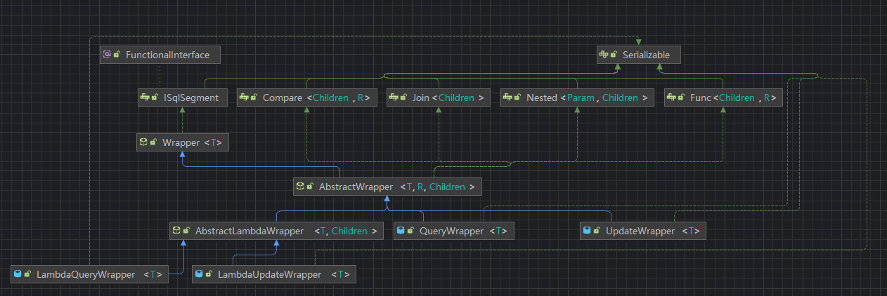

# MyBatis-plus

## 快速开始

创建User表

```sql
CREATE DATABASE UserDB;

use UserDB;

CREATE TABLE `user`
(
    id BIGINT NOT NULL COMMENT '主键ID',
    name VARCHAR(30) NULL DEFAULT NULL COMMENT '姓名',
    age INT NULL DEFAULT NULL COMMENT '年龄',
    email VARCHAR(50) NULL DEFAULT NULL COMMENT '邮箱',
    PRIMARY KEY (id)
);


INSERT INTO `user` (id, name, age, email) VALUES
(1, 'Jone', 18, 'test1@baomidou.com'),
(2, 'Jack', 20, 'test2@baomidou.com'),
(3, 'Tom', 28, 'test3@baomidou.com'),
(4, 'Sandy', 21, 'test4@baomidou.com'),
(5, 'Billie', 24, 'test5@baomidou.com');
```

添加依赖

```xml
<dependency>
    <groupId>com.baomidou</groupId>
    <artifactId>mybatis-plus-boot-starter</artifactId>
    <version>3.5.4.1</version>
    <exclusions>
        <exclusion>
            <groupId>org.mybatis</groupId>
            <artifactId>mybatis-spring</artifactId>
        </exclusion>
    </exclusions>
</dependency>

<dependency>
    <groupId>org.mybatis</groupId>
    <artifactId>mybatis-spring</artifactId>
    <version>3.0.3</version>
</dependency>
```

创建User类，使用@TableName注解

```java
package com.zhouyf.model;


import com.baomidou.mybatisplus.annotation.TableName;
import lombok.Data;

@Data
@TableName("`user`")
public class User {

    private Long id;
    private String name;
    private Integer age;
    private String email;
}
```

mapper接口

```java
package com.zhouyf.mapper;


import com.baomidou.mybatisplus.core.mapper.BaseMapper;
import com.zhouyf.model.User;
import org.apache.ibatis.annotations.Mapper;

@Mapper
public interface UserMapper extends BaseMapper<User> {

}
```

启动类，扫描mapper接口

```java
package com.zhouyf;

import org.mybatis.spring.annotation.MapperScan;
import org.springframework.boot.SpringApplication;
import org.springframework.boot.autoconfigure.SpringBootApplication;

@SpringBootApplication
@MapperScan("com.zhouyf.mapper")
public class StartSpringApplication {

    public static void main(String[] args) {
        SpringApplication.run(StartSpringApplication.class, args);
    }

}
```

测试结果

```java
package com.zhouyf.mapper;

import com.zhouyf.model.User;
import org.junit.jupiter.api.Test;
import org.springframework.beans.factory.annotation.Autowired;
import org.springframework.boot.test.context.SpringBootTest;

import java.util.List;


@SpringBootTest
public class UserTest {
    @Autowired
    private UserMapper userMapper;


    @Test
    void test(){
        List<User> users = userMapper.selectList(null);
        for (User user : users) {
            System.out.println(user);
        }
    }
}
```

输出

```
User(id=1, name=Jone, age=18, email=test1@baomidou.com)
User(id=2, name=Jack, age=20, email=test2@baomidou.com)
User(id=3, name=Tom, age=28, email=test3@baomidou.com)
User(id=4, name=Sandy, age=21, email=test4@baomidou.com)
User(id=5, name=Billie, age=24, email=test5@baomidou.com)
```

UserMapper 中的 `selectList()` 方法的参数为 MP 内置的条件封装器 `Wrapper`，所以不填写就是无任何条件

## MyBatis-Plus常用注解

### MyBatis-Plus默认约定

- 类名驼峰转下划线作为表名

- 名为id字段作为主键

- 变量名驼峰转下划线为表的字段名

### 自定义配置

@TableName：用来指定表名

@TableId：用来指定主键

@TableField：用来指定普通字段信息

### 主键生成策略
`@TableId` 注解提供了一个 `value` 参数用于指定数据库中主键列的名称，如果实体类属性名与数据库中的列名不同，可以通过这个参数指定映射关系。此外，还有一个 `type` 参数用于指定主键的生成策略。主要的生成策略包括：

- `IdType.NONE`：（默认值）无状态，该类型为未设置主键类型（注解里等于跟随全局，全局里约等于 INPUT）
- `IdType.AUTO`：数据库ID自增，主键由数据库自动生成，若没有设置自增会报错。
- `IdType.INPUT`： insert 前自行 set 主键值。
- `IdType.ASSIGN_ID`：分配ID（主要用于Long类型），使用雪花算法的ID生成策略。
- `IdType.ASSIGN_UUID`：分配UUID，生成32位UUID字符串。

例如，如果你希望使用数据库的自增策略，可以这样设置：

```java
public class User {
    @TableId(type = IdType.AUTO)
    private Long id;
    // 其他属性...
}
```

### 非主键策略

@TableName注解供了一个 `value` 参数用于指定数据库中字段列的名称，如果实体类属性名与数据库中的列名不同，可以通过这个参数指定映射关系。

- value：数据库字段名
- exist：是否为数据库表字段

## MyBatis-Plus常用配置

```yaml
mybatis-plus:
  type-aliases-package: com.zhouyf.model #别名扫描
  mapper-locations: "classpath*:/mapper/**/*.xml" #mapper配置
  configuration:
    map-underscore-to-camel-case: true  #下划线转驼峰
    cache-enabled: false #是否开启2级缓存
  global-config:
    db-config:
      id-type: assign_id #主键生成策略
      update-strategy: not_null #更新策略，只更新非空字段
```

## 条件构造器



> QueryWrapper和LambdaQueryWrapper用来select、update和delete的where条件部分。也可以指定select部分。

> UpdateWrapper和LambdaUpdateWrapper通常只有在set语句比较特殊才使用。

```java
//SELECT id,username,info,phone FROM `user` WHERE (username LIKE ? AND balance > ?)
void test1() {
    QueryWrapper<User> wrapper = new QueryWrapper<>();
    wrapper.select("id", "username", "info", "phone")
            .like("username", "o")
            .gt("balance", 1000.0);
    List<User> users = userMapper.selectList(wrapper);
    for (User user : users) {
        System.out.println(user);
    }
}

//UPDATE `user` SET balance=? WHERE (username = ?)
@Test
    //更新username为jack的balance为2500
void test2() {
    User user = new User();
    user.setBalance(2500);
    QueryWrapper<User> wrapper = new QueryWrapper<>();
    wrapper.eq("username", "jack");
    int update = userMapper.update(user, wrapper);
    System.out.println(update);
}

//UPDATE `user` SET balance = balance - 200 WHERE (username IN (?,?,?))
@Test
    //将jack,tom,rose的balance减200
void test3() {
    List<String> usernames = List.of("rose", "tom", "jack");
    UpdateWrapper<User> wrapper = new UpdateWrapper<User>().
            setSql("balance = balance - 200").
            in("username", usernames);
    int update = userMapper.update(null, wrapper);
    System.out.println(update);
}
```

## 自定义SQL

基于wrapper构建where语句

```java
List<String> usernames = List.of("rose", "tom", "jack");
int amount = 200;
LambdaUpdateWrapper<User> wrapper = new LambdaUpdateWrapper<User>().
        in(User::getUsername, usernames);
int update = userMapper.updateBalanceById(wrapper, amount);
```

在mapper方法中用Param注解声明wrapper名称，必须是ew。

@Update注解中为自定义sql，使用${ew.customSqlSegment}进行拼接wrapper定义的where语句

```java
package com.zhouyf.mapper;


import com.baomidou.mybatisplus.core.conditions.update.LambdaUpdateWrapper;
import com.baomidou.mybatisplus.core.mapper.BaseMapper;
import com.zhouyf.model.User;
import org.apache.ibatis.annotations.Mapper;
import org.apache.ibatis.annotations.Param;
import org.apache.ibatis.annotations.Update;

@Mapper
public interface UserMapper extends BaseMapper<User> {

    @Update("""
            UPDATE user set balance = balance - #{amount} ${ew.customSqlSegment}
              """)
    //UPDATE user set balance = balance - ? WHERE (username IN (?,?,?))
    int updateBalanceById(@Param("ew") LambdaUpdateWrapper<User> wrapper, int amount);
}
```

## IService接口

