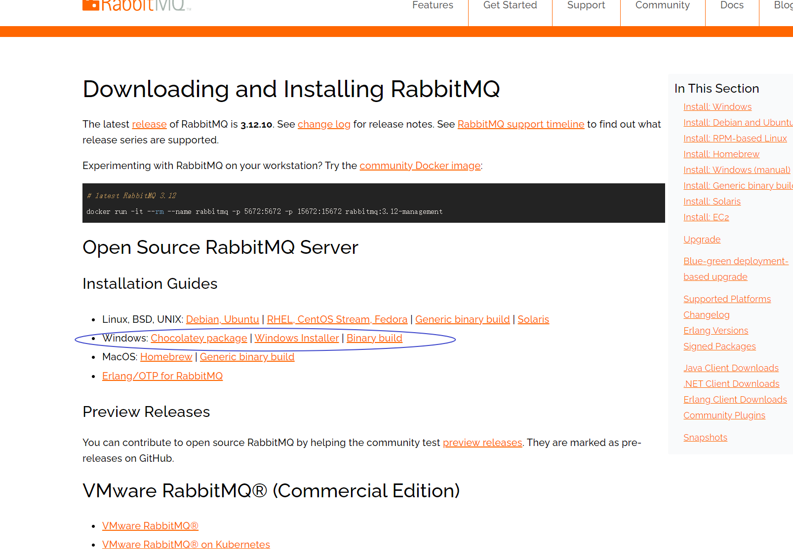

# window环境安装RabbitMQ服务

## 安装Erlang

https://www.erlang.org/downloads


## 安装RabbitMQ

https://www.rabbitmq.com/download.html



## 配置环境变量

`D:\RabbitMQ Server\rabbitmq_server-3.12.10\sbin`添加到环境变量中。

# 生产者消费者项目搭建

## 创建一个maven父工程

```xml
<dependencies>
    <dependency>
        <groupId>com.rabbitmq</groupId>
        <artifactId>amqp-client</artifactId>
        <version>5.20.0</version>
    </dependency>


    <dependency>
        <groupId>org.slf4j</groupId>
        <artifactId>slf4j-api</artifactId>
        <version>2.0.9</version>
    </dependency>


    <dependency>
        <groupId>ch.qos.logback</groupId>
        <artifactId>logback-core</artifactId>
        <version>1.4.14</version>
    </dependency>


    <dependency>
        <groupId>ch.qos.logback</groupId>
        <artifactId>logback-classic</artifactId>
        <version>1.4.14</version>
    </dependency>
</dependencies>
```

## 创建生产者子工程

```java
package com.zhouyf._01_hello;

import com.rabbitmq.client.Channel;
import com.rabbitmq.client.Connection;
import com.rabbitmq.client.ConnectionFactory;

import java.io.IOException;
import java.util.concurrent.TimeoutException;

public class Producer {
    public static void main(String[] args) throws IOException, TimeoutException {
        //创建一个连接工厂
        ConnectionFactory connectionFactory = new ConnectionFactory();
        //设置rabbitmq ip地址
        connectionFactory.setHost("localhost");
        //创建Connection对象
        Connection connection = connectionFactory.newConnection();
        //创建chanel
        Channel channel = connection.createChannel();
        //设置队列属性
        //第一个参数：队列名称
        //第二个参数：队列是否需要持久化
        //第三个参数：是否排他性(一般指定为false)
        //第四个参数：是否自动删除，如果没有消费者连接那就自动删除
        //第五个参数：是否需要设置一些额外参数
        channel.queueDeclare("01-hello", false, false, false, null);
        //发送消息
        //第三个参数：消息的属性，可以配置是否持久化
        channel.basicPublish("", "01-hello", null, "hello, rabbitmq1".getBytes());
        //关闭资源
        channel.close();
        connection.close();
    }
}
```

- **层级关系**：`ConnectionFactory` → `Connection` → `Channel`
- **功能关系**
  - `ConnectionFactory`是创建`Connection`的工厂。
  - `Connection`是网络级的连接，代表了与RabbitMQ服务器的TCP连接。
  - `Channel`是在`Connection`基础上的虚拟连接，用于执行实际的消息操作。

Connection可以比作是一条大路，而Channel可以比作为这条大路上的车道，有效地利用这条公路（`Connection`）来进行多任务的消息传输，而不需要为每个任务都另外建一条公路（建立Connection网络连接是一个非常昂贵的操作）。这样既节省资源，又提高效率。

## 创建消费者子工程

接收消息，并将接收到的消息打印到字符串

```java
package com.zhouyf._01_hello;

import com.rabbitmq.client.*;

import java.io.IOException;
import java.util.concurrent.TimeoutException;

public class Consumer {
    public static void main(String[] args) throws IOException, TimeoutException {
        //创建一个连接工厂
        ConnectionFactory connectionFactory = new ConnectionFactory();
        //设置rabbitmq ip地址
        connectionFactory.setHost("localhost");
        //创建Connection对象
        Connection connection = connectionFactory.newConnection();
        //创建chanel
        Channel channel = connection.createChannel();
        //设置队列属性
        //第一个参数：队列名称
        //第二个参数：队列是否需要持久化
        //第三个参数：是否排他性
        //第四个参数：是否自动删除
        //第五个参数：是否需要设置一些额外参数
        channel.queueDeclare("01-hello", false, false, false, null);

        channel.basicConsume("01-hello", true, new DeliverCallback() {
            /**
             * 当消息从mq中取出来了会调用这个方法，消费者消费消息就在这个handle中去进行处理
             * @param s
             * @param delivery
             * @throws IOException
             */
            @Override
            public void handle(String s, Delivery delivery) throws IOException {
                System.out.println("消息的内容为" + new String(delivery.getBody()));
            }
        }, new CancelCallback() {
            /**
             * 当消息取消了会回调这个方法
             * @param s
             * @throws IOException
             */
            @Override
            public void handle(String s) throws IOException {
                System.out.println("111111");
            }
        });
    }
}
```

## 测试

启动消费者，当生产者执行一次，消费者控制台就会打印一次接收到的字符串。

