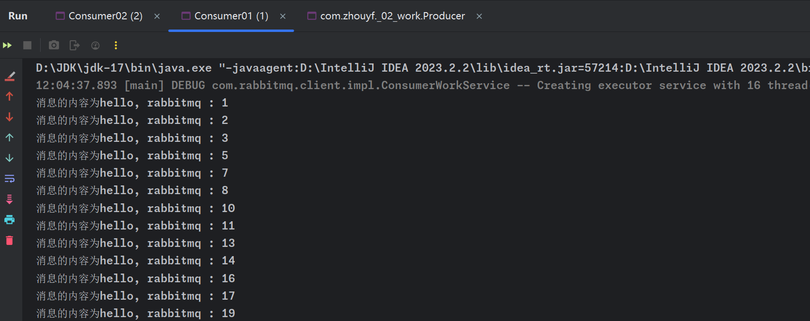
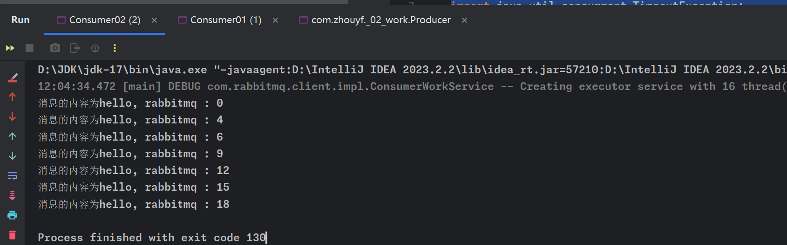

# Worker队列模式

## 模式特点

- 多个工作进程（worker）同时监听一个队列。
- 任务被均匀分摊给所有监听该队列地工作进程。
- 系统会自动地将任务在工作进程间进行分摊，从而实现负载均衡。

## Worker队列工作流程

1. **生产者发送任务**：生产者将任务作为消息发送到队列。
2. **消息分配**：RabbitMQ服务器将队列中的消息分发给空闲的工作进程。通常情况下，这是按照消息到达队列的顺序进行的。
3. **消费者处理任务**：每个工作进程从队列中获取任务，并进行处理。处理完毕后，通常会向RabbitMQ发送一个确认信号（ACK），表明任务已经被成功处理。
4. **任务完成**：一旦任务被确认处理完成，RabbitMQ就会从队列中删除该消息。

## 使用场景

- 长时间运行的任务：当任务需要较长时间来处理时，可以使用Worker队列模式来分摊任务，提高整体处理速度。
- 高负载任务：计算密集型或资源密集型的任务。
- 提高吞吐量：高吞吐量的应用场景。

## 预取计数 (Prefetch Count）

### 概念

RabbitMQ中的预取计数（Prefetch Count）是一种重要的流控制机制，用于控制在未收到消费者确认（ACK）的情况下，RabbitMQ向消费者发送的消息数量上限。

在代码中，使用如下语句来调整预取计数的数量。

```
channel.basicQos(1);
```

### 作用

- 限制未确认消息的数量：预取计数限制了在消费者发送确认之前，可以发给消费者的消息数量；如果预取计数为1，那么RabbitMQ在收到消费者对一条消息的确认之前，不会向其发送更多的消息。
- 防止消息堆积：防止在某个消费者积压过多未处理的消息，特别是在处理这些消息需要较长时间的情况下。
- 负载均衡的分配：在多消费者的情况下，预取计数帮助RabbitMQ更均匀地分配消息负载。
- 与手动确认模式相结合：在手动确认消息模式下，预取计数特别重要，因为它决定了消费者在发送ACK之前可以接收多少消息。

## 消息确认（ACK）

在RabbitMQ中，消息确认（Acknowledgment，简称ACK）是保证消息被正确处理的一种机制。消费者从队列中获取消息后，可以通过发送ACK信号来告知RabbitMQ该消息已被成功处理。RabbitMQ支持两种ACK模式：自动确认（autoAck）和手动确认（manual ack）。这两种模式的主要区别在于消息处理完成后的确认方式。

### 自动确认autoACK

- **机制**：当消息从队列发送给消费者后，它会立即被自动确认。这意味着一旦RabbitMQ将消息传递给消费者，它就会假设该消息已被成功处理，并且将其从队列中删除。
- **优点**：简单、无需编写额外的确认代码，适用于那些即使在消费者处理消息过程中出现错误也不会重新处理的场景。
- **缺点**：如果消费者在处理消息时发生故障（比如程序崩溃或者服务器重启），那么消息将会丢失，因为RabbitMQ已经认为这些消息被成功处理了。

### 手动确认manual ACK

- **机制**：消费者在处理完消息并确认消息已被正确处理后，需要显式地向RabbitMQ发送一个ACK信号。只有在收到ACK信号后，RabbitMQ才会从队列中删除该消息。
- **优点**：提供了更强的消息处理保证。如果消费者在处理消息时出现问题，消息不会丢失，因为没有发送ACK信号。RabbitMQ将会把该消息重新放入队列中，以便其他消费者或重启后的相同消费者重新处理。
- **缺点**：需要编写更多的代码来管理ACK信号，如果处理不当，可能会导致消息无限重试或者消息积压。

## 范例：工作者队列

### 生产者

发送一系列消息到RabbitMQ队列：

1. 创建`ConnectionFactory`并设置RabbitMQ服务器地址（`localhost`）。
2. 通过`ConnectionFactory`创建`Connection`。
3. 通过`Connection`创建`Channel`。
4. 通过`Channel`声明一个队列（`02-work`）。
5. 在循环中向队列发送20条消息。
6. 关闭`Channel`和`Connection`

```java
package com.zhouyf._02_work;

import com.rabbitmq.client.Channel;
import com.rabbitmq.client.Connection;
import com.rabbitmq.client.ConnectionFactory;

import java.io.IOException;
import java.util.concurrent.TimeoutException;

public class Producer {
    public static void main(String[] args) throws IOException, TimeoutException {
        //创建一个连接工厂
        ConnectionFactory connectionFactory = new ConnectionFactory();
        //设置rabbitmq ip地址
        connectionFactory.setHost("localhost");
        //创建Connection对象
        Connection connection = connectionFactory.newConnection();
        //创建chanel
        Channel channel = connection.createChannel();
        //设置队列属性
        channel.queueDeclare("02-work", false, false, false, null);
        //循环发送消息
        for (int i = 0; i < 20; i ++){
            String msg = "hello, rabbitmq : " + i;
            channel.basicPublish("", "02-work", null, msg.getBytes());
        }
        //关闭资源
        channel.close();
        connection.close();
    }
}
```

### 消费者

- **目的**：从RabbitMQ队列接收并处理消息。
- **共同特点**：
  1. 创建`ConnectionFactory`，设置RabbitMQ服务器地址。
  2. 通过`ConnectionFactory`创建`Connection`。
  3. 通过`Connection`创建`Channel`。
  4. 通过`Channel`声明队列（与生产者相同的队列`02-work`）。
  5. 设置预取计数（`basicQos(1)`），这意味着在确认前，每个消费者一次只处理一条消息。
  6. 使用`basicConsume`方法从队列消费消息，并提供`DeliverCallback`和`CancelCallback`。
- **不同点**：
  - **Consumer01**：处理每条消息后休眠1秒。
  - **Consumer02**：处理每条消息后休眠2秒。

Consumer01

```java
package com.zhouyf._02_work;

import com.rabbitmq.client.*;

import java.io.IOException;
import java.util.concurrent.TimeUnit;
import java.util.concurrent.TimeoutException;

public class Consumer01 {
    public static void main(String[] args) throws IOException, TimeoutException {
        //创建一个连接工厂
        ConnectionFactory connectionFactory = new ConnectionFactory();
        //设置rabbitmq ip地址
        connectionFactory.setHost("localhost");
        //创建Connection对象
        Connection connection = connectionFactory.newConnection();
        //创建chanel
        Channel channel = connection.createChannel();
        //设置队列属性
        channel.queueDeclare("02-work", false, false, false, null);
        channel.basicQos(1);

        channel.basicConsume("02-work", false, new DeliverCallback() {
            /**
             * 当消息从mq中取出来了会调用这个方法，消费者消费消息就在这个handle中去进行处理
             * @param s
             * @param delivery
             * @throws IOException
             */
            @Override
            public void handle(String s, Delivery delivery) throws IOException {
                try {
                    TimeUnit.SECONDS.sleep(1);
                } catch (InterruptedException e) {
                    throw new RuntimeException(e);
                }
                System.out.println("消息的内容为" + new String(delivery.getBody()));
                channel.basicAck(delivery.getEnvelope().getDeliveryTag(), false);
            }
        }, new CancelCallback() {
            /**
             * 当消息取消了会回调这个方法
             * @param s
             * @throws IOException
             */
            @Override
            public void handle(String s) throws IOException {
                System.out.println("111111");
            }
        });
    }
}
```

Consumer02

```java
package com.zhouyf._02_work;

import com.rabbitmq.client.*;

import java.io.IOException;
import java.util.concurrent.TimeUnit;
import java.util.concurrent.TimeoutException;

public class Consumer02 {
    public static void main(String[] args) throws IOException, TimeoutException {
        //创建一个连接工厂
        ConnectionFactory connectionFactory = new ConnectionFactory();
        //设置rabbitmq ip地址
        connectionFactory.setHost("localhost");
        //创建Connection对象
        Connection connection = connectionFactory.newConnection();
        //创建chanel
        Channel channel = connection.createChannel();
        //设置队列属性

        channel.queueDeclare("02-work", false, false, false, null);
        channel.basicQos(1);
        channel.basicConsume("02-work", false, new DeliverCallback() {
            /**
             * 当消息从mq中取出来了会调用这个方法，消费者消费消息就在这个handle中去进行处理
             * @param s
             * @param delivery
             * @throws IOException
             */
            @Override
            public void handle(String s, Delivery delivery) throws IOException {
                try {
                    TimeUnit.SECONDS.sleep(2);
                } catch (InterruptedException e) {
                    throw new RuntimeException(e);
                }
                System.out.println("消息的内容为" + new String(delivery.getBody()));
                channel.basicAck(delivery.getEnvelope().getDeliveryTag(), false);
            }
        }, new CancelCallback() {
            /**
             * 当消息取消了会回调这个方法
             * @param s
             * @throws IOException
             */
            @Override
            public void handle(String s) throws IOException {
                System.out.println("111111");
            }
        });
    }
}
```

### 测试结果

消费者1消费了13条消息，消费者2消费了7条消息。





这个结果反映了消费者之间处理能力的差异以及RabbitMQ在处理消息分配时的动态调整能力。这也表明在设计消费者时，考虑到它们的处理能力和效率是很重要的，尤其是在需要高效处理大量消息的系统中。