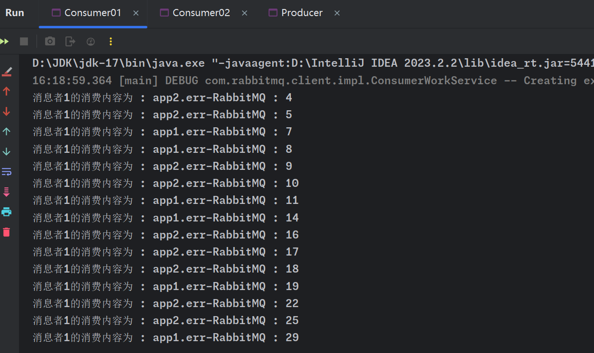
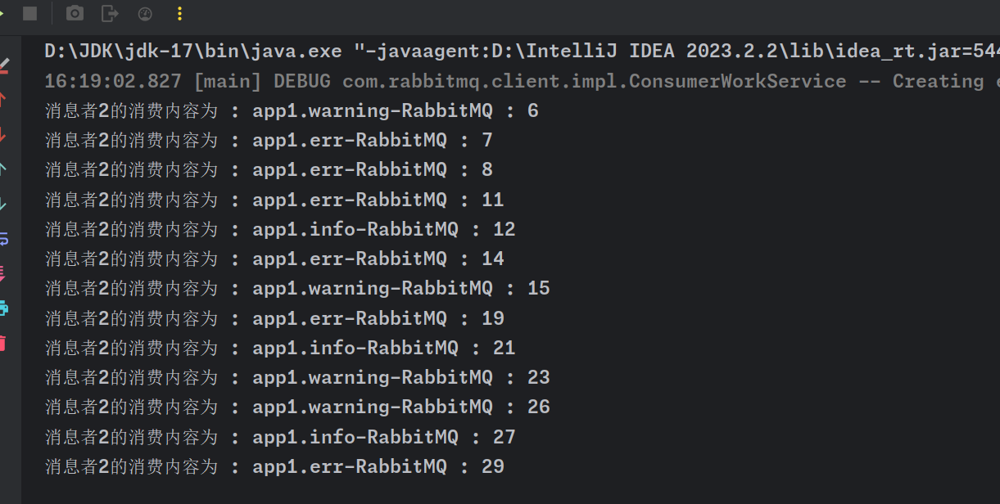

# Topic模式

RabbitMQ中的Topic模式是一种灵活的消息路由机制，它允许生产者发送的消息基于多重标准被路由到一个或多个消费者。这种模式使用主题交换机（Topic Exchange）来实现复杂的路由逻辑。

## 主题交换机

- **工作原理**：主题交换机使用消息的路由键和队列的绑定模式来路由消息。这些模式可以包含特殊字符，如星号（`*`）和井号（`#`）。
- **路由键**：消息的路由键通常是由点（`.`）分隔的多个单词组成。
- 绑定模式：
  - 星号（`*`）可以代替一个单词。
  - 井号（`#`）可以代替零个或多个单词。

## 绑定示例

- 生产者发送一条路由键为`app1.error`的消息。
- 队列A绑定了模式`*.error`，它会接收到这条消息。
- 队列B绑定了模式`app1.#`，它也会接收到这条消息。
- 队列C绑定了模式`app2.*`，它不会接收到这条消息。

# Topic模式实现范例

## 生产者

```java
package com.zhouyf._05_topic;

import com.rabbitmq.client.BuiltinExchangeType;
import com.rabbitmq.client.Channel;
import com.rabbitmq.client.Connection;
import com.rabbitmq.client.ConnectionFactory;

import java.io.IOException;
import java.util.List;
import java.util.Random;
import java.util.concurrent.TimeoutException;

public class Producer {

    public static void main(String[] args) throws IOException, TimeoutException {
        //创建一个连接工厂
        ConnectionFactory connectionFactory = new ConnectionFactory();
        //设置rabbitmq ip地址
        connectionFactory.setHost("localhost");
        //创建Connection对象
        Connection connection = connectionFactory.newConnection();
        //创建chanel
        Channel channel = connection.createChannel();

        //当生产者要发送消息时，它通过channel发送到指定的交换机
        /**
         * 第一个参数：交换机的名字
         * 第二个参数：交换机的类型
         */
        channel.exchangeDeclare("05-topic", BuiltinExchangeType.TOPIC);

        Random random = new Random();
        List<String> info =
                List.of("app1.err", "app2.err", "app2.info", "app1.info", "app1.warning");
        //循环发送消息
        for (int i = 0; i < 30; i ++){
            int index = random.nextInt(5);
            String key = info.get(index);
            String msg = key + "-RabbitMQ : " + i;
            channel.basicPublish("05-topic", key, null, msg.getBytes());
        }
        //关闭资源
        channel.close();
        connection.close();
    }
}
```

## 消费者

消费者1，只接收err消息

```java
package com.zhouyf._05_topic;

import com.rabbitmq.client.*;

import java.io.IOException;
import java.util.concurrent.TimeoutException;

public class Consumer01 {
    public static void main(String[] args) throws IOException, TimeoutException {
        //创建一个连接工厂
        ConnectionFactory connectionFactory = new ConnectionFactory();
        //设置rabbitmq ip地址
        connectionFactory.setHost("localhost");
        //创建Connection对象
        Connection connection = connectionFactory.newConnection();
        //创建chanel
        Channel channel = connection.createChannel();
        
        channel.exchangeDeclare("05-topic", BuiltinExchangeType.TOPIC);
        String queue = channel.queueDeclare().getQueue();
        
        channel.queueBind(queue, "05-topic", "*.err");

        // 设置消费者订阅队列。这里的true表示使用自动确认模式
        channel.basicConsume(queue, true, new DeliverCallback() {
            @Override
            public void handle(String s, Delivery delivery) throws IOException {
                System.out.println("消息者1的消费内容为 : " + new String(delivery.getBody()));
            }
        }, new CancelCallback() {
            // 当消费者被取消时（例如队列被删除），会调用此回调函数
            @Override
            public void handle(String s) throws IOException {
                System.out.println("111111");
            }
        });
    }
}
```

消费者2，只接收app1消息

```java
package com.zhouyf._05_topic;

import com.rabbitmq.client.*;

import java.io.IOException;
import java.util.concurrent.TimeoutException;

public class Consumer02 {
    public static void main(String[] args) throws IOException, TimeoutException {
        //创建一个连接工厂
        ConnectionFactory connectionFactory = new ConnectionFactory();
        //设置rabbitmq ip地址
        connectionFactory.setHost("localhost");
        //创建Connection对象
        Connection connection = connectionFactory.newConnection();
        //创建chanel
        Channel channel = connection.createChannel();
        //设置队列属性
        channel.exchangeDeclare("05-topic", BuiltinExchangeType.TOPIC);
        String queue = channel.queueDeclare().getQueue();
        channel.queueBind(queue, "05-topic", "app1.#");

        channel.basicConsume(queue, true, new DeliverCallback() {

            @Override
            public void handle(String s, Delivery delivery) throws IOException {
                System.out.println("消息者2的消费内容为 : " + new String(delivery.getBody()));
            }
        }, new CancelCallback() {

            @Override
            public void handle(String s) throws IOException {
                System.out.println("111111");
            }
        });
    }
}
```

## 测试

消费者1测试结果：



消费者2测试结果：



Topic模式在需要对消息进行细粒度控制的复杂系统中非常有用，它提供了高度的灵活性和扩展性。