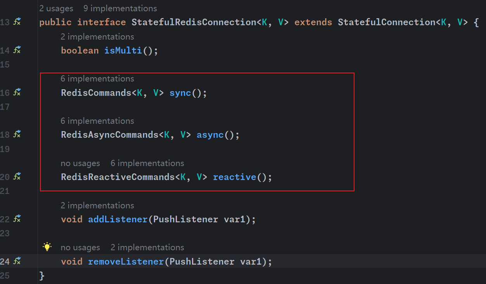

# Redis命令模式



在 Redis 中，同步、异步和响应式命令分别对应不同的编程模式和处理响应的方式。

1. **同步命令（Synchronous）**:
   - 使用 `RedisCommands<K, V> sync()` 获取的是同步命令接口。
   - 在这种模式下，客户端发出一个命令并阻塞，直到收到 Redis 服务器的响应。
   - 这是最直接的方法，但可能导致应用程序等待响应，尤其在高延迟或重负载情况下。
   - 就像你在传统餐厅点餐。你坐下，点菜，然后等待服务员把餐点送来。在这个过程中，你不能做其他事情，只能等待你的食物准备好并送到你的桌子上。
2. **异步命令（Asynchronous）**:
   - 使用 `RedisAsyncCommands<K, V> async()` 获取的是异步命令接口。
   - 异步命令允许客户端发送命令并立即继续执行，不需要等待响应。
   - 响应通过回调、Future、Promise 或类似机制在稍后处理。
   - 这种方式提高了应用程序的吞吐量，因为它不会因为等待 Redis 响应而阻塞。
   - 你点了餐后，会得到一个号码牌。你拿着号码牌去找个座位坐下，同时可以做一些其他事情，比如看书或者和朋友聊天。当你的食物准备好了，服务员会叫号或送到你的桌子上。
3. **响应式命令（Reactive）**:
   - 使用 `RedisReactiveCommands<K, V> reactive()` 获取的是响应式命令接口。
   - 响应式编程是一种更先进的异步编程模式，它提供了对数据流和变化传播的声明式操作。
   - 这种方式适合构建非阻塞的、响应式的应用程序，特别是在响应式编程框架（如 Reactor 或 RxJava）的上下文中。
   - 它支持更复杂的流操作和组合，适用于高度交互式和实时更新的应用程序。
   - 想象一个自助餐厅，有各种不同的菜肴流水线。你可以随时走到流水线旁边，拿你想吃的食物。同时，厨师不断地在更新菜肴，你可以根据需要随时去拿新的或不同的菜。

使用异步命令设置数据以及获取数据

```java
package com.zhouyf.test;

import io.lettuce.core.RedisClient;
import io.lettuce.core.RedisFuture;
import io.lettuce.core.RedisURI;
import io.lettuce.core.api.StatefulRedisConnection;
import io.lettuce.core.api.async.RedisAsyncCommands;
import org.slf4j.Logger;
import org.slf4j.LoggerFactory;

import java.util.concurrent.ExecutionException;

public class TestLettuce {
    private static final String REDIS_HOST = "192.168.136.128";

    private static final int REDIS_PORT = 6379;

    private static final String REDIS_USERNAME = "default";

    private static final String REDIS_PASSWORD = "12345";

    private static final int DATABASE_INDEX = 0;

    private static final Logger LOGGER = LoggerFactory.getLogger(TestRedisClient.class);

    public static void main(String[] args) throws ExecutionException, InterruptedException {
        // Create a RedisURI object by building a URI with the specified host and port.
        RedisURI redisURI = RedisURI.Builder.redis(REDIS_HOST, REDIS_PORT)
                .withAuthentication(REDIS_USERNAME, REDIS_PASSWORD).
                withDatabase(DATABASE_INDEX).build();

        // Create a Redis client using the previously defined RedisURI.
        RedisClient client = RedisClient.create(redisURI);
        // Establish a stateful connection with Redis using the client.
        StatefulRedisConnection<String, String> connect = client.connect();
        //// Retrieve asynchronous command API for issuing commands to Redis.
        RedisAsyncCommands<String, String> commands = connect.async();
        //Asynchronously set the value of the key 'name' to 'zhouyangfan' and retrieve a future representing the result.
        RedisFuture<String> set = commands.set("name", "zhouyangfan");
        // Log the result of the set command (once completed).
        LOGGER.debug("命令处理结果:{}", set.get());
        // Asynchronously retrieve the value of the key 'name' and retrieve a future representing the result.
        RedisFuture<String> name = commands.get("name");
        //Log the value of the 'name' key (once retrieved).
        LOGGER.debug("name为:{}", name.get());
        //Close the Redis client, effectively closing the connection.
        client.close();
    }
}
```

```
[main] DEBUG com.zhouyf.test.TestRedisClient -- 命令处理结果:OK
[main] DEBUG com.zhouyf.test.TestRedisClient -- name为:zhouyangfan
```

