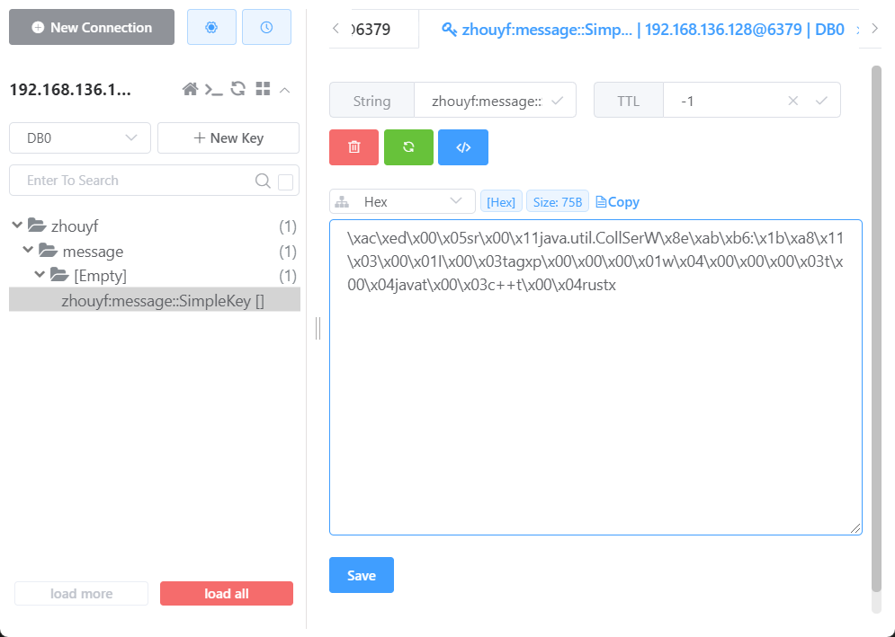

# Spring Cache整合Redis

## Spring Cache

Spring Cache提供了一种简洁的缓存抽象，旨在减少开发人员在Java应用中直接操作缓存的需要。其主要作用包括：

1. **简化缓存的使用**：通过注解等方式，开发者可以轻松地将缓存应用到现有的方法上，而无需修改方法的核心逻辑。
2. **抽象底层缓存实现**：Spring Cache允许不同的缓存实现（如EhCache, Redis等）被插入，而应用代码不需要因为缓存实现的改变而修改。
3. **提高性能**：缓存经常访问的数据，减少数据库的读取压力，从而提高应用性能。
4. **减少代码冗余**：避免在应用的多个位置编写相似的缓存处理代码。

适用场景：读操作远多于写操作，数据不频繁变化，数据获取成本高。

不适用场景：频繁变更的数据据，写操作远多于读操作，实时更新的数据，方法返回的结果巨大。

## 配置类

```java
package com.zhouyf.config;

import org.springframework.beans.factory.annotation.Autowired;
import org.springframework.context.annotation.Bean;
import org.springframework.context.annotation.Configuration;
import org.springframework.data.redis.connection.lettuce.LettuceConnectionFactory;
import org.springframework.data.redis.core.RedisTemplate;

@Configuration
public class CacheTemplateConfig {

    @Bean("cacheTemplate")
    public RedisTemplate<String, Object> cacheTemplate(
            @Autowired LettuceConnectionFactory factory
    ) {
        RedisTemplate<String, Object> template = new RedisTemplate<>();
        template.setConnectionFactory(factory);
        return template;
    }
}
```

```java
package com.zhouyf.config;

import org.springframework.beans.factory.annotation.Autowired;
import org.springframework.beans.factory.annotation.Qualifier;
import org.springframework.cache.CacheManager;
import org.springframework.cache.annotation.EnableCaching;
import org.springframework.context.annotation.Bean;
import org.springframework.context.annotation.Configuration;
import org.springframework.data.redis.cache.RedisCacheConfiguration;
import org.springframework.data.redis.cache.RedisCacheManager;
import org.springframework.data.redis.cache.RedisCacheWriter;
import org.springframework.data.redis.core.RedisTemplate;
import org.springframework.data.redis.serializer.RedisSerializationContext;

import java.util.Objects;

@Configuration
@EnableCaching
public class CacheConfig {
    @Bean
    public CacheManager cacheManager(
            @Autowired @Qualifier("cacheTemplate") RedisTemplate<String, Object> cacheTemplate
    ) {
        RedisCacheWriter redisCacheWriter =
                RedisCacheWriter.nonLockingRedisCacheWriter(Objects.requireNonNull(cacheTemplate.getConnectionFactory()));
        RedisCacheConfiguration redisCacheConfiguration =
                RedisCacheConfiguration.defaultCacheConfig().
                        serializeValuesWith(RedisSerializationContext.
                                SerializationPair.fromSerializer(cacheTemplate.getValueSerializer()));
        return new RedisCacheManager(redisCacheWriter, redisCacheConfiguration, "zhouyf:message");
    }
}
```

## 使用缓存

```java
package com.zhouyf.dao.impl;

import com.zhouyf.dao.IMessageDao;
import org.slf4j.Logger;
import org.slf4j.LoggerFactory;
import org.springframework.stereotype.Repository;

import java.util.List;

@Repository
public class IMessageDaoImpl implements IMessageDao {

    private final static Logger LOGGER = LoggerFactory.getLogger(IMessageDaoImpl.class);

    @Override
    public List<String> findAll() {
        LOGGER.info("【MessageDAO数据层调用】调用findAll()方法查询消息表全部数据");
        return List.of("java", "c++", "rust");
    }
}
```

```java
package com.zhouyf.service;

import org.springframework.cache.annotation.CacheConfig;
import org.springframework.cache.annotation.Cacheable;

import java.util.List;

@CacheConfig(cacheNames = "zhouyf:message")
public interface IMessageService {
    @Cacheable
    public List<String> list();
}
```

```java
package com.zhouyf.service.impl;

import com.zhouyf.dao.IMessageDao;
import com.zhouyf.service.IMessageService;
import org.springframework.beans.factory.annotation.Autowired;
import org.springframework.stereotype.Service;

import java.util.List;

@Service
public class IMessageServiceImpl implements IMessageService {
    @Autowired
    private IMessageDao messageDao;
    @Override
    public List<String> list() {
        return messageDao.findAll();
    }
}
```

```java
package com.zhouyf.test;

import com.zhouyf.StartRedisApplication;
import com.zhouyf.service.IMessageService;
import org.junit.jupiter.api.Test;
import org.junit.jupiter.api.extension.ExtendWith;
import org.slf4j.Logger;
import org.slf4j.LoggerFactory;
import org.springframework.beans.factory.annotation.Autowired;
import org.springframework.test.context.ContextConfiguration;
import org.springframework.test.context.junit.jupiter.SpringExtension;

import java.util.List;

@ContextConfiguration(classes = StartRedisApplication.class)
@ExtendWith(SpringExtension.class)
public class CacheTest {

    private final static Logger LOGGER = LoggerFactory.getLogger(CacheTest.class);

    @Autowired
    private IMessageService iMessageService;

    @Test
    void test(){
        List<String> list = iMessageService.list();
        LOGGER.debug("【测试类中】{}", list);
    }
}

```

第一次执行：

```
INFO com.zhouyf.dao.impl.IMessageDaoImpl -- 【MessageDAO数据层调用】调用findAll()方法查询消息表全部数据

DEBUG com.zhouyf.test.CacheTest -- 【测试类中】[java, c++, rust]
```

数据被写入到Redis中



第二次执行，将直接返回缓存中的数据

```
DEBUG com.zhouyf.test.CacheTest -- 【测试类中】[java, c++, rust]
```

