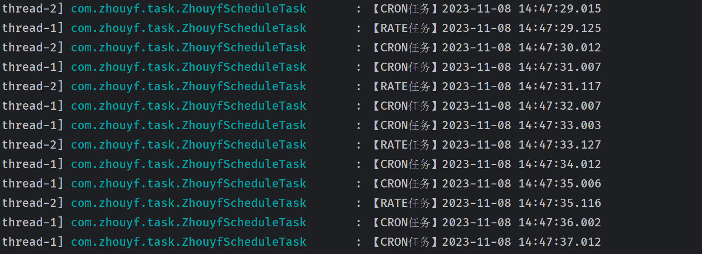

# 定时任务管理

> Spring 定时任务是 Spring 框架提供的一种创建计划任务的机制，它允许你安排一个任务在特定时间执行，这个任务可以是一次性的，也可以是多次重复执行的。

## 定时任务的场景

1. **数据备份**：可以定时备份数据库，确保数据安全。
2. **报告生成**：可以在每天的特定时间生成和发送报告。
3. **定期清理**：定时清理日志文件、临时文件等，释放服务器空间。
4. **任务提醒**：比如定时发送邮件提醒用户他们的任务即将到期。
5. **数据同步**：在多个系统间同步数据，保持数据的一致性。

## 定时任务使用

- `@Scheduled` 注解可以用在方法上，来标记该方法是一个定时任务的执行点。你可以定义这个任务的执行计划，比如每隔一定时间执行一次，或者在特定时间执行。
- 【microboot-web】创建一个任务处理类`com.zhouyf.task.ZhouyfScheduleTask`

```java
package com.zhouyf.task;

import org.slf4j.Logger;
import org.slf4j.LoggerFactory;
import org.springframework.scheduling.annotation.Scheduled;
import org.springframework.stereotype.Component;

import java.text.SimpleDateFormat;
import java.util.Date;
@Component
public class ZhouyfScheduleTask {
    public final static Logger LOGGER = LoggerFactory.getLogger(ZhouyfScheduleTask.class);
    @Scheduled(fixedRate = 2000)
    public void runJobA(){
        LOGGER.info("【RATE任务】{}",
                new SimpleDateFormat("yyyy-MM-dd HH:mm:ss.SSS").format(new Date()));
    }

    @Scheduled(cron = "* * * * * ?")
    public void runJobB(){
        LOGGER.info("【CRON任务】{}",
                new SimpleDateFormat("yyyy-MM-dd HH:mm:ss.SSS").format(new Date()));
    }
}
```

- 想要让这两个任务同时运行，必须创建相应的线程池，线程池的配置需要实现SchedulingConfigurer父接口，并重写configureTask方法

```java
package com.zhouyf.config;

import org.springframework.context.annotation.Configuration;
import org.springframework.scheduling.annotation.SchedulingConfigurer;
import org.springframework.scheduling.config.ScheduledTaskRegistrar;

import java.util.concurrent.Executors;

@Configuration
public class ScheduleConfig implements SchedulingConfigurer {
    @Override
    public void configureTasks(ScheduledTaskRegistrar taskRegistrar) {
        taskRegistrar.setScheduler(Executors.newScheduledThreadPool(2));//2个线程池
    }
}
```

- 程序启动类加上`@EnableScheduling`注解

```java
package com.zhouyf;

import com.zhouyf.banner.MyBanner;
import org.springframework.boot.Banner;
import org.springframework.boot.SpringApplication;
import org.springframework.boot.autoconfigure.SpringBootApplication;
import org.springframework.boot.web.servlet.ServletComponentScan;
import org.springframework.scheduling.annotation.EnableScheduling;

@SpringBootApplication
@ServletComponentScan() //servlet组件扫描
@EnableScheduling
public class MyApplication {
    public static void main(String[] args) {
        SpringApplication springApplication =
                new SpringApplication(MyApplication.class);//获取实例化对象
        springApplication.setBanner(new MyBanner());//配置自定义Banner的生成器
        springApplication.setBannerMode(Banner.Mode.CONSOLE); //配置Banner输出到控制台
        springApplication.run(args); //运行SpringBoot程序
    }
}
```

- 启动主程序



## 任务属性

在Spring中，定时任务的触发时间可以通过 `@Scheduled` 注解的不同属性来配置，这些属性包括 `fixedRate`、`fixedDelay` 和 `cron`。每个属性都有其特定的用途和格式要求。

### fixedRate

`fixedRate` 属性以毫秒为单位指定两次任务执行之间的间隔时间。它用于固定速率的执行，不考虑任务实际执行所需的时间。例如，若你想每隔5秒执行一次任务，可以这样写：

```java
@Scheduled(fixedRate = 5000)
public void executeTask() {
    // 任务代码
}
```

### fixedDelay

`fixedDelay` 属性也是以毫秒为单位，但它指定的是任务执行完成后到下一次任务开始之间的间隔时间。如果任务的执行时间很长，下一次执行会在当前执行完成后再等待指定的延迟时间。例如，若任务执行完毕后需要等待7秒再次执行，可以这样写：

```java
@Scheduled(fixedDelay = 7000)
public void executeTask() {
    // 任务代码
}
```

### initialDelay

`initialDelay` 与 `fixedRate` 或 `fixedDelay` 结合使用，它指定了首次任务执行前的延迟时间。例如，应用启动后延迟10秒执行任务，然后每5秒执行一次：

```java
@Scheduled(initialDelay = 10000, fixedRate = 5000)
public void executeTask() {
    // 任务代码
}
```

### cron

`cron` 属性是一个字符串，表示的是任务的执行时间和频率。这个字符串由6或7个空格分隔的时间和日期字段组成，代表了一个时间表达式，按照以下格式：

```
秒 分 时 日 月 周 [年]
```

每个字段可以接受不同的值：

- `秒`：0到59
- `分`：0到59
- `时`：0到23
- `日`：1到31，表示月份中的天数
- `月`：1到12或者使用缩写
- `周`：0到7或者使用缩写（0和7都代表周日）
- `年`（可选）：通常留空

这里有一些`cron`表达式的例子：

- 每天凌晨1点执行：`0 0 1 * * *`
- 每周一上午10:15执行：`0 15 10 * * MON`
- 每月1号和15号的10:30执行：`0 30 10 1,15 * *`
- 每5分钟执行一次：`0 */5 * * * *`

下面是一个使用`cron`表达式的例子：

```java
@Scheduled(cron = "0 */5 * * * *")
public void executeTask() {
    // 每5分钟执行一次的任务代码
}
```

在编写 `cron` 表达式时，你可以利用在线工具来生成和验证表达式，以确保它们的正确性。记住，`cron`表达式可以非常强大，能表达几乎所有的时间组合，但也需要谨慎书写以避免错误。
