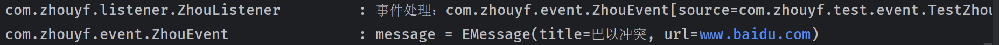
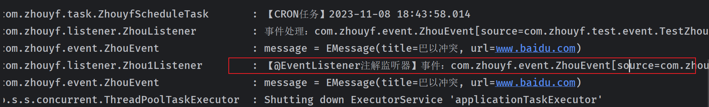

# 事件发布与监听

Spring框架中的事件允许你的应用在关键操作发生时能够发送信号，其他部分的应用可以接收这个信号并且作出相应的处理。这就像是一个广播系统，其中事件发布者发送消息，而事件监听器就像订阅了这个频道的收音机，当特定的广播出现时，它们就会被激活并执行相应的操作。

在Spring工程中，事件的使用可以让你的代码变得更加清晰和模块化，因为你不需要在组件之间直接进行通信。相反，你只需要定义何时发布事件（比如数据变更、用户行为等），以及谁对这些事件感兴趣并应当作出反应。这就解耦了应用程序的不同部分，使得它们更容易管理和维护。

## 自定义事件处理

在Spring Framework中，自定义事件处理是一种应用内各组件之间通信的方式，它允许你创建和发布状态变化的事件，其他组件可以监听并响应这些事件。这是观察者设计模式的一个实例，允许对象在不直接调用彼此的情况下通信。

Spring的事件发布机制主要涉及三个主要部分：

1. **事件（Event）**：
   - 这是要发布的消息。在Spring中，所有事件都必须扩展`ApplicationEvent`类。
2. **发布者（Publisher）**：
   - 负责发布事件。任何Spring管理的bean都可以发布事件，通过调用`ApplicationEventPublisher`的`publishEvent`方法。
3. **监听器（Listener）**：
   - 负责处理事件。监听器需要实现`ApplicationListener`接口，并覆写`onApplicationEvent`方法来定义当事件发生时如何响应。

## 自定义事件处理范例

- 定义一个vo类`com.zhouyf.vo.EMessage`

```java
package com.zhouyf.vo;

import lombok.AllArgsConstructor;
import lombok.Data;
import lombok.NoArgsConstructor;

@Data
@AllArgsConstructor
@NoArgsConstructor
public class EMessage {
    private String title;
    private String url;
}
```

- 定义事件`com.zhouyf.event.ZhouEvent`

```java
package com.zhouyf.event;

import com.zhouyf.vo.EMessage;
import lombok.Getter;
import org.slf4j.Logger;
import org.slf4j.LoggerFactory;
import org.springframework.context.ApplicationEvent;

@Getter
public class ZhouEvent extends ApplicationEvent {
    private final static Logger LOGGER = LoggerFactory.getLogger(ZhouEvent.class);
    private EMessage message;

    public ZhouEvent(Object source, EMessage message) {
        super(source);
        this.message = message;
    }

    public void fire(){
        LOGGER.info("message = {}", this.message);
    }
}
```

- 定义监听器`com.zhouyf.listener.ZhouListener`

```java
package com.zhouyf.listener;

import com.zhouyf.event.ZhouEvent;
import lombok.extern.slf4j.Slf4j;
import org.springframework.context.ApplicationListener;
import org.springframework.stereotype.Component;

@Component
@Slf4j
public class ZhouListener implements ApplicationListener<ZhouEvent> {
    @Override
    public void onApplicationEvent(ZhouEvent event) {
        log.info("事件处理：{}", event);
        event.fire();
    }
}
```

- 测试（发布者）：通过调用`ApplicationEventPublisher`的`publishEvent`方法。

```java
package com.zhouyf.test.event;

import com.zhouyf.MyApplication;
import com.zhouyf.event.ZhouEvent;
import com.zhouyf.vo.EMessage;
import org.junit.jupiter.api.Test;
import org.springframework.beans.factory.annotation.Autowired;
import org.springframework.boot.test.context.SpringBootTest;
import org.springframework.context.ApplicationEventPublisher;

@SpringBootTest(classes = MyApplication.class)
public class TestZhouEvent {
    @Autowired
    private ApplicationEventPublisher publisher;

    @Test
    void testEvent() {
        this.publisher.publishEvent(new ZhouEvent(this, new EMessage("巴以冲突", "www.baidu.com")));
    }

}
```

- 日志



澄清一下整个流程和一些细节：

1. **事件发布**:
   - 事件发布者（`TestZhouEvent`类中的`testEvent`方法）使用`ApplicationEventPublisher`发布了一个新的`ZhouEvent`事件。事件的数据是一个`EMessage`实例，其内容为`"巴以冲突"`作为标题和`"www.baidu.com"`作为URL。`ApplicationEventPublisher`接口充当事件发布机制的角色，它是观察者模式中的“主题”（Subject）的一个具体实现。它负责发布事件到所有注册的监听器（观察者），这些监听器实现了`ApplicationListener`接口或使用`@EventListener`注解。  
2. **事件监听**:
   - `ZhouListener`类是一个监听器（观察者），它监听`ZhouEvent`类型的事件。一旦`ZhouEvent`事件被发布，`ZhouListener`的`onApplicationEvent`方法就会被触发。
3. **事件处理**:
   - 在`onApplicationEvent`方法内部，监听器首先通过日志打印出事件对象的信息。根据您的描述，它将打印出类似于“事件处理：com.zhouyf.event.ZhouEvent”的消息。
   - 紧接着，`onApplicationEvent`调用事件对象的`fire()`方法，该方法进一步通过日志记录功能打印出`EMessage`对象的内容，日志内容会是`EMessage`实例的字符串表示，例如包含标题和URL的信息。

尽管`ApplicationEventPublisher`并不直接管理监听器列表（这是由Spring容器管理的），它确实起到了观察者模式中的主题角色，负责将事件通知给观察者。在这个上下文中，Spring框架本身管理着主题和观察者之间的动态关系。

## `@EventListener`注解

> 在Spring框架中，`@EventListener`是一个非常有用的注解，它允许你将任意方法定义为一个事件监听器，不再需要实现特定的接口（如`ApplicationListener`）。使用`@EventListener`注解可以使得代码更简洁、更易读，并且让事件监听逻辑的组织更为灵活。

- 在Spring中，事件是应用程序内部的通信媒介，用于在不同组件之间传递状态信息。事件可以是任何事情——从完成的数据库事务到错误消息，或者用户行为等。
- 监听器是响应事件的组件。在Spring中，你可以定义一个方法来处理特定的事件。当该事件发生时，Spring会调用这个方法。

### 使用@EventListener的步骤

- 定义事件类，通常是扩展了`ApplicationEvent`的类。
- 定义监听器方法，定义一个方法来处理事件。该方法可以有一个参数，类型与你想要监听的事件相对应。
- 使用`@EventListener`注解，在这个方法上加上`@EventListener`注解，这样Spring就知道当相应的事件被发布时，应该调用这个方法。

添加一个`com.zhouyf.listener.Zhou1Listener`类，在需要执行的方法上面添加@EventListener注解

```java
package com.zhouyf.listener;

import com.zhouyf.event.ZhouEvent;
import lombok.extern.slf4j.Slf4j;
import org.springframework.context.event.EventListener;
import org.springframework.stereotype.Component;

@Component
@Slf4j
public class Zhou1Listener {

    @EventListener
    public void handleContextStart(ZhouEvent event) {
        log.info("【@EventListener注解监听器】事件：{}",event);
        event.fire();
    }
}
```

测试

