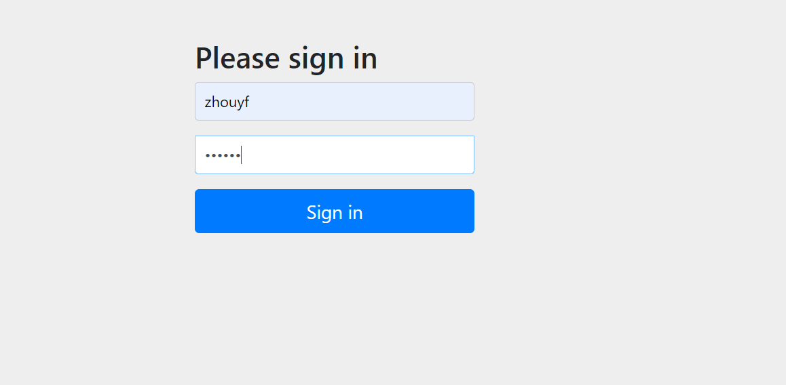

# UserDetailsService类

`UserDetailsService`接口定义了一个关键方法：`loadUserByUsername(String username)`。这个方法负责根据提供的用户名查找用户，并返回一个`UserDetails`对象，其中包含了用户的详细信息，如用户名、密码、权限等。

```java
public interface UserDetailsService {
    UserDetails loadUserByUsername(String username) throws UsernameNotFoundException;
}
```

`UserDetailsService`允许开发者自定义用户的存储方式。无论用户数据是存储在关系数据库、非关系数据库、LDAP目录服务还是其他存储系统中，只需实现`UserDetailsService`接口，就可以将这些数据源接入Spring Security的认证流程中。

# 将用户信息配置到内存中

```java
package com.zhouyf.config;

import org.springframework.context.annotation.Bean;
import org.springframework.context.annotation.Configuration;
import org.springframework.security.config.annotation.web.configuration.EnableWebSecurity;
import org.springframework.security.core.userdetails.User;
import org.springframework.security.core.userdetails.UserDetails;
import org.springframework.security.core.userdetails.UserDetailsService;
import org.springframework.security.crypto.bcrypt.BCryptPasswordEncoder;
import org.springframework.security.crypto.password.PasswordEncoder;
import org.springframework.security.provisioning.InMemoryUserDetailsManager;

@Configuration
@EnableWebSecurity
public class SecurityConfig {
    @Bean
    public UserDetailsService userDetailsService(){
        UserDetails user1 = User.withUsername("zhouyf").
               password("$2a$10$WHvv3iDmYkIjut/U.i4nHubDsgJlJaw83Wo5EJ8tfdRrZRPWGe07K").
                //明文为123456
            roles("admin").build();

        UserDetails user2 = User.withUsername("lilei").
                password("{noop}123456").
                roles("user").build();


        InMemoryUserDetailsManager inMemoryUserDetailsManager = new InMemoryUserDetailsManager();
        inMemoryUserDetailsManager.createUser(user1);
        inMemoryUserDetailsManager.createUser(user2);
        return inMemoryUserDetailsManager;
    }

    @Bean
    public PasswordEncoder passwordEncoder(){
        //配置密码编码器
        return new BCryptPasswordEncoder();
    }
}
```

控制器

```java
package com.zhouyf.controller;

import org.springframework.web.bind.annotation.GetMapping;
import org.springframework.web.bind.annotation.RestController;

@RestController
public class TestController {

    @GetMapping("test")
    public String test(){
        return "test";
    }
}
```

```
http://localhost:8080/test

zhouyf
123456
```



点击sign in，后端返回test